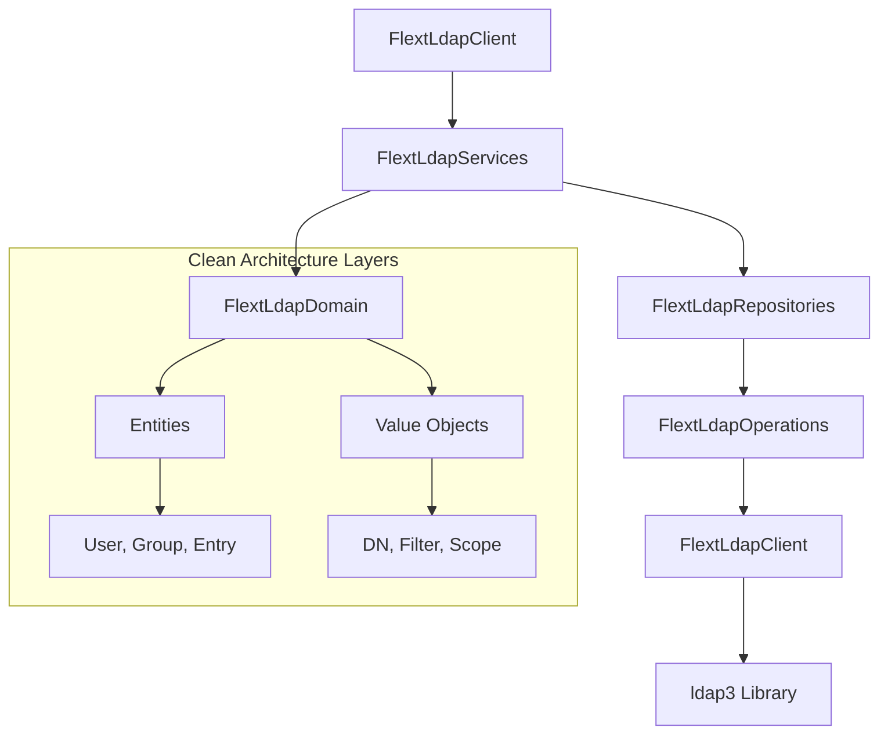

# flext-ldap

[](https://www.python.org/downloads/)

**LDAP directory services integration library** for the FLEXT ecosystem, providing LDAP operations using **Clean Architecture patterns** with async/await support.

> **⚠️ STATUS**: Active development with 33% test coverage, targeting 90%+ compliance with FLEXT-Core patterns

---

## 🎯 Purpose and Role in FLEXT Ecosystem

### **For the FLEXT Ecosystem**

FLEXT-LDAP serves as the centralized LDAP operations library for all directory service needs across the FLEXT ecosystem. It provides a standardized interface for LDAP authentication, user management, and directory queries using Clean Architecture principles and domain-driven design patterns.

### **Key Responsibilities**

1. **LDAP Operations** - User authentication, directory searches, entry management
2. **Clean Architecture** - Domain-driven design with separated layers (domain, application, infrastructure)
3. **FLEXT Integration** - FlextResult error handling, dependency injection, logging

### **Integration Points**

- **flext-core** → FlextResult, FlextContainer, FlextLogger patterns
- **flext-auth** → LDAP authentication provider for SSO systems
- **Singer ecosystem** → flext-tap-ldap, flext-target-ldap for data extraction

---

## 🏗️ Architecture and Patterns

### **FLEXT-Core Integration Status**

| Pattern             | Status  | Description                           |
| ------------------- | ------- | ------------------------------------- |
| **FlextResult&lt;T&gt;**  | 🟢 100% | All operations return FlextResult     |
| **FlextService**    | 🟡 75%  | Domain services implemented           |
| **FlextContainer**  | 🟡 60%  | Dependency injection in progress      |
| **Domain Patterns** | 🟢 85%  | Entities, value objects, repositories |

> **Status**: 🔴 Critical · 1.0.0 Release Preparation | 🟡 Partial | 🟢 Complete

### **Architecture Diagram**



---

## 🚀 Quick Start

### **Installation**

**Production environment:**

```bash
poetry add flext-ldap
```

**Development environment:**

```bash
git clone <repository-url>
cd flext-ldap
make setup     # Install dependencies and pre-commit hooks
make validate  # Run quality checks
```

### **Basic Usage**

```python
import asyncio
from flext_ldap import get_flext_ldap_api, FlextLdapEntities

async def basic_ldap_search():
    """Basic LDAP search using FlextResult patterns."""
    api = get_flext_ldap_api()

    search_request = FlextLdapEntities.SearchRequest(
        base_dn="dc=example,dc=com",
        filter_str="(objectClass=person)",
        scope="subtree",
        attributes=["uid", "cn", "mail"]
    )

    result = await api.search_entries(search_request)
    if result.is_success:
        entries = result.unwrap()
        print(f"Found {len(entries)} entries")
    else:
        print(f"Search failed: {result.error}")

asyncio.run(basic_ldap_search())
```

---

## 🔧 Development

### **Essential Commands**

```bash
make setup                    # Development environment setup
make validate                 # Complete quality pipeline (lint + type + security + test)
make test                     # Run test suite
make lint                     # Code linting with ruff
make type-check               # Type checking with mypy
make format                   # Code formatting
make clean                    # Clean build artifacts
```

### **Quality Gates**

- **Coverage**: 33% minimum (targeting 90%)
- **Type Checking**: mypy --strict compliance
- **Linting**: ruff with zero violations
- **Security**: bandit security analysis

---

## 🧪 Testing

### **Test Structure**

```
tests/
├── unit/              # Unit tests for individual components
├── integration/       # Integration tests with real LDAP server
├── e2e/              # End-to-end workflow tests
└── conftest.py       # Shared test fixtures
```

### **Testing Commands**

```bash
make test                     # Run all tests
pytest tests/unit/           # Unit tests only
pytest tests/integration/   # Integration tests (requires Docker)
pytest --cov=src            # Coverage report
```

**Docker Test Environment:**

```bash
make ldap-test-server        # Start OpenLDAP container for testing
make ldap-test-server-stop   # Stop test container
```

---

## 📊 Status and Metrics

### **Quality Standards**

- **Coverage**: 33% (target: 90%)
- **Type Safety**: mypy --strict enabled
- **Security**: bandit analysis passing
- **FLEXT-Core Compliance**: 80%

### **Ecosystem Integration**

- **Direct Dependencies**: flext-auth (authentication provider)
- **Service Dependencies**: flext-core (patterns), flext-observability (logging)
- **Integration Points**: 3 active integrations in ecosystem

---

## 🗺️ Roadmap

### **Current Version (0.9.9)**

- Clean Architecture foundation complete
- FlextResult pattern implementation
- Basic LDAP operations (authentication, search, CRUD)
- Domain entities and value objects

### **Next Version (1.0.0)**

- 90% test coverage achievement
- Complete FLEXT-Core pattern compliance
- Performance optimization for large directories
- Enhanced error handling and validation

---

## 📚 Documentation

- **[Getting Started](docs/getting-started.md)** - Installation and setup
- **[Architecture](docs/architecture.md)** - Design patterns and structure
- **[API Reference](docs/api-reference.md)** - Complete API documentation
- **[Development](docs/development.md)** - Contributing and workflows
- **[Integration](docs/integration.md)** - Ecosystem integration patterns
- **[Examples](docs/examples/)** - Working code examples
- **[Troubleshooting](docs/troubleshooting.md)** - Common issues
- **[TODO & Roadmap](docs/TODO.md)** - Development status and plans

---

## 🤝 Contributing

### **FLEXT-Core Compliance Checklist**

- [ ] Use FlextResult<T> for all operations
- [ ] Implement domain entities with business logic
- [ ] Follow Clean Architecture layer separation
- [ ] Use FlextContainer for dependency injection
- [ ] Implement proper error handling patterns

### **Quality Standards**

- All code must pass `make validate`
- Test coverage for new features required
- Type annotations required for all public APIs
- Security analysis must pass

---

## 📄 License

MIT License - see [LICENSE](LICENSE) for details.

---

## 🆘 Support

- **Documentation**: [docs/](docs/)
- **Issues**: [GitHub Issues](https://github.com/flext-sh/flext/issues)
- **Security**: Report security issues privately to maintainers

---

**flext-ldap v0.9.9** - LDAP directory services enabling authentication and user management across the FLEXT ecosystem.

**Mission**: Provide reliable LDAP operations with Clean Architecture patterns for enterprise directory service integration.
