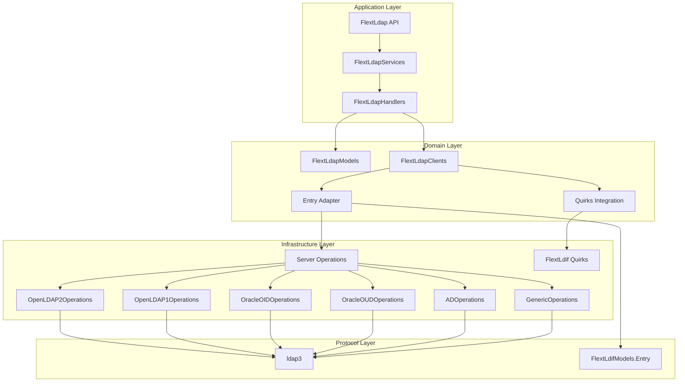

# FLEXT-LDAP

[](https://www.python.org/downloads/)
[](#)
[](#)
[](#)
[](docs/)
[](#)

**Universal LDAP directory services library** for the FLEXT ecosystem, providing enterprise-grade LDAP operations with **server-specific implementations**, **Clean Architecture patterns**, and **zero code duplication**.

> **✅ v0.10.3**: Full compliance with FLEXT ecosystem standards. **Advanced type system patterns** (variance/covariance), **protocol override compatibility**, **complexity reduction techniques**, **zero linting violations** (ruff, mypy, pyrefly), and **maintained public API stability**. See [CLAUDE.md](CLAUDE.md) for development patterns.

## 🚀 What's New in v0.10.0

### Major Improvements

- **🎯 Simplified Architecture**: 18 → 12 root modules (-33% complexity)
- **♻️ Zero Code Duplication**: Removed 850-1,200 LOC duplicating flext-core
- **🏗️ Consistent Patterns**: All modules follow `FlextXxx` namespace class pattern
- **📦 Consolidated Structure**: Nested classes for related functionality
- **🔒 API Stability**: Public API (`FlextLdap`) completely unchanged
- **🐍 Modern Python**: Python 3.13+ type syntax throughout

### Breaking Changes (Internal Only)

Import paths for internal modules have changed. **Public API is unchanged**. See [Migration Guide](docs/refactoring/MIGRATION_GUIDE.md) for details.

```python
# ✅ PUBLIC API - UNCHANGED (no migration needed)
from flext_ldap import FlextLdap, m
ldap = FlextLdap()

# ⚠️ INTERNAL MODULES - Changed (migration required)
# OLD: from flext_ldap.authentication import FlextLdapAuthentication
# NEW: from flext_ldap import FlextLdapClients
#      auth = FlextLdapClients.Authentication()
```

---

## 📚 Documentation

### Quick Links

- **[🚀 Getting Started](#quick-start)** - Installation and basic usage
- **[🏗️ Architecture](#architecture-overview)** - System design and patterns
- **[📖 Migration Guide](docs/refactoring/MIGRATION_GUIDE.md)** - Upgrading from v0.9.0
- **[🔧 Development](#development)** - Contributing and development workflows
- **[🧪 Testing](#testing)** - Test suite and quality gates

### Comprehensive Documentation

- **[Architecture Documentation](docs/architecture/)** - Deep dive into system design
- **[API Reference](docs/api/)** - Complete API documentation
- **[Development Guides](docs/development/)** - Contributing guidelines
- **[Refactoring Documentation](docs/refactoring/)** - v0.10.0 transformation details

---

## 🎯 Purpose and Role in FLEXT Ecosystem

### LDAP Foundation for Enterprise

FLEXT-LDAP serves as the **universal LDAP operations foundation** for all enterprise directory service needs across the FLEXT ecosystem. It provides:

- **Server-Specific Implementations**: Complete support for OpenLDAP 1.x/2.x, Oracle OID/OUD, Active Directory
- **Automatic Quirks Handling**: Server-specific behavior detection and adaptation
- **LDIF Integration**: Seamless integration with flext-ldif for entry processing
- **Clean Architecture**: Domain-driven design with clear layer separation
- **Type Safety**: Strict type checking with Python 3.13+ and Pydantic v2
- **Railway-Oriented Programming**: FlextResult[T] for composable error handling

### Universal LDAP Server Support

#### Complete Implementations (Production-Ready)

| Server               | ACL Format           | Schema DN            | Status        |
| -------------------- | -------------------- | -------------------- | ------------- |
| **OpenLDAP 2.x**     | olcAccess            | cn=subschema         | 🟢 Production |
| **OpenLDAP 1.x**     | access               | cn=subschema         | 🟢 Production |
| **Oracle OID**       | orclaci              | cn=subschemasubentry | 🟢 Production |
| **Oracle OUD**       | ds-privilege-name    | cn=schema            | 🟢 Production |
| **Active Directory** | nTSecurityDescriptor | cn=schema            | 🟢 Production |
| **Generic LDAP**     | N/A                  | cn=subschema         | 🟢 Fallback   |

#### Key Features by Server

- **OpenLDAP 2.x**: cn=config, olcAccess ACLs, complete feature support
- **OpenLDAP 1.x**: slapd.conf, access ACLs, legacy support
- **Oracle OID**: orclaci ACLs, Oracle-specific object classes, VLV support
- **Oracle OUD**: ds-privilege-name ACLs, 389-based with Oracle extensions
- **Active Directory**: LDAP interface, nTSecurityDescriptor ACLs
- **Generic**: RFC-compliant fallback for unknown servers

### Key Responsibilities

1. **Universal LDAP Interface** - Single API for all LDAP server types
2. **Server-Specific Operations** - Complete implementations with quirks handling
3. **FlextLdif Integration** - Universal entry/LDIF handling with server detection
4. **Entry Adapter Pattern** - Bidirectional ldap3 ↔ FlextLdif conversion
5. **Schema Discovery** - Server-specific schema endpoints and parsing
6. **ACL Management** - Server-specific ACL formats and operations
7. **Clean Architecture** - Domain-driven design with infrastructure abstraction

### Integration Points

- **flext-core** → FlextResult, FlextService, x, FlextLogger patterns
- **flext-ldif** → LDIF entry models, quirks detection, server-specific handling
- **ldap3** → Low-level LDAP protocol (wrapped, not exposed to ecosystem)
- **flext-auth** → LDAP authentication provider for SSO systems
- **flext-meltano** → Singer taps/targets for LDAP data integration
- **client-a-oud-mig** → Oracle Unified Directory migration (enterprise tool)

---

## 🏗️ Architecture Overview

### Simplified Module Structure (v0.10.0)

```
flext-ldap/
├── src/flext_ldap/
│   ├── api.py                    # FlextLdap - Public API facade
│   ├── services.py               # FlextLdapServices - Business logic
│   ├── handlers.py               # FlextLdapHandlers - Command/query handlers
│   ├── clients.py                # FlextLdapClients - LDAP protocol wrapper
│   │   # Nested: Authentication, Search
│   ├── models.py                 # FlextLdapModels - Domain models
│   │   # Nested: Domain, Validations
│   ├── schema.py                 # FlextLdapSchema - Schema operations
│   │   # Nested: Sync
│   ├── acl.py                    # FlextLdapAcl - ACL management
│   │   # Nested: Manager, Parsers, Converters
│   ├── entry_adapter.py          # FlextLdapEntryAdapter - ldap3 ↔ flext-ldif
│   ├── quirks_integration.py     # FlextLdapQuirksAdapter - Server detection
│   ├── repositories.py           # Infrastructure repositories
│   ├── config.py                 # Configuration management
│   ├── constants.py              # Domain constants
│   ├── exceptions.py             # Domain exceptions
│   ├── protocols.py              # Protocol definitions
│   ├── typings.py                # Type definitions
│   ├── utilities.py              # Utility functions
│   └── servers/                  # Server-specific implementations
│       ├── base_operations.py    # Abstract server interface
│       ├── factory.py            # Server factory pattern
│       ├── openldap2_operations.py  # OpenLDAP 2.x
│       ├── openldap1_operations.py  # OpenLDAP 1.x
│       ├── oid_operations.py     # Oracle OID
│       ├── oud_operations.py     # Oracle OUD
│       ├── ad_operations.py      # Active Directory
│       ├── generic_operations.py # Generic fallback
│       └── detector.py           # Server type detection
└── tests/
    ├── unit/                     # Unit tests (~50 files)
    ├── integration/              # Integration tests (~15 files)
    └── e2e/                      # End-to-end tests (~2 files)
```

**Key Improvements**:

- **12 root modules** (down from 18)
- **Nested classes** for related functionality
- **Single FlextXxx** class per module
- **Consistent patterns** across all modules

### Clean Architecture Layers



### Module Patterns (v0.10.0)

All modules follow consistent `FlextXxx` namespace class pattern:

```python
# Single namespace class per module
class FlextLdapClients(FlextService[None]):
    """LDAP client operations."""

    class Authentication:
        """Authentication operations."""
        def bind(...): ...

    class Search:
        """Search operations."""
        def search_entries(...): ...

# Usage
from flext_ldap import FlextLdapClients

auth = FlextLdapClients.Authentication()
search = FlextLdapClients.Search()
```

### Key Development Patterns (v0.10.3)

#### Type System - Variance and Covariance

Use `Mapping` instead of `dict` when working with callables for better type compatibility:

```python
from collections.abc import Mapping
from typing import Callable

# ✅ CORRECT - Mapping is covariant, allows structural compatibility
def find_handlers(
    handlers: Mapping[str, Callable[..., FlexibleValue]],
) -> str | None:
    """Accepts dict[str, Callable[..., bool]] because Mapping is covariant."""
    pass

# ❌ INCORRECT - dict is invariant, won't accept subtype compatibility
def find_handlers(
    handlers: dict[str, Callable[..., FlexibleValue]],
) -> str | None:
    """This would NOT accept dict[str, Callable[..., bool]]."""
    pass
```

#### Protocol Override Compatibility

When overriding protocol namespace classes, maintain full backward compatibility using ignore comments:

```python
class Config:
    """Configuration protocols - overrides parent while maintaining compatibility."""

    @runtime_checkable
    class ConnectionConfigProtocol(Protocol):
        host: str
        port: int
```

#### Code Complexity Reduction

Refactor complex methods into focused helper methods to meet ruff limits:

- **C901** (cyclomatic complexity): Must be < 10
- **PLR1702** (nested blocks): Must be < 5

**For more patterns, see [CLAUDE.md](CLAUDE.md)**

---

## 🚀 Quick Start

### Installation

**Production environment:**

```bash
# Via Poetry (recommended)
poetry add flext-ldap

# Via pip
pip install flext-ldap
```

**Development environment:**

```bash
git clone <repository-url>
cd flext-ldap
make setup     # Install dependencies and pre-commit hooks
make validate  # Run quality checks
```

### Basic Usage

**Simple LDAP Search:**

```python
from flext_ldap import FlextLdap, m

def search_users():
    """Search for users in LDAP directory."""
    # Create API instance
    api = FlextLdap()

    # Create search request
    search_request = FlextLdapModels.SearchRequest(
        base_dn="dc=example,dc=com",
        filter_str="(objectClass=person)",
        scope="subtree",
        attributes=["uid", "cn", "mail"]
    )

    # Execute search (returns FlextResult[List[Entry]])
    result = api.search_entries(search_request)

    # Handle result
    if result.is_success:
        entries = result.unwrap()
        for entry in entries:
            print(f"DN: {entry.dn}")
            print(f"Mail: {entry.attributes.get('mail')}")
    else:
        print(f"Search failed: {result.error}")

# Run the search
search_users()
```

**Server-Specific Operations:**

```python
from flext_ldap.servers import OpenLDAP2Operations
import ldap3

def discover_openldap_schema():
    """Discover schema from OpenLDAP 2.x server."""
    # Create server connection
    server = ldap3.Server('ldap://localhost:389')
    connection = ldap3.Connection(
        server,
        user='cn=REDACTED_LDAP_BIND_PASSWORD,dc=example,dc=com',
        password='REDACTED_LDAP_BIND_PASSWORD_password'
    )
    connection.bind()

    # Use server-specific operations
    ops = OpenLDAP2Operations()
    schema_result = ops.discover_schema(connection)

    if schema_result.is_success:
        schema = schema_result.unwrap()
        print(f"Object classes: {len(schema['object_classes'])}")
        print(f"Attribute types: {len(schema['attribute_types'])}")
    else:
        print(f"Schema discovery failed: {schema_result.error}")

    connection.unbind()

discover_openldap_schema()
```

**Entry Conversion (ldap3 ↔ FlextLdif):**

```python
from flext_ldap import FlextLdapEntryAdapter
from flext_ldif import FlextLdifModels

def convert_ldap_entries():
    """Convert between ldap3 and FlextLdif formats."""
    adapter = FlextLdapEntryAdapter()

    # ldap3 → FlextLdif
    ldap3_entry = connection.entries[0]  # From ldap3 search
    ldif_entry_result = adapter.ldap3_to_ldif_entry(ldap3_entry)

    if ldif_entry_result.is_success:
        ldif_entry = ldif_entry_result.unwrap()
        print(f"Converted DN: {ldif_entry.dn.value}")

    # FlextLdif → ldap3
    new_entry = FlextLdifModels.Entry(
        dn=FlextLdifModels.DistinguishedName(value="cn=newuser,dc=example,dc=com"),
        attributes=FlextLdifModels.Attributes(attributes={
            "cn": ["newuser"],
            "objectClass": ["person"]
        })
    )
    attributes_result = adapter.ldif_entry_to_ldap3_attributes(new_entry)

convert_ldap_entries()
```

**ACL Management:**

```python
from flext_ldap import FlextLdapAcl

def manage_acls(connection, server_type):
    """Manage ACLs with server-specific handling."""
    # Use nested ACL classes
    manager = FlextLdapAcl.Manager()
    parsers = FlextLdapAcl.Parsers()
    converters = FlextLdapAcl.Converters()

    # Get ACLs (server-specific)
    acl_result = manager.get_acls(
        connection,
        dn="olcDatabase={1}mdb,cn=config",
        server_type=server_type
    )

    if acl_result.is_success:
        acls = acl_result.unwrap()
        print(f"Found {len(acls)} ACL entries")

        # Parse and convert
        for acl_string in acls:
            parsed = parsers.parse(acl_string, server_type)
            ldif_format = converters.to_ldif_format(parsed)
            print(ldif_format)

manage_acls(connection, "openldap2")
```

---

## 🌐 Server-Specific Features

### OpenLDAP 2.x

```python
from flext_ldap.servers import OpenLDAP2Operations

ops = OpenLDAP2Operations()

# Features
- Schema discovery: cn=subschema
- ACL format: olcAccess
- Configuration: cn=config
- Paged results: ✅ Full support
- VLV: ✅ Full support
- START_TLS: ✅ Supported
```

### Oracle OID

```python
from flext_ldap.servers import OracleOIDOperations

ops = OracleOIDOperations()

# Features
- Schema discovery: cn=subschemasubentry
- ACL format: orclaci
- Oracle-specific object classes
- VLV support: ✅ Full support
- Oracle extensions: ✅ Supported
```

### Oracle OUD

```python
from flext_ldap.servers import OracleOUDOperations

ops = OracleOUDOperations()

# Features
- Schema discovery: cn=schema
- ACL format: ds-privilege-name
- 389 DS based with Oracle extensions
- Advanced replication: ✅ Supported
- Performance optimizations
```

### Active Directory

```python
from flext_ldap.servers import ActiveDirectoryOperations

ops = ActiveDirectoryOperations()

# Features
- Schema discovery: cn=schema
- ACL format: nTSecurityDescriptor
- Paged results: ✅ Supported
- LDAP interface to AD
```

### Feature Comparison

| Feature              | OpenLDAP 2.x | OpenLDAP 1.x | Oracle OID | Oracle OUD      | Active Directory        |
| -------------------- | ------------ | ------------ | ---------- | --------------- | ----------------------- |
| **Schema Discovery** | ✅           | ✅           | ✅         | ✅              | ✅                      |
| **ACL Management**   | ✅ olcAccess | ✅ access    | ✅ orclaci | ✅ ds-privilege | ✅ Security Descriptors |
| **Paged Results**    | ✅           | ✅           | ✅         | ✅              | ✅                      |
| **VLV Support**      | ✅           | ⚠️ Limited   | ✅         | ✅              | ✅                      |
| **START_TLS**        | ✅           | ✅           | ✅         | ✅              | ✅                      |
| **Replication**      | ✅           | ✅           | ✅         | ✅ Advanced     | ✅                      |

---

## 🔧 Development

### Essential Commands

```bash
# Setup and validation
make setup                    # Development environment setup
make validate                 # Complete quality pipeline

# Code quality
make lint                     # Ruff linting (ZERO violations required)
make type-check               # Pyrefly strict type checking
make security                 # Bandit security scanning
make format                   # Code formatting

# Testing
make test                     # Run full test suite
make test-unit                # Unit tests only
make test-integration         # Integration tests (requires Docker)
make test-fast                # Fast tests only
make coverage-html            # Generate HTML coverage report

# Docker LDAP test server
make ldap-start               # Start OpenLDAP test container
make ldap-stop                # Stop test container
make ldap-health              # Check server health
make ldap-clean               # Clean and reset

# Build and cleanup
make build                    # Build package
make clean                    # Clean build artifacts
make clean-all                # Deep clean including venvs
```

### Quality Gates

**ZERO TOLERANCE** standards:

- **Coverage**: 42% current (targeting 100%, focus on services/operations.py 15%, services/detection.py 19%, services/sync.py 29%, utilities.py 27%)
- **Type Checking**: 
  - Pyrefly strict mode - ZERO errors
  - MyPy strict mode - ZERO errors
  - Pyright - ZERO errors, ZERO warnings
- **Linting**: Ruff - ZERO violations
- **Security**: Bandit - ZERO critical issues
- **Tests**: All tests passing (NO skipped tests)
- **Test Infrastructure**: 
  - NO Python modules in `tests/fixtures/*.py`
  - Use `tests/helpers/` for all test code
  - Use `conftest.py` and `flext_tests` patterns

### Development Standards

- **Railway-Oriented Programming**: Use `r[T]` alias for `FlextResult[T]` for all operations
- **Type Safety**: Complete type annotations with Python 3.13+ syntax, avoid `object` and `dict[str, object]`
- **Clean Architecture**: Respect layer boundaries (no infrastructure leakage)
- **Pydantic v2**: Use native types (PositiveInt, EmailStr, etc.)
- **No Duplication**: Never duplicate flext-core functionality
- **Protocol Compatibility**: Protocols and concrete types work transparently without casts
- **Override Compatibility**: All method overrides maintain backward compatibility (no bad-override)
- **Short Names**: All short aliases (`r`, `t`, `c`, `m`, `p`, `u`, `e`, `d`, `x`, `h`, `s`) work without lint complaints
- **Test Infrastructure**: Use `tests/helpers/` for test code, `tests/fixtures/` only for non-Python files
- **No Skipped Tests**: Use `pytest.fail()` for infrastructure failures, create test data for missing data

---

## 🧪 Testing

### Test Structure

```
tests/
├── conftest.py              # All fixtures and pytest configuration (ONLY ONE)
├── base.py                  # TestsFlextLdapServiceBase (extends FlextService, provides 's')
├── constants.py             # TestsFlextLdapConstants (extends FlextTestsConstants + FlextLdapConstants, provides 'c')
├── typings.py               # TestsFlextLdapTypes (extends FlextTestsTypes + FlextLdapTypes, provides 't')
├── models.py                # TestsFlextLdapModels (extends FlextLdapModels, provides 'm')
├── protocols.py             # TestsFlextLdapProtocols (extends FlextTestsProtocols + FlextLdapProtocols, provides 'p')
├── utilities.py             # TestsFlextLdapUtilities (extends FlextTestsUtilities + FlextLdapUtilities, provides 'u')
├── __init__.py              # Exports t, c, p, m, u, s, e, r, d, x
├── helpers/                 # flext-ldap specific test helpers (NOT fixtures)
│   └── operation_helpers.py # TestsFlextLdapOperationHelpers (uses conftest.py and flext_tests)
├── fixtures/                # NON-PYTHON files only (JSON, LDIF, etc.)
│   ├── test_users.json
│   ├── test_groups.json
│   └── test_base.ldif
├── unit/                    # Unit tests (one class per module, prefix TestsFlextLdap)
│   └── test_operations.py  # TestsFlextLdapOperations class
└── integration/             # Integration tests (one class per module, prefix TestsFlextLdap)
    └── test_api.py          # TestsFlextLdapApi class
```

**Test Class Pattern (MANDATORY)**:
- One class per test module, prefixed with `TestsFlextLdap`
- Use `t, c, p, m, u, s` for test support (from `tests` module)
- Use `e, r, d, x` from flext-core directly
- NO skipped tests - Use `pytest.fail()` for infrastructure failures
- NO Python modules in `tests/fixtures/*.py` - Use `tests/helpers/` instead

### Test Commands

```bash
# Run all tests
make test

# Specific test categories
pytest -m unit                # Unit tests only
pytest -m integration         # Integration tests (Docker required)
pytest -m ldap                # LDAP-specific tests
pytest -m "not slow"          # Fast tests only

# Single test execution
pytest tests/unit/test_api.py::TestFlextLdapApi::test_search -v

# Coverage
pytest --cov=src/flext_ldap --cov-report=html
make coverage-html
```

### Docker Test Environment

**OpenLDAP Test Server:**

```bash
# Start container (osixia/openldap:1.5.0)
make ldap-start

# Container details:
- Port: 3390 (non-standard to avoid conflicts)
- Domain: dc=flext,dc=local
- Admin DN: cn=REDACTED_LDAP_BIND_PASSWORD,dc=flext,dc=local
- Admin Password: REDACTED_LDAP_BIND_PASSWORD123

# Health check
make ldap-health

# Search test data
make ldap-search

# Clean and restart
make ldap-reset
```

### Test Markers

Use pytest markers to control test execution:

```python
@pytest.mark.unit              # Fast unit tests
@pytest.mark.integration       # Integration tests
@pytest.mark.docker            # Requires Docker
@pytest.mark.ldap              # LDAP-specific
@pytest.mark.slow              # Slow tests (> 5 seconds)
@pytest.mark.e2e               # End-to-end workflows
```

---

## 📊 Project Statistics

### Quality Metrics (v0.10.0)

- **Test Suite**: 7 unit test files (targeting 100% coverage)
- **Test Coverage**: 42% (targeting 100%, focus on services/operations.py 15%, services/detection.py 19%, services/sync.py 29%, utilities.py 27%)
- **Code Base**: ~2,800-3,150 LOC (reduced from ~4,000)
- **Modules**: 12 root modules (down from 18)
- **Lint Status**: Zero violations (Ruff)
- **Type Safety**: Pyrefly strict mode - Zero errors
- **Code Duplication**: 0 LOC (removed 850-1,200 LOC)

### Architecture Metrics

| Metric         | v0.9.0 | v0.10.0      | Improvement |
| -------------- | ------ | ------------ | ----------- |
| Root Modules   | 18     | 12           | -33%        |
| Subdirectories | 2      | 1            | -50%        |
| Test Files     | 87     | ~60          | -31%        |
| Duplicate LOC  | ~1,200 | 0            | -100%       |
| Total LOC      | ~4,000 | ~2,800-3,150 | -28-30%     |

### Implementation Status

**Complete**:

- ✅ Universal LDAP interface
- ✅ Server-specific operations (6 servers)
- ✅ FlextLdif integration
- ✅ Entry adapter pattern
- ✅ Clean Architecture layers
- ✅ Zero code duplication
- ✅ Consistent module patterns
- ✅ Python 3.13+ type syntax

**In Progress**:

- 🔄 Test coverage expansion (42% → 100%)
- 🔄 Active Directory enhancements
- 🔄 Performance optimization

---

## 🗺️ Roadmap

### Current Release (v0.10.0) - Architecture Refactoring

✅ **Complete**:

- Simplified architecture (18 → 12 modules)
- Zero code duplication with flext-core
- Consistent FlextXxx module patterns
- Nested classes for related functionality
- Python 3.13+ type syntax throughout
- Public API stability maintained

### Next Release (v0.10.1) - Test Coverage Enhancement

🎯 **Planned**:

- Expand test coverage (42% → 100%)
- Real LDAP functionality tests
- Integration test expansion
- Performance benchmarks

### Future Release (v1.0.0) - Production Hardening

🔮 **Future**:

- Active Directory feature completion
- Connection pooling and retry mechanisms
- Performance optimization for large directories
- Comprehensive monitoring and observability
- Production deployment guides

---

## 📚 Additional Documentation

### Core Documentation

- **[Migration Guide](docs/refactoring/MIGRATION_GUIDE.md)** - Upgrading from v0.9.0 to v0.10.0
- **[Refactoring Plan](docs/refactoring/REFACTORING_PLAN.md)** - v0.10.0 transformation details
- **[Architecture Changes](docs/refactoring/ARCHITECTURE_CHANGES.md)** - Before/after comparison
- **[Step-by-Step Guide](docs/refactoring/STEP_BY_STEP_GUIDE.md)** - Implementation execution

### Extended Documentation

- **[Architecture Deep-Dive](docs/architecture/)** - Comprehensive architecture documentation
- **[API Reference](docs/api/)** - Complete API documentation
- **[Development Guides](docs/development/)** - Contributing and development workflows
- **[Server Operations](docs/server-operations.md)** - Server-specific implementations
- **[ACL Management](docs/ACL_MANAGEMENT.md)** - Server-specific ACL handling
- **[Troubleshooting](docs/troubleshooting.md)** - Common issues and solutions

---

## 🤝 Contributing

### FLEXT Compliance Checklist

- [ ] Use FlextResult[T] for all operations (no exceptions)
- [ ] Follow Clean Architecture layer separation
- [ ] Use x inherited properties (logger, config, container)
- [ ] Implement domain entities with Pydantic v2
- [ ] Follow Python 3.13+ type syntax
- [ ] Use Pydantic native types (PositiveInt, EmailStr, etc.)
- [ ] Pass all quality gates: `make validate`

### Quality Standards

**MANDATORY before commits**:

```bash
make validate    # Must pass: lint + type-check + security + test
```

**Code standards**:

- Line length: 88 characters (Ruff default)
- Type annotations: Complete, strict (Pyrefly)
- Test coverage: 100% for all features (pragmas only for untestable code)
- Documentation: Google-style docstrings

### Contribution Workflow

1. **Fork and clone** the repository
2. **Create feature branch** from `main`
3. **Make changes** following standards
4. **Run quality gates**: `make validate`
5. **Run tests**: `make test`
6. **Create pull request** with clear description

---

## 📄 License

MIT License - see [LICENSE](LICENSE) for details.

---

## 🆘 Support

### Resources

- **Documentation**: [docs/](docs/)
- **Migration Guide**: [docs/refactoring/MIGRATION_GUIDE.md](docs/refactoring/MIGRATION_GUIDE.md)
- **Issues**: [GitHub Issues](https://github.com/flext/flext-ldap/issues)
- **Discussions**: [GitHub Discussions](https://github.com/flext/flext-ldap/discussions)

### Reporting Issues

When reporting issues, please include:

- flext-ldap version (`pip show flext-ldap`)
- Python version (`python --version`)
- Error messages and stack traces
- Minimal reproducible example
- Operating system and LDAP server type

### Security

Report security issues privately to maintainers. Do not open public issues for security vulnerabilities.

---

**flext-ldap v0.10.0** - Universal LDAP directory services with Clean Architecture, server-specific implementations, and zero code duplication.

**Mission**: Provide reliable, maintainable LDAP operations for enterprise directory service integration across the FLEXT ecosystem.

**Status**: Production-ready with comprehensive server support (OpenLDAP 1.x/2.x, Oracle OID/OUD, Active Directory), zero code duplication, and consistent architecture patterns.
