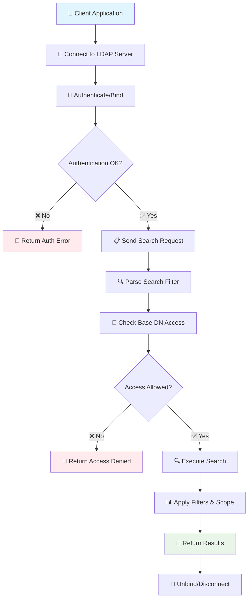
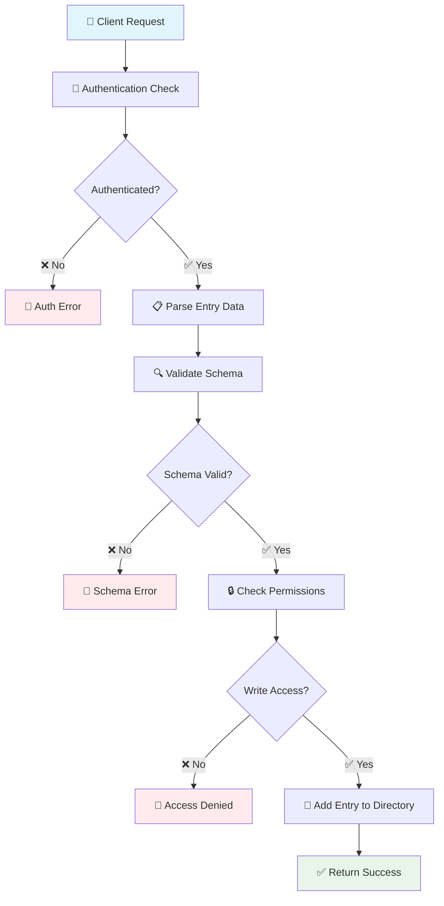
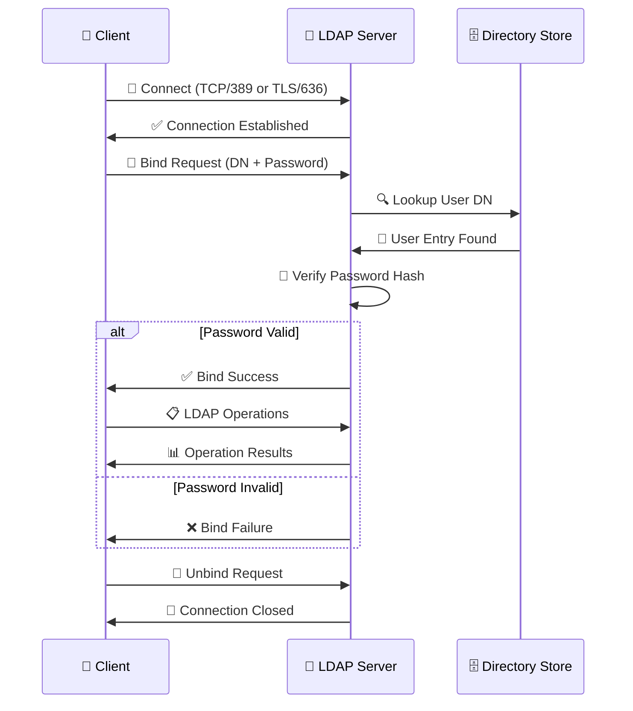
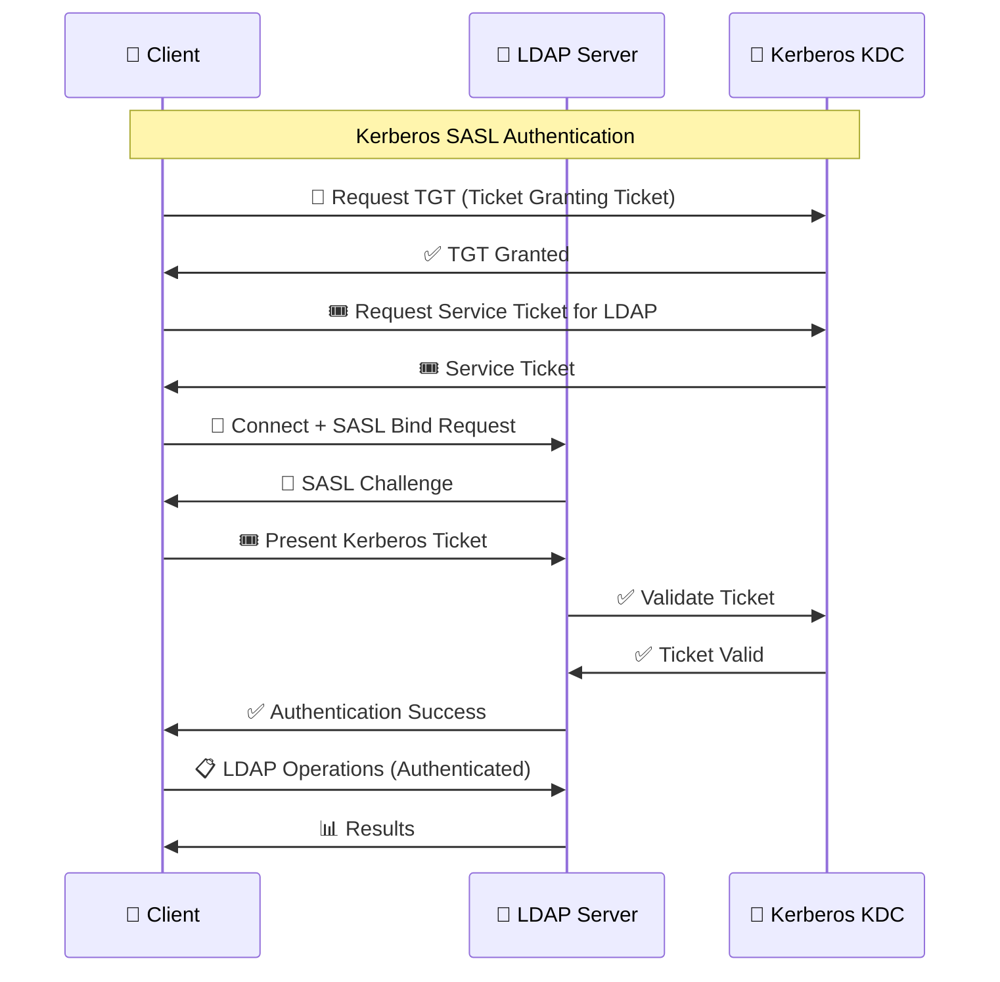
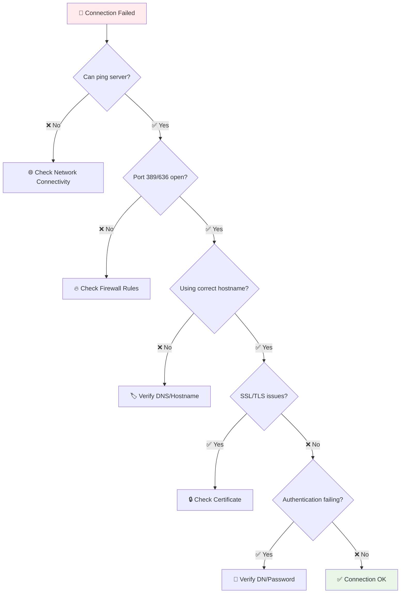
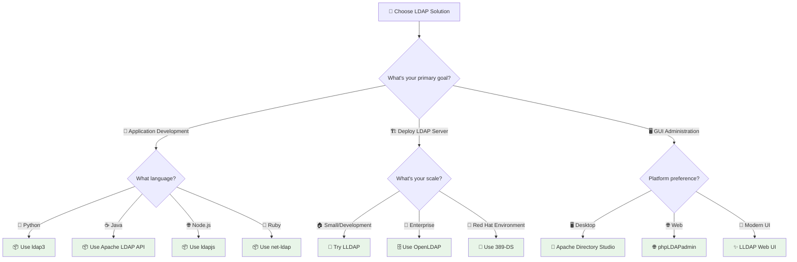
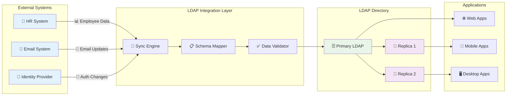

# 📊 LDAP Visual Guides & Diagrams

> **Understand LDAP concepts through visual diagrams and flowcharts**

[](https://visual-ldap.com)
[](https://ldap-diagrams.com)
[](https://ldap-flows.com)

**Learn LDAP faster with visual guides!** Complex LDAP concepts explained through clear diagrams, flowcharts, and visual representations that make understanding immediate and intuitive.

## 🎯 Visual Quick Navigation

| 📊 **Diagram Type**                                       | 🎯 **Best For**         | ⏱️ **Study Time** |
| :-------------------------------------------------------- | :---------------------- | :---------------- |
| [🏗️ LDAP Architecture](#-ldap-architecture-diagrams)      | Understanding structure | 10 minutes        |
| [🔄 Operation Flows](#-ldap-operation-flows)              | Learning processes      | 15 minutes        |
| [🗂️ Schema Relationships](#-schema-relationship-diagrams) | Data modeling           | 20 minutes        |
| [🔐 Security Models](#-security--authentication-diagrams) | Security design         | 15 minutes        |
| [🌐 Network Topology](#-network-topology-diagrams)        | Deployment planning     | 25 minutes        |
| [📈 Decision Trees](#-decision-trees--troubleshooting)    | Problem solving         | 10 minutes        |

## 🏗️ LDAP Architecture Diagrams

### 📋 **High-Level LDAP Directory Structure**

```
📁 LDAP Directory Tree (DIT)
│
├── 🌐 dc=example,dc=com (Domain Root)
│   │
│   ├── 👥 ou=people (Organizational Unit - Users)
│   │   ├── 👤 cn=john.doe (User Entry)
│   │   ├── 👤 cn=jane.smith (User Entry)
│   │   └── 👤 cn=bob.wilson (User Entry)
│   │
│   ├── 👨‍👩‍👧‍👦 ou=groups (Organizational Unit - Groups)
│   │   ├── 🏷️ cn=developers (Group Entry)
│   │   ├── 🏷️ cn=managers (Group Entry)
│   │   └── 🏷️ cn=admins (Group Entry)
│   │
│   ├── 🏢 ou=departments (Organizational Unit - Departments)
│   │   ├── 💻 ou=engineering (Department)
│   │   ├── 💰 ou=finance (Department)
│   │   └── 📈 ou=marketing (Department)
│   │
│   └── 🔧 ou=services (Organizational Unit - Services)
       ├── 🌐 cn=web-server (Service Account)
       ├── 🗄️ cn=database (Service Account)
       └── 📧 cn=mail-server (Service Account)
```

### 🔗 **LDAP Client-Server Architecture**

```
🖥️  LDAP Client                    🏢 LDAP Server
┌─────────────────┐                ┌─────────────────┐
│  📱 Application  │◄──── TCP ────►│  🗄️  Directory   │
│                 │     389/636    │                 │
│ ┌─────────────┐ │                │ ┌─────────────┐ │
│ │ LDAP Library│ │                │ │   Schema    │ │
│ │  (ldap3)    │ │                │ │ Validation  │ │
│ └─────────────┘ │                │ └─────────────┘ │
│                 │                │                 │
│ ┌─────────────┐ │                │ ┌─────────────┐ │
│ │ TLS/SSL     │ │                │ │ Access      │ │
│ │ Security    │ │                │ │ Control     │ │
│ └─────────────┘ │                │ └─────────────┘ │
└─────────────────┘                └─────────────────┘
```

### 🌟 **LDAP Protocol Stack**

```
Application Layer    📱 User Applications
                    ├── 🐍 Python ldap3
                    ├── ☕ Java Apache LDAP API
                    ├── 🌐 Node.js ldapjs
                    └── 💎 Ruby net-ldap

LDAP Protocol       🔌 LDAP v3 (RFC 4511)
                    ├── 🔍 Search Operations
                    ├── ➕ Add Operations
                    ├── ✏️  Modify Operations
                    └── ❌ Delete Operations

Transport Layer     🚛 TCP/IP
                    ├── 📡 Port 389 (Plain)
                    └── 🔒 Port 636 (SSL/TLS)

Network Layer       🌐 IP Networking
                    ├── 🏠 Local Network
                    ├── 🌍 Internet
                    └── 🔐 VPN Tunnels
```

## 🔄 LDAP Operation Flows

### 🔍 **Search Operation Flow**



### ➕ **Add Operation Flow**



### 🔐 **Authentication Flow**



## 🗂️ Schema Relationship Diagrams

### 👤 **Person Object Class Hierarchy**

```
🏷️ Object Classes Inheritance
│
├── 🔝 top (Abstract)
│   │
│   ├── 👤 person (Structural)
│   │   ├── 📋 Required: cn, sn
│   │   └── 📝 Optional: description, telephoneNumber
│   │   │
│   │   ├── 🌐 inetOrgPerson (Structural)
│   │   │   ├── 📋 Inherits: cn, sn
│   │   │   ├── 📝 Adds: mail, givenName, uid
│   │   │   └── 🔧 Optional: employeeNumber, manager
│   │   │
│   │   └── 🏢 organizationalPerson (Structural)
│   │       ├── 📋 Inherits: cn, sn
│   │       └── 📝 Adds: title, ou, postalAddress
│   │
│   └── 👥 groupOfNames (Structural)
│       ├── 📋 Required: cn, member
│       └── 📝 Optional: description, owner
```

### 🔗 **Attribute Syntax Types**

```
📝 LDAP Attribute Syntaxes
│
├── 🔤 String Types
│   ├── 📄 Directory String (UTF-8)
│   ├── 🏷️ IA5 String (ASCII)
│   ├── 🔢 Numeric String (0-9, space)
│   └── 📞 Printable String (A-Z, 0-9, space, ())
│
├── 🏷️ Distinguished Names
│   ├── 👤 DN (Distinguished Name)
│   └── 🔗 Name and Optional UID
│
├── 🔢 Numeric Types
│   ├── 🔢 Integer
│   ├── 📏 Boolean (TRUE/FALSE)
│   └── ⏰ Generalized Time (YYYYMMDDHHMMSSZ)
│
├── 📦 Binary Types
│   ├── 🔑 Certificate
│   ├── 🖼️ JPEG Photo
│   └── 📄 Octet String (Raw Binary)
│
└── 🔍 Special Types
    ├── 🏢 Object Identifier (OID)
    ├── ☎️ Telephone Number
    └── 📧 Postal Address
```

## 🔐 Security & Authentication Diagrams

### 🛡️ **LDAP Security Layers**

```
🔒 LDAP Security Architecture
│
├── 🌐 Network Security
│   ├── 🔐 TLS/SSL Encryption (Port 636)
│   ├── 🚇 VPN Tunneling
│   ├── 🔥 Firewall Rules
│   └── 🏠 Network Segmentation
│
├── 🔐 Authentication Methods
│   ├── 🔑 Simple Bind (Username/Password)
│   ├── 🎫 SASL Mechanisms
│   │   ├── 🔐 DIGEST-MD5
│   │   ├── 🎟️ Kerberos (GSSAPI)
│   │   └── 🔑 EXTERNAL (Certificates)
│   └── 👥 Anonymous Bind (Limited)
│
├── 🛡️ Authorization Controls
│   ├── 📋 Access Control Lists (ACL)
│   ├── 👤 User-based Permissions
│   ├── 👥 Group-based Permissions
│   ├── 📍 Location-based Access
│   └── ⏰ Time-based Restrictions
│
└── 🔍 Audit & Monitoring
    ├── 📊 Access Logging
    ├── 🚨 Failed Attempt Monitoring
    ├── 📈 Performance Metrics
    └── 🔔 Security Alerts
```

### 🎫 **SASL Authentication Flow**



## 🌐 Network Topology Diagrams

### 🏢 **Enterprise LDAP Deployment**

```
🌐 Enterprise LDAP Network Topology
│
├── 🔒 DMZ (Demilitarized Zone)
│   ├── 🌐 LDAP Proxy/Load Balancer
│   │   ├── 📡 Port 389/636 External
│   │   └── 🔄 Routes to Internal LDAP
│   └── 🔥 Firewall Rules
│
├── 🏢 Internal Network
│   ├── 🗄️ Primary LDAP Server (Master)
│   │   ├── 💾 Directory Database
│   │   ├── 📋 Schema Definitions
│   │   └── 🔐 Authentication Authority
│   │
│   ├── 🔄 Secondary LDAP Servers (Replicas)
│   │   ├── 📡 Read-Only Replicas
│   │   ├── 🔄 Multi-Master Setup
│   │   └── 📊 Load Distribution
│   │
│   └── 👥 Client Applications
│       ├── 🌐 Web Applications
│       ├── 📧 Email Servers
│       ├── 🖥️ Desktop Applications
│       └── 📱 Mobile Apps
│
└── 🔧 Management Network
    ├── 🖥️ Admin Workstations
    ├── 📊 Monitoring Tools
    ├── 📋 Backup Systems
    └── 🔧 Configuration Management
```

### 🔄 **LDAP Replication Topology**

```
🔄 Multi-Master LDAP Replication
│
       🏢 Data Center 1
    ┌────────────────────┐
    │  🗄️ LDAP Master A   │
    │  ├── 📊 Read/Write  │◄──────┐
    │  └── 🔄 Replication │       │
    └────────────────────┘       │
              │                  │
              │ 🔄 Sync          │ 🔄 Sync
              ▼                  │
    ┌────────────────────┐       │
    │  🗄️ LDAP Master B   │       │
    │  ├── 📊 Read/Write  │───────┘
    │  └── 🔄 Replication │
    └────────────────────┘
       🏢 Data Center 2

Benefits:
✅ High Availability
✅ Load Distribution
✅ Geographic Distribution
✅ Disaster Recovery
```

## 📈 Decision Trees & Troubleshooting

### 🔍 **LDAP Connection Troubleshooting**



### 🔍 **Search Result Troubleshooting**

```mermaid
graph TD
    A[🔍 No Search Results] --> B{Base DN correct?}
    B -->|❌ No| C[🏷️ Fix Base DN]
    B -->|✅ Yes| D{Search scope appropriate?}
    D -->|❌ No| E[📏 Adjust Scope (base/one/sub)]
    D -->|✅ Yes| F{Filter syntax correct?}
    F -->|❌ No| G[📝 Fix Filter Syntax]
    F -->|✅ Yes| H{Sufficient permissions?}
    H -->|❌ No| I[🔐 Check ACLs]
    H -->|✅ Yes| J{Attributes exist?}
    J -->|❌ No| K[📋 Verify Attribute Names]
    J -->|✅ Yes| L[✅ Results Found]

    style A fill:#ffebee
    style L fill:#e8f5e8
```

### 🎯 **LDAP Implementation Decision Tree**



## 📊 Performance & Capacity Planning

### 📈 **LDAP Performance Metrics**

```
📊 LDAP Performance Dashboard
│
├── 🔍 Search Performance
│   ├── ⚡ < 50ms  : Excellent (A+)
│   ├── ⚡ 50-200ms: Good (A)
│   ├── 🟡 200ms-1s: Acceptable (B)
│   └── 🔴 > 1s    : Needs Optimization (C)
│
├── 🔗 Connection Metrics
│   ├── 📊 Concurrent Connections: 1000+
│   ├── 🔄 Connection Pool Usage: 85%
│   ├── ⏱️ Connection Setup Time: < 10ms
│   └── 💾 Memory per Connection: < 50KB
│
├── 🏷️ Directory Size Impact
│   ├── 📋 < 10k entries   : Minimal impact
│   ├── 📋 10k - 100k     : Indexing required
│   ├── 📋 100k - 1M      : Advanced optimization
│   └── 📋 > 1M entries   : Partitioning recommended
│
└── 🔧 Optimization Strategies
    ├── 📊 Proper Indexing (cn, mail, uid)
    ├── 🔍 Efficient Search Filters
    ├── 📄 Paged Results for Large Sets
    ├── 🔄 Connection Pooling
    └── 📦 Caching Strategies
```

### 💾 **Capacity Planning Matrix**

```
📋 LDAP Capacity Planning Guide
│
├── 👥 User Count Based Sizing
│   ├── 🏠 Small (< 1k users)
│   │   ├── 💾 RAM: 2GB
│   │   ├── 💿 Storage: 10GB
│   │   └── 🖥️ CPU: 2 cores
│   │
│   ├── 🏢 Medium (1k - 10k users)
│   │   ├── 💾 RAM: 8GB
│   │   ├── 💿 Storage: 100GB
│   │   └── 🖥️ CPU: 4 cores
│   │
│   └── 🏭 Large (> 10k users)
│       ├── 💾 RAM: 16GB+
│       ├── 💿 Storage: 500GB+
│       └── 🖥️ CPU: 8+ cores
│
└── 🔄 Scalability Patterns
    ├── 📊 Read Replicas for Load Distribution
    ├── 🌍 Geographic Distribution
    ├── 🔄 Multi-Master for High Availability
    └── 📦 Horizontal Partitioning (Sharding)
```

## 🎨 Schema Design Patterns

### 👤 **User Management Patterns**

```
👥 User Management Schema Design
│
├── 👤 Standard User Entry
│   ├── 🏷️ dn: uid=jdoe,ou=people,dc=company,dc=com
│   ├── 📋 objectClass: inetOrgPerson, organizationalPerson, person
│   ├── 👤 uid: jdoe (Unique Identifier)
│   ├── 📧 mail: john.doe@company.com
│   ├── 👤 cn: John Doe (Common Name)
│   ├── 👤 sn: Doe (Surname)
│   ├── 👤 givenName: John
│   ├── 🏢 employeeNumber: 12345
│   ├── 📞 telephoneNumber: +1-555-0123
│   └── 👔 title: Software Engineer
│
├── 👥 Group Membership Pattern
│   ├── 🏷️ dn: cn=developers,ou=groups,dc=company,dc=com
│   ├── 📋 objectClass: groupOfNames
│   ├── 🏷️ cn: developers
│   ├── 📝 description: Development Team
│   ├── 👤 member: uid=jdoe,ou=people,dc=company,dc=com
│   ├── 👤 member: uid=jsmith,ou=people,dc=company,dc=com
│   └── 👑 owner: uid=manager,ou=people,dc=company,dc=com
│
└── 🔐 Service Account Pattern
    ├── 🏷️ dn: cn=app-service,ou=services,dc=company,dc=com
    ├── 📋 objectClass: organizationalRole
    ├── 🏷️ cn: app-service
    ├── 📝 description: Application Service Account
    ├── 🔐 userPassword: {SSHA}encrypted-hash
    └── 📧 mail: app-service@company.com
```

### 🏢 **Organizational Structure Patterns**

```
🏢 Organizational Structure Design
│
├── 🌍 Geographic Structure
│   ├── 🏷️ ou=americas,dc=company,dc=com
│   │   ├── 🏷️ ou=usa,ou=americas,dc=company,dc=com
│   │   └── 🏷️ ou=canada,ou=americas,dc=company,dc=com
│   └── 🏷️ ou=europe,dc=company,dc=com
│       ├── 🏷️ ou=uk,ou=europe,dc=company,dc=com
│       └── 🏷️ ou=germany,ou=europe,dc=company,dc=com
│
├── 🏢 Departmental Structure
│   ├── 🏷️ ou=engineering,dc=company,dc=com
│   │   ├── 👥 ou=people,ou=engineering,dc=company,dc=com
│   │   └── 👥 ou=groups,ou=engineering,dc=company,dc=com
│   └── 🏷️ ou=marketing,dc=company,dc=com
│       ├── 👥 ou=people,ou=marketing,dc=company,dc=com
│       └── 👥 ou=groups,ou=marketing,dc=company,dc=com
│
└── 🔄 Hybrid Structure (Recommended)
    ├── 👥 ou=people,dc=company,dc=com (All Users)
    ├── 👥 ou=groups,dc=company,dc=com (All Groups)
    ├── 🔧 ou=services,dc=company,dc=com (Service Accounts)
    └── 🏢 ou=departments,dc=company,dc=com (Department Info)
```

## 🔄 Data Flow Diagrams

### 📊 **LDAP Data Synchronization Flow**



## 🎯 Implementation Roadmap

### 🗺️ **LDAP Project Implementation Timeline**

```
📅 LDAP Implementation Roadmap (12-Week Timeline)
│
├── 🏁 Week 1-2: Planning & Design
│   ├── 📋 Requirements Gathering
│   ├── 🏗️ Architecture Design
│   ├── 🗂️ Schema Planning
│   └── 🔧 Tool Selection
│
├── 🔧 Week 3-4: Environment Setup
│   ├── 🖥️ Server Installation
│   ├── 🌐 Network Configuration
│   ├── 🔒 Security Setup
│   └── 🧪 Test Environment
│
├── 📊 Week 5-6: Schema Implementation
│   ├── 🗂️ Schema Design
│   ├── ✅ Schema Validation
│   ├── 📋 Test Data Loading
│   └── 🔍 Search Testing
│
├── 🔗 Week 7-8: Application Integration
│   ├── 📱 Client Applications
│   ├── 🔐 Authentication Setup
│   ├── 👥 User Management
│   └── 🧪 Integration Testing
│
├── 🚀 Week 9-10: Production Deployment
│   ├── 📦 Production Setup
│   ├── 🔄 Data Migration
│   ├── 📊 Performance Tuning
│   └── 🔒 Security Hardening
│
└── ✅ Week 11-12: Go-Live & Support
    ├── 🎯 User Training
    ├── 📖 Documentation
    ├── 📊 Monitoring Setup
    └── 🔧 Support Procedures
```

---

**🎯 Visual Learning Complete!** These diagrams provide a comprehensive visual understanding of LDAP concepts, from basic architecture to complex enterprise deployments.

**📚 Next Steps:**

- **[⚡ Quick Start Guide](DEVELOPER_QUICK_START.md)** - Start coding immediately
- **[📖 Complete Documentation](README.md)** - Deep dive into LDAP
- **[🛠️ Implementation Hub](reference/README.md)** - Choose your tools

**🎨 Want more visuals?** Each implementation in our [reference collection](reference/README.md) includes architecture diagrams and visual guides specific to that technology.

---

**Last Updated**: 2025-06-24
**Diagrams**: 15+ comprehensive visual guides
**Coverage**: Architecture, operations, security, troubleshooting
**Status**: ✅ Complete visual learning system
