# 🔐 LDAP Core Shared - API Documentation

**Complete API Reference for Enterprise LDAP Operations**

This documentation provides comprehensive coverage of all modules, classes, and functions in the ldap-core-shared library. Each component is documented with detailed explanations, parameters, return types, and practical examples.

## 📋 Table of Contents

### 🏗️ Core Modules
- [🔗 Connection Management](core/connection-management.md) - Enterprise connection pooling and management
- [⚙️ LDAP Operations](core/operations.md) - CRUD operations with transaction support
- [🔍 Search Engine](core/search-engine.md) - Advanced search with caching and pagination
- [🔒 Security](core/security.md) - SSH tunnels and authentication management

### 📊 Domain Models
- [📋 Result Types](domain/results.md) - Comprehensive typed result classes
- [🏗️ Domain Models](domain/models.md) - Core domain entities and value objects
- [🎯 Value Objects](domain/value-objects.md) - Immutable value objects for LDAP data

### 📄 LDIF Processing
- [📝 LDIF Processor](ldif/processor.md) - Standards-compliant LDIF parsing
- [✍️ LDIF Writer](ldif/writer.md) - Advanced LDIF generation and formatting
- [✅ LDIF Validator](ldif/validator.md) - Comprehensive validation and error checking
- [📊 LDIF Analyzer](ldif/analyzer.md) - Content analysis and data quality assessment
- [🔄 LDIF Transformer](ldif/transformer.md) - Entry filtering and transformation
- [🔗 LDIF Merger](ldif/merger.md) - Multiple file merging with conflict resolution

### 🗂️ Schema Management
- [🔍 Schema Discovery](schema/discovery.md) - Auto-discover schemas from LDAP servers
- [📋 Schema Parser](schema/parser.md) - RFC 2252 compliant schema parsing
- [✅ Schema Validator](schema/validator.md) - Enterprise-grade schema validation
- [📊 Schema Comparator](schema/comparator.md) - Schema comparison and difference analysis
- [🔄 Schema Migrator](schema/migrator.md) - Migration planning and LDIF generation
- [📈 Schema Analyzer](schema/analyzer.md) - Advanced schema analysis and optimization

### 🛠️ Utilities
- [📋 Constants](utils/constants.md) - Comprehensive LDAP constants and configurations
- [📈 Performance Monitoring](utils/performance.md) - Real-time metrics and analysis
- [🔧 LDAP Helpers](utils/helpers.md) - DN manipulation, filter building, data conversion
- [📝 Logging](utils/logging.md) - Enterprise logging and audit trails

### 🎯 Events
- [📡 Domain Events](events/domain-events.md) - Event-driven architecture support
- [🎯 Event Handlers](events/handlers.md) - Event processing and routing

## 🚀 Quick Start

### Basic Usage Example

```python
from ldap_core_shared.core import LDAPConnectionManager, LDAPOperations
from ldap_core_shared.core.connection_manager import ConnectionInfo

# Create connection configuration
conn_info = ConnectionInfo(
    host="ldap.example.com",
    port=389,
    bind_dn="cn=admin,dc=example,dc=com",
    password="password"
)

# Initialize connection manager and operations
manager = LDAPConnectionManager()
operations = LDAPOperations(manager)

# Perform search operation
result = operations.search_entries(
    base_dn="ou=people,dc=example,dc=com",
    search_filter="(objectClass=person)"
)

print(f"Found {result.entries_found} entries")
for entry in result.entries:
    print(f"DN: {entry['dn']}")
```

### Advanced Operations

```python
from ldap_core_shared.ldif import LDIFProcessor, LDIFAnalyzer
from ldap_core_shared.schema import SchemaDiscovery, SchemaComparator
from ldap_core_shared.utils.performance import PerformanceMonitor

# LDIF Processing
processor = LDIFProcessor()
analyzer = LDIFAnalyzer()

ldif_result = processor.parse_file("data.ldif")
analysis = analyzer.analyze_entries(ldif_result.entries)

# Schema Management  
discovery = SchemaDiscovery()
comparator = SchemaComparator()

schema = discovery.discover_from_server(conn_info)
differences = comparator.compare_schemas(source_schema, target_schema)

# Performance Monitoring
monitor = PerformanceMonitor()
with monitor.track_operation("bulk_import"):
    # Perform operations
    pass
```

## 🏗️ Architecture Overview

The ldap-core-shared library follows enterprise architecture principles:

### 🎯 **Core Design Principles**
- **Zero Tolerance**: Comprehensive typing and validation
- **Enterprise Grade**: Production-ready with monitoring and metrics
- **Domain-Driven Design**: Clear separation of concerns
- **Performance First**: Optimized for high-throughput operations
- **RFC Compliant**: Standards-compliant implementations

### 📊 **Module Organization**

```mermaid
graph TD
    A[Core Modules] --> B[Connection Management]
    A --> C[LDAP Operations]
    A --> D[Search Engine] 
    A --> E[Security]
    
    F[Domain Layer] --> G[Result Types]
    F --> H[Domain Models]
    F --> I[Value Objects]
    
    J[LDIF Processing] --> K[Processor]
    J --> L[Writer]
    J --> M[Validator]
    J --> N[Analyzer]
    J --> O[Transformer]
    J --> P[Merger]
    
    Q[Schema Management] --> R[Discovery]
    Q --> S[Parser]
    Q --> T[Validator]
    Q --> U[Comparator]
    Q --> V[Migrator]
    Q --> W[Analyzer]
    
    X[Utilities] --> Y[Constants]
    X --> Z[Performance]
    X --> AA[Helpers]
    X --> BB[Logging]
```



### 🔄 **Data Flow**

1. **Connection Layer**: Manages LDAP connections with pooling and health monitoring
2. **Operation Layer**: Handles CRUD operations with transaction support
3. **Domain Layer**: Provides typed results and domain models
4. **Processing Layer**: LDIF and schema processing capabilities
5. **Utility Layer**: Cross-cutting concerns like logging and performance monitoring

## 📊 Performance Characteristics

### 🎯 **A+ Grade Targets**
- **Search Operations**: 12,000+ entries/second
- **Bulk Operations**: 8,000+ operations/second  
- **Connection Pooling**: 95%+ reuse rate
- **Memory Efficiency**: <100MB for 10,000 entries
- **Response Time**: <50ms for typical operations

### 📈 **Scalability Features**
- Connection pooling with health monitoring
- Streaming LDIF processing for large files
- Pagination support for large result sets
- Circuit breaker patterns for fault tolerance
- Comprehensive performance metrics and monitoring

## 🔧 Configuration

### Environment-Based Configuration

```python
from ldap_core_shared.utils.constants import DEFAULT_PROFILES

# Development environment
dev_config = DEFAULT_PROFILES["DEVELOPMENT"]

# Production environment  
prod_config = DEFAULT_PROFILES["PRODUCTION"]

# High-performance environment
hp_config = DEFAULT_PROFILES["HIGH_PERFORMANCE"]
```

### Custom Configuration

```python
from ldap_core_shared.core.connection_manager import ConnectionPool

# Custom connection pool
pool = ConnectionPool(
    connection_info=conn_info,
    min_connections=10,
    max_connections=50,
    timeout=60,
    max_idle_time=300
)
```

## 📚 Additional Resources

- [🎯 Getting Started Guide](../README.md#getting-started)
- [🔧 Implementation Examples](../reference/README.md)
- [✅ RFC Compliance Checklist](../IMPLEMENTATION_CHECKLIST.md)
- [⚡ Quick Reference](../RFC_QUICK_REFERENCE.md)
- [🗺️ RFC-to-Code Mapping](../RFC_IMPLEMENTATION_MAPPING.md)

## 🐛 Error Handling

All modules provide comprehensive error handling with typed exceptions:

```python
from ldap_core_shared.domain.results import LDAPOperationResult

try:
    result = operations.add_entry(dn, attributes)
    if not result.success:
        print(f"Operation failed: {result.error_message}")
        print(f"LDAP Error Code: {result.ldap_error_code}")
except Exception as e:
    print(f"Unexpected error: {e}")
```

## ⚡ Performance Tips

1. **Use Connection Pooling**: Always use connection pools for production
2. **Batch Operations**: Use bulk operations for multiple entries
3. **Pagination**: Use pagination for large search results
4. **Streaming**: Use streaming for large LDIF files
5. **Monitoring**: Enable performance monitoring in production

---

**🎯 Ready to dive deeper?** Choose a module from the table of contents above to explore detailed API documentation with examples and best practices.