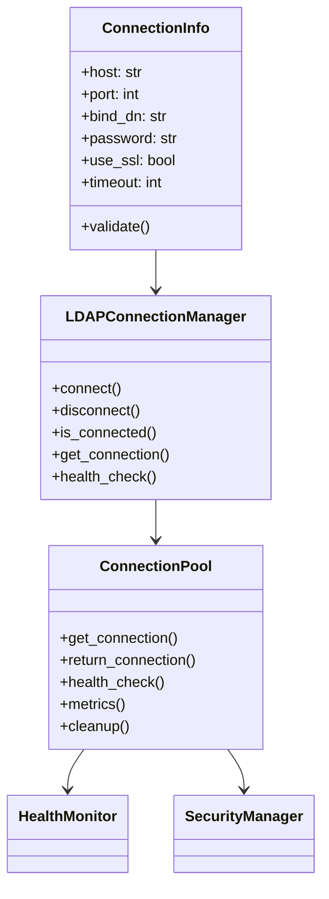

# 🔗 Connection Management API

**Enterprise LDAP Connection Management with Pooling and Health Monitoring**

The connection management module provides robust, enterprise-grade LDAP connection handling with automatic pooling, health monitoring, failover, and performance optimization.

## 📋 Table of Contents

- [🏗️ Classes Overview](#-classes-overview)
- [🔧 ConnectionInfo](#-connectioninfo)
- [🔗 LDAPConnectionManager](#-ldapconnectionmanager)
- [💧 ConnectionPool](#-connectionpool)
- [🔒 Security Features](#-security-features)
- [📊 Performance Monitoring](#-performance-monitoring)
- [🎯 Usage Examples](#-usage-examples)
- [⚙️ Configuration Options](#-configuration-options)
- [🐛 Error Handling](#-error-handling)

## 🏗️ Classes Overview

```python
from ldap_core_shared.core.connection_manager import (
    LDAPConnectionManager,  # Main connection manager
    ConnectionPool,         # Enterprise connection pooling
    ConnectionInfo,         # Connection configuration
)
```

### Class Hierarchy



## 🔧 ConnectionInfo

Configuration class for LDAP connection parameters with comprehensive validation.

### Constructor

```python
class ConnectionInfo:
    def __init__(
        self,
        host: str,
        port: int = 389,
        bind_dn: str | None = None,
        password: str | None = None,
        use_ssl: bool = False,
        use_tls: bool = False,
        timeout: int = 30,
        max_retries: int = 3,
        retry_delay: float = 1.0,
        pool_size: int = 10,
        max_pool_size: int = 50,
        pool_timeout: int = 60,
        validate_cert: bool = True,
        ca_cert_path: str | None = None,
        client_cert_path: str | None = None,
        client_key_path: str | None = None,
    )
```

### Parameters

| Parameter          | Type          | Default      | Description                                    |
| ------------------ | ------------- | ------------ | ---------------------------------------------- |
| `host`             | `str`         | **Required** | LDAP server hostname or IP address             |
| `port`             | `int`         | `389`        | LDAP server port (389 for LDAP, 636 for LDAPS) |
| `bind_dn`          | `str \| None` | `None`       | Distinguished name for authentication          |
| `password`         | `str \| None` | `None`       | Password for authentication                    |
| `use_ssl`          | `bool`        | `False`      | Use SSL/TLS encryption (LDAPS)                 |
| `use_tls`          | `bool`        | `False`      | Use StartTLS encryption                        |
| `timeout`          | `int`         | `30`         | Connection timeout in seconds                  |
| `max_retries`      | `int`         | `3`          | Maximum retry attempts for failed connections  |
| `retry_delay`      | `float`       | `1.0`        | Delay between retry attempts                   |
| `pool_size`        | `int`         | `10`         | Initial connection pool size                   |
| `max_pool_size`    | `int`         | `50`         | Maximum connection pool size                   |
| `pool_timeout`     | `int`         | `60`         | Pool connection timeout in seconds             |
| `validate_cert`    | `bool`        | `True`       | Validate SSL certificates                      |
| `ca_cert_path`     | `str \| None` | `None`       | Path to CA certificate file                    |
| `client_cert_path` | `str \| None` | `None`       | Path to client certificate file                |
| `client_key_path`  | `str \| None` | `None`       | Path to client private key file                |

### Methods

#### `validate() -> LDAPValidationResult`

Validates the connection configuration.

```python
conn_info = ConnectionInfo(
    host="ldap.example.com",
    port=389,
    bind_dn="cn=admin,dc=example,dc=com",
    password="password"
)

validation_result = conn_info.validate()
if validation_result.valid:
    print("Configuration is valid")
else:
    print(f"Validation errors: {validation_result.schema_errors}")
```

#### `to_dict() -> dict[str, Any]`

Returns configuration as dictionary.

```python
config_dict = conn_info.to_dict()
```

#### `from_dict(data: dict[str, Any]) -> ConnectionInfo`

Creates ConnectionInfo from dictionary.

```python
conn_info = ConnectionInfo.from_dict({
    "host": "ldap.example.com",
    "port": 389,
    "bind_dn": "cn=admin,dc=example,dc=com",
    "password": "password"
})
```

### Example Usage

```python
# Basic connection
conn_info = ConnectionInfo(
    host="ldap.example.com",
    bind_dn="cn=admin,dc=example,dc=com",
    password="admin_password"
)

# Secure connection with SSL
secure_conn_info = ConnectionInfo(
    host="ldaps.example.com",
    port=636,
    use_ssl=True,
    bind_dn="cn=admin,dc=example,dc=com",
    password="admin_password",
    ca_cert_path="/path/to/ca.crt"
)

# High-performance configuration
hp_conn_info = ConnectionInfo(
    host="ldap.example.com",
    bind_dn="cn=admin,dc=example,dc=com",
    password="admin_password",
    pool_size=20,
    max_pool_size=100,
    timeout=60
)
```

## 🔗 LDAPConnectionManager

Main connection manager class providing enterprise-grade connection handling.

### Constructor

```python
class LDAPConnectionManager:
    def __init__(
        self,
        connection_info: ConnectionInfo,
        use_pool: bool = True,
        health_check_interval: int = 60,
        enable_monitoring: bool = True,
    )
```

### Parameters

| Parameter               | Type             | Default      | Description                      |
| ----------------------- | ---------------- | ------------ | -------------------------------- |
| `connection_info`       | `ConnectionInfo` | **Required** | Connection configuration         |
| `use_pool`              | `bool`           | `True`       | Enable connection pooling        |
| `health_check_interval` | `int`            | `60`         | Health check interval in seconds |
| `enable_monitoring`     | `bool`           | `True`       | Enable performance monitoring    |

### Methods

#### `connect() -> LDAPConnectionResult`

Establishes connection to LDAP server.

```python
manager = LDAPConnectionManager(conn_info)
result = manager.connect()

if result.connected:
    print(f"Connected to {result.host}:{result.port}")
    print(f"Connection time: {result.connection_time:.2f}ms")
    print(f"Authentication: {result.auth_method}")
    print(f"Encryption: {result.encryption}")
else:
    print(f"Connection failed: {result.connection_error}")
```

**Returns**: `LDAPConnectionResult` with connection details and metrics.

#### `disconnect() -> bool`

Closes the connection and cleanup resources.

```python
success = manager.disconnect()
if success:
    print("Successfully disconnected")
```

**Returns**: `bool` indicating success.

#### `is_connected() -> bool`

Checks if connection is active.

```python
if manager.is_connected():
    print("Connection is active")
else:
    print("No active connection")
```

#### `get_connection() -> Any`

Gets a connection from the pool or creates a new one.

```python
with manager.get_connection() as conn:
    # Use connection for LDAP operations
    pass
```

**Returns**: Connection object (context manager).

#### `health_check() -> LDAPConnectionResult`

Performs comprehensive health check on the connection.

```python
health_result = manager.health_check()
print(f"Health check result: {health_result.connected}")
print(f"Response time: {health_result.response_time:.2f}ms")
print(f"Last activity: {health_result.last_activity}")
```

#### `get_metrics() -> LDAPPerformanceResult`

Returns performance metrics for the connection manager.

```python
metrics = manager.get_metrics()
print(f"Total operations: {metrics.total_operations}")
print(f"Success rate: {metrics.success_rate:.1f}%")
print(f"Average response time: {metrics.average_duration:.2f}ms")
print(f"Pool utilization: {metrics.pool_utilization:.1f}%")
```

### Advanced Features

#### Automatic Reconnection

```python
# Enable automatic reconnection
manager = LDAPConnectionManager(
    conn_info,
    auto_reconnect=True,
    reconnect_attempts=5,
    reconnect_delay=2.0
)
```

#### Connection Failover

```python
# Multiple LDAP servers for failover
failover_config = [
    ConnectionInfo(host="ldap1.example.com"),
    ConnectionInfo(host="ldap2.example.com"),
    ConnectionInfo(host="ldap3.example.com"),
]

manager = LDAPConnectionManager.with_failover(failover_config)
```

## 💧 ConnectionPool

Enterprise connection pooling with health monitoring and performance optimization.

### Constructor

```python
class ConnectionPool:
    def __init__(
        self,
        connection_info: ConnectionInfo,
        min_connections: int = 5,
        max_connections: int = 50,
        timeout: int = 60,
        max_idle_time: int = 300,
        health_check_interval: int = 60,
        enable_metrics: bool = True,
    )
```

### Methods

#### `get_connection() -> ConnectionContext`

Gets a connection from the pool with automatic return.

```python
pool = ConnectionPool(conn_info)

# Using context manager (recommended)
with pool.get_connection() as conn:
    # Connection automatically returned to pool
    result = conn.search(...)

# Manual management (not recommended)
conn = pool.get_connection()
try:
    result = conn.search(...)
finally:
    pool.return_connection(conn)
```

#### `return_connection(connection: Any) -> bool`

Returns a connection to the pool.

```python
success = pool.return_connection(conn)
```

#### `health_check() -> dict[str, Any]`

Performs health check on all pooled connections.

```python
health_status = pool.health_check()
print(f"Active connections: {health_status['active_connections']}")
print(f"Idle connections: {health_status['idle_connections']}")
print(f"Healthy connections: {health_status['healthy_connections']}")
```

#### `get_metrics() -> dict[str, Any]`

Returns detailed pool metrics.

```python
metrics = pool.get_metrics()
print(f"Pool size: {metrics['pool_size']}")
print(f"Utilization: {metrics['utilization']:.1f}%")
print(f"Connection reuse rate: {metrics['reuse_rate']:.1f}%")
print(f"Average acquisition time: {metrics['avg_acquisition_time']:.2f}ms")
```

#### `cleanup() -> int`

Cleans up idle and unhealthy connections.

```python
cleaned_count = pool.cleanup()
print(f"Cleaned up {cleaned_count} connections")
```

### Pool Configuration Examples

#### Development Environment

```python
dev_pool = ConnectionPool(
    conn_info,
    min_connections=2,
    max_connections=5,
    timeout=10,
    max_idle_time=60
)
```

#### Production Environment

```python
prod_pool = ConnectionPool(
    conn_info,
    min_connections=10,
    max_connections=100,
    timeout=60,
    max_idle_time=300,
    health_check_interval=30
)
```

#### High-Performance Environment

```python
hp_pool = ConnectionPool(
    conn_info,
    min_connections=25,
    max_connections=200,
    timeout=90,
    max_idle_time=600,
    preload_connections=True,
    enable_compression=True
)
```

## 🔒 Security Features

### SSL/TLS Configuration

```python
# SSL connection
ssl_conn_info = ConnectionInfo(
    host="ldaps.example.com",
    port=636,
    use_ssl=True,
    validate_cert=True,
    ca_cert_path="/path/to/ca.crt"
)

# StartTLS connection
tls_conn_info = ConnectionInfo(
    host="ldap.example.com",
    port=389,
    use_tls=True,
    validate_cert=True
)
```

### Client Certificate Authentication

```python
cert_conn_info = ConnectionInfo(
    host="ldaps.example.com",
    port=636,
    use_ssl=True,
    client_cert_path="/path/to/client.crt",
    client_key_path="/path/to/client.key",
    ca_cert_path="/path/to/ca.crt"
)
```

### Password Security

```python
# Using environment variables
import os

secure_conn_info = ConnectionInfo(
    host="ldap.example.com",
    bind_dn="cn=admin,dc=example,dc=com",
    password=os.getenv("LDAP_PASSWORD"),  # From environment
    use_tls=True
)

# Using password callback
def get_password():
    return input("Enter LDAP password: ")

conn_info = ConnectionInfo(
    host="ldap.example.com",
    bind_dn="cn=admin,dc=example,dc=com",
    password_callback=get_password
)
```

## 📊 Performance Monitoring

### Connection Metrics

```python
manager = LDAPConnectionManager(conn_info, enable_monitoring=True)

# Get performance metrics
metrics = manager.get_metrics()

print(f"Connection Statistics:")
print(f"  Total connections: {metrics.total_operations}")
print(f"  Successful connections: {metrics.successful_operations}")
print(f"  Failed connections: {metrics.failed_operations}")
print(f"  Success rate: {metrics.success_rate:.1f}%")
print(f"  Average connection time: {metrics.average_duration:.2f}ms")

print(f"Pool Statistics:")
print(f"  Pool size: {metrics.pool_size}")
print(f"  Pool utilization: {metrics.pool_utilization:.1f}%")
print(f"  Connection reuse rate: {metrics.connection_reuse_rate:.1f}%")

print(f"Resource Usage:")
print(f"  Memory usage: {metrics.memory_peak_mb:.1f} MB")
print(f"  CPU usage: {metrics.cpu_usage_percent:.1f}%")
```

### Performance Alerting

```python
# Set up performance thresholds
manager.set_thresholds(
    max_connection_time=100,  # milliseconds
    min_success_rate=95,      # percentage
    max_pool_utilization=80   # percentage
)

# Check for performance issues
alerts = manager.check_performance()
for alert in alerts:
    print(f"Performance Alert: {alert['message']}")
    print(f"  Current value: {alert['current_value']}")
    print(f"  Threshold: {alert['threshold']}")
```

## 🎯 Usage Examples

### Basic Connection

```python
from ldap_core_shared.core.connection_manager import (
    LDAPConnectionManager, ConnectionInfo
)

# Create connection configuration
conn_info = ConnectionInfo(
    host="ldap.example.com",
    port=389,
    bind_dn="cn=admin,dc=example,dc=com",
    password="password"
)

# Create connection manager
manager = LDAPConnectionManager(conn_info)

# Connect and perform operations
result = manager.connect()
if result.connected:
    print("Connected successfully!")

    # Use the connection
    with manager.get_connection() as conn:
        # Perform LDAP operations
        pass

    # Disconnect when done
    manager.disconnect()
```

### Production Configuration

```python
# Production-ready configuration
prod_conn_info = ConnectionInfo(
    host="ldap.example.com",
    port=636,
    use_ssl=True,
    bind_dn="cn=service-account,ou=services,dc=example,dc=com",
    password=os.getenv("LDAP_SERVICE_PASSWORD"),
    timeout=30,
    max_retries=3,
    pool_size=20,
    max_pool_size=100,
    validate_cert=True,
    ca_cert_path="/etc/ssl/certs/ldap-ca.crt"
)

# Create manager with monitoring
manager = LDAPConnectionManager(
    prod_conn_info,
    use_pool=True,
    health_check_interval=30,
    enable_monitoring=True
)

# Start monitoring in background
manager.start_monitoring()

try:
    # Application operations
    result = manager.connect()

    # Your application code here

finally:
    # Clean shutdown
    manager.stop_monitoring()
    manager.disconnect()
```

### High-Availability Setup

```python
# Multiple LDAP servers for high availability
ha_config = [
    ConnectionInfo(host="ldap1.example.com", priority=1),
    ConnectionInfo(host="ldap2.example.com", priority=2),
    ConnectionInfo(host="ldap3.example.com", priority=3),
]

# Create HA connection manager
ha_manager = LDAPConnectionManager.create_ha_cluster(
    ha_config,
    failover_timeout=5,
    health_check_interval=10,
    auto_failback=True
)

# Use as normal - failover is automatic
result = ha_manager.connect()
```

## ⚙️ Configuration Options

### Environment-Based Configuration

```python
# Development environment
dev_config = ConnectionInfo(
    host=os.getenv("LDAP_HOST", "localhost"),
    port=int(os.getenv("LDAP_PORT", "389")),
    bind_dn=os.getenv("LDAP_BIND_DN"),
    password=os.getenv("LDAP_PASSWORD"),
    pool_size=5,
    max_pool_size=10
)

# Production environment
prod_config = ConnectionInfo(
    host=os.getenv("LDAP_HOST"),
    port=int(os.getenv("LDAP_PORT", "636")),
    use_ssl=True,
    bind_dn=os.getenv("LDAP_BIND_DN"),
    password=os.getenv("LDAP_PASSWORD"),
    pool_size=20,
    max_pool_size=100,
    timeout=60,
    ca_cert_path=os.getenv("LDAP_CA_CERT_PATH")
)
```

### Configuration from File

```python
import json

# Load from JSON configuration
with open("ldap_config.json") as f:
    config_data = json.load(f)

conn_info = ConnectionInfo.from_dict(config_data["ldap"])
manager = LDAPConnectionManager(conn_info)
```

## 🐛 Error Handling

### Connection Errors

```python
try:
    result = manager.connect()
    if not result.connected:
        if result.connection_error:
            print(f"Connection failed: {result.connection_error}")
        if result.auth_error:
            print(f"Authentication failed: {result.auth_error}")
except ConnectionTimeout:
    print("Connection timed out")
except AuthenticationFailed as e:
    print(f"Authentication failed: {e}")
except SSLError as e:
    print(f"SSL error: {e}")
except LDAPException as e:
    print(f"LDAP error: {e}")
```

### Pool Errors

```python
try:
    with pool.get_connection() as conn:
        # Use connection
        pass
except PoolExhausted:
    print("Connection pool exhausted")
except PoolTimeout:
    print("Timeout waiting for connection")
except ConnectionUnhealthy as e:
    print(f"Unhealthy connection: {e}")
```

### Automatic Error Recovery

```python
# Configure automatic error recovery
manager = LDAPConnectionManager(
    conn_info,
    auto_recovery=True,
    recovery_attempts=3,
    recovery_delay=5.0,
    circuit_breaker_threshold=5
)

# Manager will automatically handle transient errors
```

## 🎯 Best Practices

### 1. **Always Use Connection Pooling**

```python
# ✅ Good - Uses pooling
manager = LDAPConnectionManager(conn_info, use_pool=True)

# ❌ Bad - No pooling
manager = LDAPConnectionManager(conn_info, use_pool=False)
```

### 2. **Use Context Managers**

```python
# ✅ Good - Automatic resource cleanup
with manager.get_connection() as conn:
    result = conn.search(...)

# ❌ Bad - Manual resource management
conn = manager.get_connection()
try:
    result = conn.search(...)
finally:
    manager.return_connection(conn)
```

### 3. **Enable SSL/TLS**

```python
# ✅ Good - Secure connection
conn_info = ConnectionInfo(
    host="ldap.example.com",
    use_ssl=True,
    validate_cert=True
)

# ❌ Bad - Insecure connection
conn_info = ConnectionInfo(
    host="ldap.example.com",
    use_ssl=False
)
```

### 4. **Monitor Performance**

```python
# ✅ Good - Monitoring enabled
manager = LDAPConnectionManager(
    conn_info,
    enable_monitoring=True,
    health_check_interval=30
)

# Check metrics regularly
metrics = manager.get_metrics()
if metrics.success_rate < 95:
    logger.warning("Low success rate detected")
```

### 5. **Handle Errors Gracefully**

```python
# ✅ Good - Comprehensive error handling
try:
    result = manager.connect()
    if result.connected:
        # Perform operations
        pass
    else:
        logger.error(f"Connection failed: {result.connection_error}")
        # Implement fallback logic
except Exception as e:
    logger.exception("Unexpected error occurred")
    # Implement error recovery
```

---

**🔗 Related Documentation**

- [⚙️ LDAP Operations](operations.md)
- [🔍 Search Engine](search-engine.md)
- [🔒 Security](security.md)
- [📋 Result Types](../domain/results.md)
