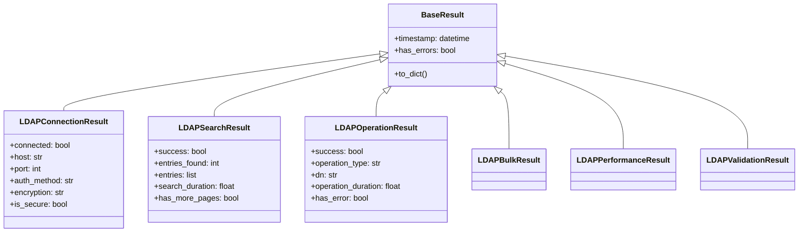

# 📋 Domain Results API

**Enterprise-Grade Typed Result Classes for LDAP Operations**

The domain results module provides comprehensive typed result objects for all LDAP operations, ensuring type safety, IDE support, runtime validation, and consistent result structures across the entire library.

## 📋 Table of Contents

- [🏗️ Architecture Overview](#-architecture-overview)
- [🔗 LDAPConnectionResult](#-ldapconnectionresult)
- [🔍 LDAPSearchResult](#-ldapsearchresult)
- [⚙️ LDAPOperationResult](#-ldapoperationresult)
- [📊 LDAPBulkResult](#-ldapbulkresult)
- [📈 LDAPPerformanceResult](#-ldapperformanceresult)
- [✅ LDAPValidationResult](#-ldapvalidationresult)
- [🔄 Result Aggregation](#-result-aggregation)
- [🎯 Usage Examples](#-usage-examples)
- [🔧 Best Practices](#-best-practices)

## 🏗️ Architecture Overview

The results module follows enterprise design principles for maximum type safety and developer experience:

### 🎯 **Key Design Principles**
- **Zero Tolerance**: No untyped dict returns where structure is known
- **Type Safety**: Full typing with mypy compliance
- **Enterprise Validation**: Comprehensive validation using Pydantic
- **Performance**: Optimized for high-throughput LDAP operations
- **Composability**: Results can be merged and aggregated
- **Backward Compatibility**: to_dict() methods for legacy consumers

### 📊 **Result Categories**



All result classes inherit from Pydantic's `BaseModel` and provide:
- **Immutable data structures** (frozen=True)
- **Strict validation** (strict=True, extra="forbid")
- **Computed properties** for derived values
- **Timestamp tracking** for audit trails

## 🔗 LDAPConnectionResult

Typed result for LDAP connection operations with comprehensive connection metrics and security information.

### Definition

```python
class LDAPConnectionResult(BaseModel):
    # Connection status
    connected: bool
    host: str
    port: int
    auth_method: str = "simple"
    encryption: str = "none"
    
    # Connection metrics
    connection_time: float = Field(ge=0.0)
    response_time: float = Field(ge=0.0)
    last_activity: datetime | None = None
    
    # Tunnel information
    tunnel_active: bool = False
    tunnel_local_port: int | None = Field(default=None, gt=0, lt=65536)
    
    # Error tracking
    connection_error: str | None = None
    auth_error: str | None = None
    
    # Protocol-specific info
    ldap_info: dict[str, Any] = Field(default_factory=dict)
    ssh_info: dict[str, Any] = Field(default_factory=dict)
    
    timestamp: datetime = Field(default_factory=lambda: datetime.now(UTC))
```

### Properties

| Field | Type | Description |
|-------|------|-------------|
| `connected` | `bool` | Whether connection is established |
| `host` | `str` | LDAP server hostname |
| `port` | `int` | LDAP server port |
| `auth_method` | `str` | Authentication method used |
| `encryption` | `str` | Encryption protocol in use |
| `connection_time` | `float` | Time to establish connection (ms) |
| `response_time` | `float` | Last response time (ms) |
| `last_activity` | `datetime \| None` | Timestamp of last activity |
| `tunnel_active` | `bool` | Whether SSH tunnel is active |
| `tunnel_local_port` | `int \| None` | Local SSH tunnel port |
| `connection_error` | `str \| None` | Connection error message |
| `auth_error` | `str \| None` | Authentication error message |
| `ldap_info` | `dict[str, Any]` | LDAP-specific information |
| `ssh_info` | `dict[str, Any]` | SSH tunnel information |

### Computed Properties

#### `has_errors -> bool`
Check if any connection errors occurred.

```python
result = manager.connect()
if result.has_errors:
    print(f"Connection error: {result.connection_error}")
    print(f"Auth error: {result.auth_error}")
```

#### `is_secure -> bool`
Check if connection uses secure protocols.

```python
result = manager.connect()
if result.is_secure:
    print(f"Secure connection using {result.encryption}")
else:
    print("Warning: Insecure connection")
```

### Usage Examples

```python
# Basic connection result
result = manager.connect()
print(f"Connected: {result.connected}")
print(f"Host: {result.host}:{result.port}")
print(f"Auth method: {result.auth_method}")
print(f"Encryption: {result.encryption}")
print(f"Connection time: {result.connection_time:.2f}ms")

# Check for security
if result.is_secure:
    print("✅ Secure connection established")
else:
    print("⚠️  Insecure connection - consider using SSL/TLS")

# Handle errors
if result.has_errors:
    if result.connection_error:
        logger.error(f"Connection failed: {result.connection_error}")
    if result.auth_error:
        logger.error(f"Authentication failed: {result.auth_error}")
```

## 🔍 LDAPSearchResult

Typed result for LDAP search operations with pagination support and performance metrics.

### Definition

```python
class LDAPSearchResult(BaseModel):
    success: bool
    entries_found: int = Field(ge=0)
    search_base: str
    search_filter: str
    
    # Search results
    entries: list[dict[str, Any]] = Field(default_factory=list)
    attributes_returned: list[str] = Field(default_factory=list)
    
    # Search configuration
    scope: str = "subtree"
    size_limit: int = Field(default=1000, ge=0)
    time_limit: int = Field(default=30, ge=0)
    
    # Performance metrics
    search_duration: float = Field(ge=0.0)
    entries_per_second: float = Field(ge=0.0)
    
    # Pagination support
    page_size: int | None = Field(default=None, gt=0)
    has_more_pages: bool = False
    page_cookie: str | None = None
    
    # Error tracking
    errors: list[str] = Field(default_factory=list)
    warnings: list[str] = Field(default_factory=list)
    
    timestamp: datetime = Field(default_factory=lambda: datetime.now(UTC))
```

### Properties

| Field | Type | Description |
|-------|------|-------------|
| `success` | `bool` | Whether search succeeded |
| `entries_found` | `int` | Number of entries found |
| `search_base` | `str` | Search base DN |
| `search_filter` | `str` | LDAP search filter used |
| `entries` | `list[dict[str, Any]]` | Search result entries |
| `attributes_returned` | `list[str]` | Attributes included in results |
| `scope` | `str` | Search scope (base, level, subtree) |
| `size_limit` | `int` | Maximum entries limit |
| `time_limit` | `int` | Search time limit (seconds) |
| `search_duration` | `float` | Search execution time (ms) |
| `entries_per_second` | `float` | Search performance metric |
| `page_size` | `int \| None` | Pagination page size |
| `has_more_pages` | `bool` | Whether more results available |
| `page_cookie` | `str \| None` | Pagination cookie |
| `errors` | `list[str]` | Search error messages |
| `warnings` | `list[str]` | Search warning messages |

### Computed Properties

#### `has_errors -> bool`
Check if any search errors occurred.

#### `has_warnings -> bool`
Check if any search warnings occurred.

### Usage Examples

```python
# Perform search
result = operations.search_entries(
    base_dn="ou=people,dc=example,dc=com",
    search_filter="(objectClass=person)"
)

# Check results
print(f"Search successful: {result.success}")
print(f"Entries found: {result.entries_found}")
print(f"Search duration: {result.search_duration:.2f}ms")
print(f"Performance: {result.entries_per_second:.0f} entries/second")

# Process entries
for entry in result.entries:
    dn = entry.get('dn')
    cn = entry.get('cn', [''])[0]
    mail = entry.get('mail', [''])[0]
    print(f"DN: {dn}, Name: {cn}, Email: {mail}")

# Handle pagination
if result.has_more_pages:
    print(f"More results available (page size: {result.page_size})")
    next_result = operations.search_entries(
        base_dn=result.search_base,
        search_filter=result.search_filter,
        page_cookie=result.page_cookie
    )

# Check for issues
if result.has_errors:
    for error in result.errors:
        logger.error(f"Search error: {error}")

if result.has_warnings:
    for warning in result.warnings:
        logger.warning(f"Search warning: {warning}")
```

## ⚙️ LDAPOperationResult

Typed result for individual LDAP operations (add, modify, delete) with transaction support.

### Definition

```python
class LDAPOperationResult(BaseModel):
    success: bool
    operation_type: str  # add, modify, delete
    dn: str
    
    # Operation details
    attributes_modified: dict[str, Any] = Field(default_factory=dict)
    backup_created: bool = False
    transaction_id: str | None = None
    
    # Performance metrics
    operation_duration: float = Field(ge=0.0)
    
    # Error tracking
    error_message: str | None = None
    ldap_error_code: int | None = None
    
    # Rollback information
    rollback_data: dict[str, Any] = Field(default_factory=dict)
    
    timestamp: datetime = Field(default_factory=lambda: datetime.now(UTC))
```

### Properties

| Field | Type | Description |
|-------|------|-------------|
| `success` | `bool` | Whether operation succeeded |
| `operation_type` | `str` | Type of operation (add/modify/delete) |
| `dn` | `str` | Distinguished name of entry |
| `attributes_modified` | `dict[str, Any]` | Attributes that were modified |
| `backup_created` | `bool` | Whether backup was created |
| `transaction_id` | `str \| None` | Transaction identifier |
| `operation_duration` | `float` | Operation execution time (ms) |
| `error_message` | `str \| None` | Error message if failed |
| `ldap_error_code` | `int \| None` | LDAP error code |
| `rollback_data` | `dict[str, Any]` | Data for rollback operations |

### Computed Properties

#### `has_error -> bool`
Check if operation failed.

### Usage Examples

```python
# Add entry
result = operations.add_entry(
    dn="cn=john.doe,ou=people,dc=example,dc=com",
    attributes={
        'objectClass': ['person', 'inetOrgPerson'],
        'cn': ['John Doe'],
        'sn': ['Doe'],
        'givenName': ['John'],
        'mail': ['john.doe@example.com']
    }
)

# Check result
if result.success:
    print(f"✅ {result.operation_type.title()} operation successful")
    print(f"   DN: {result.dn}")
    print(f"   Duration: {result.operation_duration:.2f}ms")
    if result.backup_created:
        print(f"   Backup created for rollback")
else:
    print(f"❌ {result.operation_type.title()} operation failed")
    print(f"   Error: {result.error_message}")
    if result.ldap_error_code:
        print(f"   LDAP Error Code: {result.ldap_error_code}")

# Handle transaction
if result.transaction_id:
    print(f"Operation part of transaction: {result.transaction_id}")

# Rollback if needed
if result.has_error and result.rollback_data:
    rollback_result = operations.rollback_operation(result)
    if rollback_result.success:
        print("Operation rolled back successfully")
```

## 📊 LDAPBulkResult

Typed result for bulk LDAP operations with progress tracking and transaction support.

### Definition

```python
class LDAPBulkResult(BaseModel):
    total_entries: int = Field(ge=0)
    successful_entries: int = Field(ge=0)
    failed_entries: int = Field(ge=0)
    operation_type: str
    
    # Operation details
    operations_log: list[LDAPOperationResult] = Field(default_factory=list)
    checkpoints: list[dict[str, Any]] = Field(default_factory=list)
    
    # Performance metrics
    operation_duration: float = Field(ge=0.0)
    operations_per_second: float = Field(ge=0.0)
    
    # Transaction info
    transaction_id: str | None = None
    transaction_committed: bool = False
    backup_created: bool = False
    
    # Error tracking
    errors: list[str] = Field(default_factory=list)
    critical_errors: list[str] = Field(default_factory=list)
    
    timestamp: datetime = Field(default_factory=lambda: datetime.now(UTC))
```

### Properties

| Field | Type | Description |
|-------|------|-------------|
| `total_entries` | `int` | Total number of entries processed |
| `successful_entries` | `int` | Number of successful operations |
| `failed_entries` | `int` | Number of failed operations |
| `operation_type` | `str` | Type of bulk operation |
| `operations_log` | `list[LDAPOperationResult]` | Individual operation results |
| `checkpoints` | `list[dict[str, Any]]` | Progress checkpoints |
| `operation_duration` | `float` | Total operation time (ms) |
| `operations_per_second` | `float` | Performance metric |
| `transaction_id` | `str \| None` | Transaction identifier |
| `transaction_committed` | `bool` | Whether transaction was committed |
| `backup_created` | `bool` | Whether backup was created |
| `errors` | `list[str]` | Non-critical error messages |
| `critical_errors` | `list[str]` | Critical error messages |

### Computed Properties

#### `success_rate -> float`
Calculate success rate as percentage.

#### `has_critical_errors -> bool`
Check if any critical errors occurred.

#### `is_complete_success -> bool`
Check if all operations succeeded.

### Usage Examples

```python
# Bulk import from LDIF
entries = [
    {"dn": "cn=user1,ou=people,dc=example,dc=com", "attributes": {...}},
    {"dn": "cn=user2,ou=people,dc=example,dc=com", "attributes": {...}},
    # ... more entries
]

result = operations.bulk_add(entries)

# Check overall results
print(f"Bulk operation completed:")
print(f"  Total entries: {result.total_entries}")
print(f"  Successful: {result.successful_entries}")
print(f"  Failed: {result.failed_entries}")
print(f"  Success rate: {result.success_rate:.1f}%")
print(f"  Duration: {result.operation_duration:.2f}ms")
print(f"  Performance: {result.operations_per_second:.0f} ops/second")

# Check for complete success
if result.is_complete_success:
    print("✅ All operations completed successfully")
else:
    print("⚠️  Some operations failed")

# Handle critical errors
if result.has_critical_errors:
    print("❌ Critical errors occurred:")
    for error in result.critical_errors:
        print(f"   {error}")

# Review failed operations
failed_operations = [op for op in result.operations_log if not op.success]
if failed_operations:
    print(f"Failed operations ({len(failed_operations)}):")
    for op in failed_operations:
        print(f"   DN: {op.dn}")
        print(f"   Error: {op.error_message}")

# Transaction handling
if result.transaction_id:
    if result.transaction_committed:
        print(f"✅ Transaction {result.transaction_id} committed")
    else:
        print(f"⚠️  Transaction {result.transaction_id} not committed")
```

## 📈 LDAPPerformanceResult

Typed result for LDAP performance monitoring with comprehensive metrics.

### Definition

```python
class LDAPPerformanceResult(BaseModel):
    operation_name: str
    total_operations: int = Field(ge=0)
    successful_operations: int = Field(ge=0)
    failed_operations: int = Field(ge=0)
    
    # Performance metrics
    total_duration: float = Field(ge=0.0)
    average_duration: float = Field(ge=0.0)
    operations_per_second: float = Field(ge=0.0)
    
    # Resource usage
    memory_peak_mb: float = Field(ge=0.0)
    cpu_usage_percent: float = Field(ge=0.0, le=100.0)
    
    # Connection pool metrics
    pool_size: int = Field(ge=0)
    pool_utilization: float = Field(ge=0.0, le=100.0)
    connection_reuse_rate: float = Field(ge=0.0, le=100.0)
    
    timestamp: datetime = Field(default_factory=lambda: datetime.now(UTC))
```

### Properties

| Field | Type | Description |
|-------|------|-------------|
| `operation_name` | `str` | Name of monitored operation |
| `total_operations` | `int` | Total number of operations |
| `successful_operations` | `int` | Number of successful operations |
| `failed_operations` | `int` | Number of failed operations |
| `total_duration` | `float` | Total execution time (ms) |
| `average_duration` | `float` | Average operation time (ms) |
| `operations_per_second` | `float` | Throughput metric |
| `memory_peak_mb` | `float` | Peak memory usage (MB) |
| `cpu_usage_percent` | `float` | CPU usage percentage |
| `pool_size` | `int` | Connection pool size |
| `pool_utilization` | `float` | Pool utilization percentage |
| `connection_reuse_rate` | `float` | Connection reuse rate percentage |

### Computed Properties

#### `success_rate -> float`
Calculate success rate as percentage.

#### `failure_rate -> float`
Calculate failure rate as percentage.

### Usage Examples

```python
# Get performance metrics
metrics = monitor.get_metrics("search_operations")

print(f"Performance Report: {metrics.operation_name}")
print(f"==================")
print(f"Operations:")
print(f"  Total: {metrics.total_operations}")
print(f"  Successful: {metrics.successful_operations}")
print(f"  Failed: {metrics.failed_operations}")
print(f"  Success rate: {metrics.success_rate:.1f}%")

print(f"Performance:")
print(f"  Total duration: {metrics.total_duration:.2f}ms")
print(f"  Average duration: {metrics.average_duration:.2f}ms")
print(f"  Throughput: {metrics.operations_per_second:.0f} ops/sec")

print(f"Resource Usage:")
print(f"  Peak memory: {metrics.memory_peak_mb:.1f} MB")
print(f"  CPU usage: {metrics.cpu_usage_percent:.1f}%")

print(f"Connection Pool:")
print(f"  Pool size: {metrics.pool_size}")
print(f"  Utilization: {metrics.pool_utilization:.1f}%")
print(f"  Reuse rate: {metrics.connection_reuse_rate:.1f}%")

# Performance alerting
if metrics.success_rate < 95:
    logger.warning(f"Low success rate: {metrics.success_rate:.1f}%")

if metrics.average_duration > 100:
    logger.warning(f"High latency: {metrics.average_duration:.2f}ms")

if metrics.pool_utilization > 80:
    logger.warning(f"High pool utilization: {metrics.pool_utilization:.1f}%")
```

## ✅ LDAPValidationResult

Typed result for LDAP validation operations with detailed error categorization.

### Definition

```python
class LDAPValidationResult(BaseModel):
    valid: bool
    validation_type: str
    entries_validated: int = Field(ge=0)
    
    # Validation details
    schema_errors: list[str] = Field(default_factory=list)
    syntax_errors: list[str] = Field(default_factory=list)
    reference_errors: list[str] = Field(default_factory=list)
    
    # Performance metrics
    validation_duration: float = Field(ge=0.0)
    
    timestamp: datetime = Field(default_factory=lambda: datetime.now(UTC))
```

### Properties

| Field | Type | Description |
|-------|------|-------------|
| `valid` | `bool` | Whether validation passed |
| `validation_type` | `str` | Type of validation performed |
| `entries_validated` | `int` | Number of entries validated |
| `schema_errors` | `list[str]` | Schema validation errors |
| `syntax_errors` | `list[str]` | Syntax validation errors |
| `reference_errors` | `list[str]` | Reference validation errors |
| `validation_duration` | `float` | Validation time (ms) |

### Computed Properties

#### `has_errors -> bool`
Check if any validation errors occurred.

#### `total_errors -> int`
Get total count of all validation errors.

### Usage Examples

```python
# Validate LDIF file
result = validator.validate_ldif("import.ldif")

print(f"Validation Result: {result.validation_type}")
print(f"Entries validated: {result.entries_validated}")
print(f"Duration: {result.validation_duration:.2f}ms")

if result.valid:
    print("✅ Validation passed - LDIF is valid")
else:
    print(f"❌ Validation failed - {result.total_errors} errors found")
    
    if result.schema_errors:
        print("Schema Errors:")
        for error in result.schema_errors:
            print(f"  - {error}")
    
    if result.syntax_errors:
        print("Syntax Errors:")
        for error in result.syntax_errors:
            print(f"  - {error}")
    
    if result.reference_errors:
        print("Reference Errors:")
        for error in result.reference_errors:
            print(f"  - {error}")
```

## 🔄 Result Aggregation

The results module provides utility functions for merging and aggregating multiple results.

### Merge Search Results

```python
def merge_search_results(results: list[LDAPSearchResult]) -> LDAPSearchResult
```

Merge multiple search results into a single result.

```python
# Search multiple OUs
results = []
for ou in ["ou=people", "ou=groups", "ou=services"]:
    result = operations.search_entries(
        base_dn=f"{ou},dc=example,dc=com",
        search_filter="(objectClass=*)"
    )
    results.append(result)

# Merge all results
merged_result = merge_search_results(results)
print(f"Total entries found: {merged_result.entries_found}")
print(f"Total search time: {merged_result.search_duration:.2f}ms")
print(f"Average performance: {merged_result.entries_per_second:.0f} entries/sec")
```

### Merge Bulk Results

```python
def merge_bulk_results(results: list[LDAPBulkResult]) -> LDAPBulkResult
```

Merge multiple bulk operation results into a single result.

```python
# Multiple bulk operations
bulk_results = []
for batch in entry_batches:
    result = operations.bulk_add(batch)
    bulk_results.append(result)

# Merge all bulk results
merged_result = merge_bulk_results(bulk_results)
print(f"Total entries processed: {merged_result.total_entries}")
print(f"Overall success rate: {merged_result.success_rate:.1f}%")
print(f"Total duration: {merged_result.operation_duration:.2f}ms")
```

## 🎯 Usage Examples

### Enterprise Search Operation

```python
from ldap_core_shared.core import LDAPOperations
from ldap_core_shared.domain.results import LDAPSearchResult

def search_users_with_monitoring(operations: LDAPOperations) -> LDAPSearchResult:
    """Search for users with comprehensive result handling."""
    
    # Perform search
    result = operations.search_entries(
        base_dn="ou=people,dc=example,dc=com",
        search_filter="(&(objectClass=inetOrgPerson)(mail=*))",
        attributes=["cn", "mail", "departmentNumber", "title"],
        page_size=100
    )
    
    # Log performance metrics
    logger.info(
        f"Search completed: {result.entries_found} entries in "
        f"{result.search_duration:.2f}ms "
        f"({result.entries_per_second:.0f} entries/sec)"
    )
    
    # Handle pagination
    all_entries = result.entries.copy()
    while result.has_more_pages:
        next_result = operations.search_entries(
            base_dn=result.search_base,
            search_filter=result.search_filter,
            page_cookie=result.page_cookie
        )
        all_entries.extend(next_result.entries)
        result = next_result
    
    # Create final merged result
    final_result = LDAPSearchResult(
        success=True,
        entries_found=len(all_entries),
        search_base=result.search_base,
        search_filter=result.search_filter,
        entries=all_entries,
        search_duration=result.search_duration,
        entries_per_second=len(all_entries) / (result.search_duration / 1000)
    )
    
    return final_result
```

### Bulk Operation with Progress Tracking

```python
from ldap_core_shared.domain.results import LDAPBulkResult

def bulk_import_with_progress(operations: LDAPOperations, entries: list) -> LDAPBulkResult:
    """Bulk import with detailed progress tracking."""
    
    batch_size = 100
    all_results = []
    
    for i in range(0, len(entries), batch_size):
        batch = entries[i:i + batch_size]
        
        # Process batch
        batch_result = operations.bulk_add(batch)
        all_results.append(batch_result)
        
        # Log progress
        progress = ((i + len(batch)) / len(entries)) * 100
        logger.info(
            f"Progress: {progress:.1f}% "
            f"({batch_result.successful_entries}/{len(batch)} successful)"
        )
        
        # Check for critical errors
        if batch_result.has_critical_errors:
            logger.error("Critical errors detected - stopping import")
            break
    
    # Merge all results
    final_result = merge_bulk_results(all_results)
    
    # Final summary
    logger.info(
        f"Bulk import completed: {final_result.successful_entries}/"
        f"{final_result.total_entries} successful "
        f"({final_result.success_rate:.1f}% success rate)"
    )
    
    return final_result
```

## 🔧 Best Practices

### 1. **Always Check Success Status**

```python
# ✅ Good - Check success status
result = operations.add_entry(dn, attributes)
if result.success:
    print("Entry added successfully")
else:
    logger.error(f"Failed to add entry: {result.error_message}")

# ❌ Bad - Assume success
result = operations.add_entry(dn, attributes)
print(f"Added entry: {result.dn}")  # May fail if operation failed
```

### 2. **Use Computed Properties**

```python
# ✅ Good - Use computed properties
if result.has_errors:
    handle_errors(result.errors)

if result.is_secure:
    proceed_with_sensitive_operations()

# ❌ Bad - Manual error checking
if len(result.errors) > 0:  # Verbose and error-prone
    handle_errors(result.errors)
```

### 3. **Handle Performance Monitoring**

```python
# ✅ Good - Monitor performance
metrics = manager.get_metrics()
if metrics.success_rate < 95:
    logger.warning(f"Low success rate: {metrics.success_rate:.1f}%")

if metrics.average_duration > 100:
    logger.warning(f"High latency detected: {metrics.average_duration:.2f}ms")

# Set up alerts
if metrics.pool_utilization > 80:
    scale_up_pool()
```

### 4. **Use Result Aggregation**

```python
# ✅ Good - Aggregate related results
search_results = [search_ou1(), search_ou2(), search_ou3()]
merged_result = merge_search_results(search_results)

# ❌ Bad - Manual aggregation
total_entries = sum(r.entries_found for r in search_results)
all_entries = []
for r in search_results:
    all_entries.extend(r.entries)
```

### 5. **Implement Proper Error Handling**

```python
# ✅ Good - Comprehensive error handling
try:
    result = operations.search_entries(base_dn, filter)
    
    if result.success:
        process_entries(result.entries)
    else:
        # Handle search failures
        for error in result.errors:
            logger.error(f"Search error: {error}")
        
        # Implement fallback logic
        fallback_search()
        
except Exception as e:
    logger.exception("Unexpected error during search")
    # Implement error recovery
```

---

**📋 Related Documentation**
- [🔗 Connection Management](../core/connection-management.md)
- [⚙️ LDAP Operations](../core/operations.md)
- [🔍 Search Engine](../core/search-engine.md)
- [📄 LDIF Processing](../ldif/processor.md)