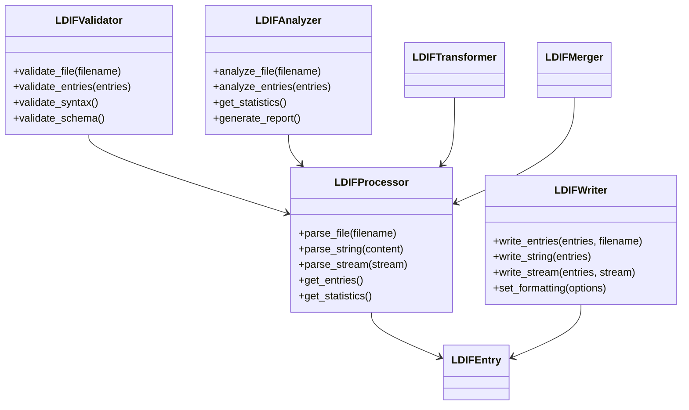
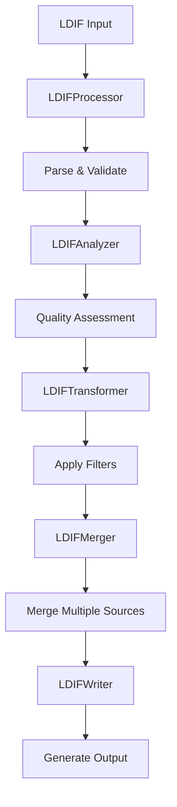

# 📄 LDIF Processor API

**Standards-Compliant LDIF Processing Engine for Enterprise LDAP Operations**

The LDIF (LDAP Data Interchange Format) processing module provides comprehensive capabilities for parsing, writing, validating, analyzing, transforming, and merging LDIF files according to RFC 2849 standards.

## 📋 Table of Contents

- [🏗️ Architecture Overview](#-architecture-overview)
- [📝 LDIFProcessor](#-ldifprocessor)
- [✍️ LDIFWriter](#-ldifwriter)
- [✅ LDIFValidator](#-ldifvalidator)
- [📊 LDIFAnalyzer](#-ldifanalyzer)
- [🔄 LDIFTransformer](#-ldiftransformer)
- [🔗 LDIFMerger](#-ldifmerger)
- [🎯 Usage Examples](#-usage-examples)
- [🔧 Best Practices](#-best-practices)

## 🏗️ Architecture Overview

The LDIF processing suite follows enterprise design principles for maximum flexibility and performance:

### 🎯 **Key Features**

- **RFC 2849 Compliant**: Standards-compliant LDIF parsing and generation
- **Enterprise Scale**: Streaming support for large LDIF files
- **Schema Aware**: Schema-aware LDIF processing and validation
- **Performance Optimized**: High-throughput processing with progress monitoring
- **Extensible**: Plugin architecture for custom transformations
- **Error Resilient**: Comprehensive error handling and recovery

### 📊 **Component Architecture**



### 🔄 **Processing Pipeline**



## 📝 LDIFProcessor

Core LDIF processing engine that provides standards-compliant parsing and entry management.

### Constructor

```python
class LDIFProcessor:
    def __init__(
        self,
        schema: SchemaDefinition | None = None,
        encoding: str = "utf-8",
        strict_mode: bool = True,
        max_entries: int | None = None,
        progress_callback: Callable[[int, int], None] | None = None,
        error_handler: Callable[[str, Exception], bool] | None = None,
    )
```

### Parameters

| Parameter           | Type                       | Default   | Description                      |
| ------------------- | -------------------------- | --------- | -------------------------------- |
| `schema`            | `SchemaDefinition \| None` | `None`    | Schema for validation (optional) |
| `encoding`          | `str`                      | `"utf-8"` | File encoding                    |
| `strict_mode`       | `bool`                     | `True`    | Enable strict RFC compliance     |
| `max_entries`       | `int \| None`              | `None`    | Maximum entries to process       |
| `progress_callback` | `Callable`                 | `None`    | Progress notification callback   |
| `error_handler`     | `Callable`                 | `None`    | Custom error handler             |

### Methods

#### `parse_file(filename: str) -> LDAPSearchResult`

Parse LDIF file and return entries with comprehensive metadata.

```python
processor = LDIFProcessor(strict_mode=True)
result = processor.parse_file("users.ldif")

if result.success:
    print(f"Parsed {result.entries_found} entries")
    print(f"Parse time: {result.search_duration:.2f}ms")

    for entry in result.entries:
        print(f"DN: {entry['dn']}")
        print(f"Attributes: {list(entry.keys())}")
else:
    print(f"Parse failed: {result.errors}")
```

**Returns**: `LDAPSearchResult` with parsed entries and metadata.

#### `parse_string(content: str) -> LDAPSearchResult`

Parse LDIF content from string.

```python
ldif_content = """
dn: cn=John Doe,ou=people,dc=example,dc=com
objectClass: person
objectClass: inetOrgPerson
cn: John Doe
sn: Doe
givenName: John
mail: john.doe@example.com
"""

result = processor.parse_string(ldif_content)
print(f"Parsed {result.entries_found} entries from string")
```

#### `parse_stream(stream: IO) -> Iterator[LDAPEntry]`

Parse LDIF from stream with memory-efficient processing.

```python
with open("large_file.ldif", "r") as f:
    for entry in processor.parse_stream(f):
        # Process entry immediately
        process_entry(entry)

        # Memory usage stays constant
```

**Returns**: Iterator of `LDAPEntry` objects for memory efficiency.

#### `get_statistics() -> dict[str, Any]`

Get detailed parsing statistics.

```python
stats = processor.get_statistics()
print(f"Statistics:")
print(f"  Total entries: {stats['total_entries']}")
print(f"  Valid entries: {stats['valid_entries']}")
print(f"  Invalid entries: {stats['invalid_entries']}")
print(f"  Parse time: {stats['parse_time_ms']:.2f}ms")
print(f"  Entries per second: {stats['entries_per_second']:.0f}")
print(f"  Memory usage: {stats['memory_usage_mb']:.1f}MB")
```

### Advanced Features

#### Schema-Aware Processing

```python
# Load schema for validation
schema = SchemaDiscovery().discover_from_server(conn_info)

# Create schema-aware processor
processor = LDIFProcessor(
    schema=schema.data,
    strict_mode=True
)

result = processor.parse_file("entries.ldif")

# Automatic schema validation during parsing
for entry in result.entries:
    if entry.get('_schema_valid', True):
        print(f"Valid entry: {entry['dn']}")
    else:
        print(f"Schema violation: {entry['dn']}")
        print(f"Errors: {entry.get('_schema_errors', [])}")
```

#### Progress Monitoring

```python
def progress_callback(current: int, total: int):
    percentage = (current / total) * 100
    print(f"Progress: {percentage:.1f}% ({current}/{total})")

processor = LDIFProcessor(
    progress_callback=progress_callback,
    max_entries=10000
)

result = processor.parse_file("large_file.ldif")
```

#### Error Handling

```python
def error_handler(context: str, error: Exception) -> bool:
    logger.error(f"Parse error in {context}: {error}")

    # Return True to continue parsing, False to stop
    if isinstance(error, CriticalParseError):
        return False  # Stop on critical errors
    else:
        return True   # Continue on non-critical errors

processor = LDIFProcessor(error_handler=error_handler)
```

## ✍️ LDIFWriter

Advanced LDIF writing engine with formatting control and performance optimization.

### Constructor

```python
class LDIFWriter:
    def __init__(
        self,
        encoding: str = "utf-8",
        line_length: int = 76,
        sort_attributes: bool = True,
        include_comments: bool = True,
        format_style: str = "standard",
        compression: bool = False,
    )
```

### Parameters

| Parameter          | Type   | Default      | Description                                |
| ------------------ | ------ | ------------ | ------------------------------------------ |
| `encoding`         | `str`  | `"utf-8"`    | Output file encoding                       |
| `line_length`      | `int`  | `76`         | Maximum line length (RFC 2849)             |
| `sort_attributes`  | `bool` | `True`       | Sort attributes alphabetically             |
| `include_comments` | `bool` | `True`       | Include informational comments             |
| `format_style`     | `str`  | `"standard"` | Formatting style (standard/compact/pretty) |
| `compression`      | `bool` | `False`      | Enable gzip compression                    |

### Methods

#### `write_entries(entries: list[dict], filename: str, **options) -> LDAPOperationResult`

Write entries to LDIF file with comprehensive formatting options.

```python
writer = LDIFWriter(
    format_style="pretty",
    include_comments=True,
    sort_attributes=True
)

entries = [
    {
        "dn": "cn=John Doe,ou=people,dc=example,dc=com",
        "objectClass": ["person", "inetOrgPerson"],
        "cn": ["John Doe"],
        "sn": ["Doe"],
        "mail": ["john.doe@example.com"]
    }
]

result = writer.write_entries(
    entries,
    "output.ldif",
    title="User Export",
    description="Exported user accounts",
    include_metadata=True
)

if result.success:
    print(f"Wrote {len(entries)} entries in {result.operation_duration:.2f}ms")
else:
    print(f"Write failed: {result.error_message}")
```

#### `write_string(entries: list[dict]) -> str`

Generate LDIF content as string.

```python
ldif_content = writer.write_string(entries)
print("Generated LDIF:")
print(ldif_content)
```

#### `write_stream(entries: Iterator[dict], stream: IO) -> LDAPOperationResult`

Write entries to stream for memory-efficient processing.

```python
with open("output.ldif", "w") as f:
    result = writer.write_stream(entry_generator(), f)
```

### Formatting Options

#### Standard Format (RFC 2849)

```python
writer = LDIFWriter(format_style="standard")
# Output: Standard RFC 2849 compliant format
```

#### Pretty Format (Human Readable)

```python
writer = LDIFWriter(
    format_style="pretty",
    include_comments=True,
    sort_attributes=True
)

# Output includes:
# - Descriptive comments
# - Sorted attributes
# - Consistent spacing
# - Entry separators
```

#### Compact Format (Minimal)

```python
writer = LDIFWriter(
    format_style="compact",
    include_comments=False,
    line_length=200
)

# Output:
# - No comments
# - Longer lines
# - Minimal whitespace
```

## ✅ LDIFValidator

Comprehensive LDIF validation engine with detailed error reporting.

### Constructor

```python
class LDIFValidator:
    def __init__(
        self,
        schema: SchemaDefinition | None = None,
        validate_syntax: bool = True,
        validate_schema: bool = True,
        validate_references: bool = True,
        strict_dn_validation: bool = True,
    )
```

### Methods

#### `validate_file(filename: str) -> LDAPValidationResult`

Comprehensive file validation with detailed error categorization.

```python
validator = LDIFValidator(
    schema=schema,
    validate_syntax=True,
    validate_schema=True,
    validate_references=True
)

result = validator.validate_file("import.ldif")

print(f"Validation Result:")
print(f"  Valid: {result.valid}")
print(f"  Entries validated: {result.entries_validated}")
print(f"  Duration: {result.validation_duration:.2f}ms")

if not result.valid:
    print(f"Total errors: {result.total_errors}")

    if result.syntax_errors:
        print("Syntax Errors:")
        for error in result.syntax_errors:
            print(f"  - {error}")

    if result.schema_errors:
        print("Schema Errors:")
        for error in result.schema_errors:
            print(f"  - {error}")

    if result.reference_errors:
        print("Reference Errors:")
        for error in result.reference_errors:
            print(f"  - {error}")
```

#### `validate_entries(entries: list[dict]) -> LDAPValidationResult`

Validate entries in memory.

```python
result = validator.validate_entries(parsed_entries)
```

#### `validate_syntax() -> list[str]`

Syntax-only validation (RFC 2849 compliance).

```python
syntax_errors = validator.validate_syntax()
if syntax_errors:
    print("Syntax violations found:")
    for error in syntax_errors:
        print(f"  - {error}")
```

### Validation Categories

#### Syntax Validation

- RFC 2849 compliance
- Line length limits
- Character encoding
- DN format validation
- Attribute value formats

#### Schema Validation

- Object class requirements
- Attribute presence rules
- Value syntax validation
- Structural validation

#### Reference Validation

- DN references
- Group memberships
- Organizational hierarchy
- Cross-references

## 📊 LDIFAnalyzer

Advanced LDIF content analysis and data quality assessment.

### Constructor

```python
class LDIFAnalyzer:
    def __init__(
        self,
        schema: SchemaDefinition | None = None,
        enable_quality_checks: bool = True,
        enable_statistics: bool = True,
        enable_recommendations: bool = True,
    )
```

### Methods

#### `analyze_file(filename: str) -> LDIFAnalysisResult`

Comprehensive file analysis with quality assessment.

```python
analyzer = LDIFAnalyzer(
    schema=schema,
    enable_quality_checks=True,
    enable_recommendations=True
)

analysis = analyzer.analyze_file("data.ldif")

print(f"LDIF Analysis Report:")
print(f"====================")
print(f"File: {analysis.filename}")
print(f"Total entries: {analysis.total_entries}")
print(f"File size: {analysis.file_size_mb:.1f} MB")
print(f"Analysis time: {analysis.analysis_duration:.2f}ms")

# Object class distribution
print(f"\nObject Classes:")
for oc, count in analysis.object_class_distribution.items():
    print(f"  {oc}: {count} entries")

# Attribute analysis
print(f"\nAttribute Statistics:")
print(f"  Total attributes: {analysis.total_attributes}")
print(f"  Unique attributes: {analysis.unique_attributes}")
print(f"  Most common attributes:")
for attr, count in analysis.attribute_frequency[:10]:
    print(f"    {attr}: {count} occurrences")

# Data quality
print(f"\nData Quality Score: {analysis.quality_score:.1f}/100")
if analysis.quality_issues:
    print("Quality Issues:")
    for issue in analysis.quality_issues:
        print(f"  - {issue}")

# Recommendations
if analysis.recommendations:
    print("Recommendations:")
    for rec in analysis.recommendations:
        print(f"  - {rec}")
```

#### `analyze_entries(entries: list[dict]) -> LDIFAnalysisResult`

Analyze entries in memory.

```python
analysis = analyzer.analyze_entries(parsed_entries)
```

#### `generate_report(analysis: LDIFAnalysisResult, format: str = "text") -> str`

Generate detailed analysis report.

```python
# Text report
text_report = analyzer.generate_report(analysis, format="text")
print(text_report)

# HTML report
html_report = analyzer.generate_report(analysis, format="html")
with open("analysis_report.html", "w") as f:
    f.write(html_report)

# JSON report
json_report = analyzer.generate_report(analysis, format="json")
with open("analysis_report.json", "w") as f:
    f.write(json_report)
```

### Analysis Features

#### Statistical Analysis

- Entry count and distribution
- Attribute frequency analysis
- Value length statistics
- Encoding analysis

#### Quality Assessment

- Data completeness
- Consistency checks
- Duplicate detection
- Orphaned references

#### Performance Analysis

- File size optimization
- Index recommendations
- Query performance hints

## 🔄 LDIFTransformer

Powerful entry transformation and filtering engine.

### Constructor

```python
class LDIFTransformer:
    def __init__(
        self,
        schema: SchemaDefinition | None = None,
        enable_plugins: bool = True,
        transformation_rules: list[TransformationRule] | None = None,
    )
```

### Methods

#### `transform_entries(entries: list[dict], rules: list[TransformationRule]) -> list[dict]`

Apply transformation rules to entries.

```python
from ldap_core_shared.ldif.transformer import (
    AttributeRenameRule,
    ValueTransformRule,
    FilterRule,
    DNTransformRule
)

transformer = LDIFTransformer()

# Define transformation rules
rules = [
    # Rename attribute
    AttributeRenameRule(
        from_attribute="mailAlternateAddress",
        to_attribute="mail",
        merge_values=True
    ),

    # Transform DN structure
    DNTransformRule(
        from_base="ou=users,dc=old,dc=com",
        to_base="ou=people,dc=new,dc=com"
    ),

    # Filter entries
    FilterRule(
        include_filter="(objectClass=person)",
        exclude_filter="(accountStatus=disabled)"
    ),

    # Transform values
    ValueTransformRule(
        attribute="telephoneNumber",
        transform_function=normalize_phone_numbers
    )
]

# Apply transformations
transformed_entries = transformer.transform_entries(entries, rules)
```

#### `filter_entries(entries: list[dict], filter_expr: str) -> list[dict]`

Filter entries using LDAP filter expressions.

```python
# Filter active users only
active_users = transformer.filter_entries(
    entries,
    "(&(objectClass=person)(!(accountStatus=disabled)))"
)

# Filter by department
it_dept = transformer.filter_entries(
    entries,
    "(departmentNumber=IT)"
)
```

#### `normalize_entries(entries: list[dict], normalization_rules: list[str]) -> list[dict]`

Apply normalization rules to entries.

```python
normalized_entries = transformer.normalize_entries(
    entries,
    normalization_rules=[
        "lowercase_dns",
        "standardize_phone_numbers",
        "normalize_email_addresses",
        "remove_empty_attributes"
    ]
)
```

### Transformation Rules

#### Attribute Transformation

```python
# Rename attributes
rename_rule = AttributeRenameRule(
    from_attribute="mail",
    to_attribute="emailAddress"
)

# Map object classes
objectclass_rule = ObjectClassMappingRule(
    mappings={
        "posixAccount": "inetOrgPerson",
        "shadowAccount": "person"
    }
)

# Transform attribute values
value_rule = ValueTransformRule(
    attribute="telephoneNumber",
    transform_function=lambda x: re.sub(r'\D', '', x)  # Remove non-digits
)
```

#### DN Transformation

```python
# Migrate DN structure
dn_rule = DNTransformRule(
    from_base="ou=users,dc=oldorg,dc=com",
    to_base="ou=people,dc=neworg,dc=com",
    preserve_rdn=True
)

# Flatten OU structure
flatten_rule = DNFlattenRule(
    target_base="ou=people,dc=example,dc=com"
)
```

## 🔗 LDIFMerger

Advanced multi-file merging with conflict resolution.

### Constructor

```python
class LDIFMerger:
    def __init__(
        self,
        conflict_resolution: str = "newest",
        merge_strategy: str = "union",
        enable_deduplication: bool = True,
        preserve_order: bool = False,
    )
```

### Methods

#### `merge_files(filenames: list[str], output_filename: str) -> LDAPBulkResult`

Merge multiple LDIF files with conflict resolution.

```python
merger = LDIFMerger(
    conflict_resolution="newest",
    merge_strategy="union",
    enable_deduplication=True
)

result = merger.merge_files(
    filenames=[
        "users_dept1.ldif",
        "users_dept2.ldif",
        "users_dept3.ldif"
    ],
    output_filename="all_users.ldif"
)

print(f"Merge Result:")
print(f"  Files merged: {len(filenames)}")
print(f"  Total entries: {result.total_entries}")
print(f"  Conflicts resolved: {result.conflicts_resolved}")
print(f"  Duplicates removed: {result.duplicates_removed}")
print(f"  Merge time: {result.operation_duration:.2f}ms")
```

#### `merge_entries(entry_lists: list[list[dict]]) -> list[dict]`

Merge entry lists in memory.

```python
all_entries = merger.merge_entries([
    dept1_entries,
    dept2_entries,
    dept3_entries
])
```

### Conflict Resolution Strategies

#### Newest Wins

```python
merger = LDIFMerger(conflict_resolution="newest")
# Uses modification timestamp to resolve conflicts
```

#### Manual Resolution

```python
def conflict_resolver(entry1: dict, entry2: dict) -> dict:
    # Custom conflict resolution logic
    if entry1.get('priority', 0) > entry2.get('priority', 0):
        return entry1
    else:
        return entry2

merger = LDIFMerger(
    conflict_resolution="custom",
    conflict_resolver=conflict_resolver
)
```

#### Attribute Merging

```python
merger = LDIFMerger(
    conflict_resolution="merge",
    merge_attributes=["mail", "telephoneNumber"],  # Merge these attributes
    overwrite_attributes=["title", "department"]   # Overwrite these
)
```

## 🎯 Usage Examples

### Complete LDIF Processing Pipeline

```python
from ldap_core_shared.ldif import (
    LDIFProcessor, LDIFWriter, LDIFValidator,
    LDIFAnalyzer, LDIFTransformer, LDIFMerger
)

def process_ldif_migration(source_files: list[str], output_file: str):
    """Complete LDIF processing pipeline for migration."""

    # Step 1: Parse and validate source files
    processor = LDIFProcessor(strict_mode=True)
    validator = LDIFValidator(validate_schema=True)

    all_entries = []
    for source_file in source_files:
        # Parse file
        parse_result = processor.parse_file(source_file)
        if not parse_result.success:
            logger.error(f"Failed to parse {source_file}: {parse_result.errors}")
            continue

        # Validate entries
        validation_result = validator.validate_entries(parse_result.entries)
        if not validation_result.valid:
            logger.warning(f"Validation issues in {source_file}: {validation_result.total_errors} errors")

        all_entries.extend(parse_result.entries)

    # Step 2: Analyze data quality
    analyzer = LDIFAnalyzer(enable_quality_checks=True)
    analysis = analyzer.analyze_entries(all_entries)

    print(f"Analysis Results:")
    print(f"  Total entries: {analysis.total_entries}")
    print(f"  Quality score: {analysis.quality_score:.1f}/100")

    # Step 3: Apply transformations
    transformer = LDIFTransformer()

    transformation_rules = [
        # Migrate DN structure
        DNTransformRule(
            from_base="ou=users,dc=old,dc=com",
            to_base="ou=people,dc=new,dc=com"
        ),

        # Standardize attributes
        AttributeRenameRule(
            from_attribute="mailAlternateAddress",
            to_attribute="mail",
            merge_values=True
        ),

        # Filter active accounts only
        FilterRule(
            include_filter="(!(accountStatus=disabled))"
        )
    ]

    transformed_entries = transformer.transform_entries(all_entries, transformation_rules)

    # Step 4: Merge and deduplicate
    merger = LDIFMerger(
        conflict_resolution="newest",
        enable_deduplication=True
    )

    merged_entries = merger.merge_entries([transformed_entries])

    # Step 5: Final validation
    final_validation = validator.validate_entries(merged_entries)
    if not final_validation.valid:
        logger.error(f"Final validation failed: {final_validation.total_errors} errors")
        return False

    # Step 6: Write output
    writer = LDIFWriter(
        format_style="pretty",
        include_comments=True
    )

    write_result = writer.write_entries(
        merged_entries,
        output_file,
        title="LDAP Migration Export",
        description=f"Migrated from {len(source_files)} source files"
    )

    if write_result.success:
        print(f"Migration completed: {len(merged_entries)} entries written to {output_file}")
        return True
    else:
        logger.error(f"Failed to write output: {write_result.error_message}")
        return False

# Usage
success = process_ldif_migration(
    source_files=["dept1.ldif", "dept2.ldif", "dept3.ldif"],
    output_file="migrated_users.ldif"
)
```

### Performance-Optimized Bulk Processing

```python
def bulk_ldif_processing(large_file: str, batch_size: int = 1000):
    """Memory-efficient processing of large LDIF files."""

    processor = LDIFProcessor(max_entries=batch_size)
    writer = LDIFWriter(format_style="compact")

    total_processed = 0
    batch_number = 1

    # Process in batches to manage memory
    with open(large_file, 'r') as input_file:
        while True:
            # Read batch
            batch_entries = []
            for _ in range(batch_size):
                try:
                    entry = next(processor.parse_stream(input_file))
                    batch_entries.append(entry)
                except StopIteration:
                    break

            if not batch_entries:
                break

            # Process batch
            processed_entries = transformer.transform_entries(
                batch_entries,
                transformation_rules
            )

            # Write batch
            batch_filename = f"output_batch_{batch_number:04d}.ldif"
            writer.write_entries(processed_entries, batch_filename)

            total_processed += len(processed_entries)
            batch_number += 1

            print(f"Processed batch {batch_number-1}: {len(processed_entries)} entries")

            # Memory cleanup
            del batch_entries, processed_entries
            gc.collect()

    print(f"Total processed: {total_processed} entries in {batch_number-1} batches")
```

## 🔧 Best Practices

### 1. **Use Streaming for Large Files**

```python
# ✅ Good - Streaming processing for large files
with open("large_file.ldif", "r") as f:
    for entry in processor.parse_stream(f):
        process_entry(entry)

# ❌ Bad - Loading entire file into memory
result = processor.parse_file("large_file.ldif")
for entry in result.entries:  # Entire file in memory
    process_entry(entry)
```

### 2. **Always Validate Before Processing**

```python
# ✅ Good - Validate before processing
validation_result = validator.validate_file("input.ldif")
if validation_result.valid:
    process_file("input.ldif")
else:
    handle_validation_errors(validation_result)

# ❌ Bad - Process without validation
process_file("input.ldif")  # May fail during processing
```

### 3. **Use Schema-Aware Processing**

```python
# ✅ Good - Schema-aware processing
schema = SchemaDiscovery().discover_from_server(conn_info)
processor = LDIFProcessor(schema=schema.data)

# ❌ Bad - Schema-blind processing
processor = LDIFProcessor()  # No schema validation
```

### 4. **Implement Progress Monitoring**

```python
# ✅ Good - Progress monitoring for long operations
def progress_callback(current, total):
    print(f"Progress: {current}/{total} ({current/total:.1%})")

processor = LDIFProcessor(progress_callback=progress_callback)

# ❌ Bad - No progress feedback
processor = LDIFProcessor()  # User has no feedback
```

### 5. **Handle Errors Gracefully**

```python
# ✅ Good - Comprehensive error handling
def error_handler(context, error):
    logger.error(f"Error in {context}: {error}")
    # Return True to continue, False to stop
    return not isinstance(error, CriticalError)

processor = LDIFProcessor(error_handler=error_handler)

# ❌ Bad - No error handling
processor = LDIFProcessor()  # Crashes on errors
```

---

**📄 Related Documentation**

- [✅ LDIF Validator](validator.md)
- [📊 LDIF Analyzer](analyzer.md)
- [🔄 LDIF Transformer](transformer.md)
- [🔗 LDIF Merger](merger.md)
- [📋 Result Types](../domain/results.md)
