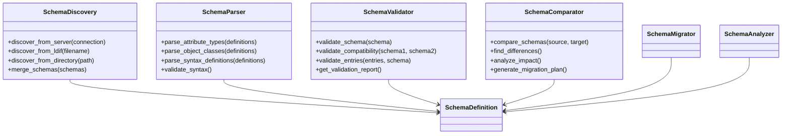
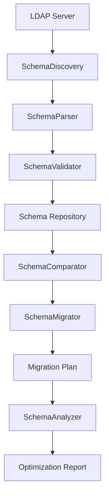

# 🔍 Schema Discovery API

**Comprehensive LDAP Schema Discovery and Management**

The Schema Discovery module provides enterprise-grade capabilities for discovering, parsing, validating, comparing, migrating, and analyzing LDAP schemas. It supports RFC 2252 compliant schema definitions and provides advanced schema management features.

## 📋 Table of Contents

- [🏗️ Architecture Overview](#-architecture-overview)
- [🔍 SchemaDiscovery](#-schemadiscovery)
- [📋 SchemaParser](#-schemaparser)
- [✅ SchemaValidator](#-schemavalidator)
- [📊 SchemaComparator](#-schemacomparator)
- [🔄 SchemaMigrator](#-schemamigrator)
- [📈 SchemaAnalyzer](#-schemaanalyzer)
- [🎯 Usage Examples](#-usage-examples)
- [🔧 Best Practices](#-best-practices)

## 🏗️ Architecture Overview

The Schema Management suite follows enterprise architecture principles for comprehensive schema lifecycle management:

### 🎯 **Key Features**
- **RFC 2252 Compliant**: Standards-compliant schema parsing and validation
- **Multi-Server Discovery**: Discover schemas from multiple LDAP servers
- **Schema Evolution**: Track and manage schema changes over time
- **Migration Planning**: Generate migration plans and LDIF files
- **Compatibility Analysis**: Assess schema compatibility across environments
- **Performance Optimization**: Schema-based query optimization recommendations

### 📊 **Component Architecture**



### 🔄 **Schema Management Workflow**



## 🔍 SchemaDiscovery

Core schema discovery engine that can discover schemas from various sources.

### Constructor

```python
class SchemaDiscovery:
    def __init__(
        self,
        cache_enabled: bool = True,
        cache_timeout: int = 3600,
        include_operational: bool = False,
        include_extensions: bool = True,
        discovery_timeout: int = 30,
    )
```

### Parameters

| Parameter | Type | Default | Description |
|-----------|------|---------|-------------|
| `cache_enabled` | `bool` | `True` | Enable schema caching |
| `cache_timeout` | `int` | `3600` | Cache timeout in seconds |
| `include_operational` | `bool` | `False` | Include operational attributes |
| `include_extensions` | `bool` | `True` | Include vendor extensions |
| `discovery_timeout` | `int` | `30` | Discovery timeout in seconds |

### Methods

#### `discover_from_server(connection_info: ConnectionInfo) -> LDAPSearchResult`

Discover schema from LDAP server with comprehensive metadata.

```python
from ldap_core_shared.schema import SchemaDiscovery
from ldap_core_shared.core.connection_manager import ConnectionInfo

discovery = SchemaDiscovery(
    include_operational=True,
    include_extensions=True
)

conn_info = ConnectionInfo(
    host="ldap.example.com",
    port=389,
    bind_dn="cn=REDACTED_LDAP_BIND_PASSWORD,dc=example,dc=com",
    password="REDACTED_LDAP_BIND_PASSWORD_password"
)

result = discovery.discover_from_server(conn_info)

if result.success:
    schema = result.entries[0]  # Schema definition
    
    print(f"Schema discovered from {conn_info.host}")
    print(f"Discovery time: {result.search_duration:.2f}ms")
    print(f"Attribute types: {len(schema['attributeTypes'])}")
    print(f"Object classes: {len(schema['objectClasses'])}")
    print(f"Syntax definitions: {len(schema['ldapSyntaxes'])}")
    print(f"Matching rules: {len(schema['matchingRules'])}")
    
    # Access specific schema components
    attribute_types = schema['attributeTypes']
    object_classes = schema['objectClasses']
    ldap_syntaxes = schema['ldapSyntaxes']
    matching_rules = schema['matchingRules']
    
else:
    print(f"Schema discovery failed: {result.errors}")
```

**Returns**: `LDAPSearchResult` with schema definition and discovery metadata.

#### `discover_from_ldif(filename: str) -> SchemaDefinition`

Discover schema from LDIF file containing schema definitions.

```python
# Discover from OpenLDAP schema file
schema = discovery.discover_from_ldif("schema/core.ldif")

# Discover from custom schema export
schema = discovery.discover_from_ldif("exports/production_schema.ldif")

print(f"Schema loaded from LDIF:")
print(f"  Attribute types: {len(schema.attribute_types)}")
print(f"  Object classes: {len(schema.object_classes)}")
```

#### `discover_from_directory(directory_path: str) -> list[SchemaDefinition]`

Discover schemas from directory containing schema files.

```python
# Discover all schemas from OpenLDAP schema directory
schemas = discovery.discover_from_directory("/etc/openldap/schema/")

print(f"Discovered {len(schemas)} schema files:")
for schema in schemas:
    print(f"  {schema.name}: {len(schema.attribute_types)} attributes, "
          f"{len(schema.object_classes)} object classes")
```

#### `merge_schemas(schemas: list[SchemaDefinition]) -> SchemaDefinition`

Merge multiple schema definitions into a unified schema.

```python
# Merge multiple schema sources
core_schema = discovery.discover_from_ldif("schema/core.ldif")
cosine_schema = discovery.discover_from_ldif("schema/cosine.ldif")
inetorgperson_schema = discovery.discover_from_ldif("schema/inetorgperson.ldif")

merged_schema = discovery.merge_schemas([
    core_schema,
    cosine_schema,
    inetorgperson_schema
])

print(f"Merged schema contains:")
print(f"  Total attribute types: {len(merged_schema.attribute_types)}")
print(f"  Total object classes: {len(merged_schema.object_classes)}")
print(f"  Conflicts resolved: {merged_schema.merge_conflicts}")
```

### Advanced Discovery Features

#### Multi-Server Discovery

```python
# Discover from multiple servers for high availability
servers = [
    ConnectionInfo(host="ldap1.example.com"),
    ConnectionInfo(host="ldap2.example.com"),
    ConnectionInfo(host="ldap3.example.com"),
]

schemas = []
for server in servers:
    try:
        result = discovery.discover_from_server(server)
        if result.success:
            schemas.append(result.entries[0])
            print(f"✅ Discovered schema from {server.host}")
        else:
            print(f"❌ Failed to discover schema from {server.host}")
    except Exception as e:
        print(f"❌ Error connecting to {server.host}: {e}")

# Compare schemas for consistency
if len(schemas) > 1:
    comparator = SchemaComparator()
    for i in range(1, len(schemas)):
        differences = comparator.compare_schemas(schemas[0], schemas[i])
        if differences.has_differences:
            print(f"⚠️  Schema differences detected between servers")
```

#### Schema Evolution Tracking

```python
# Track schema changes over time
class SchemaTracker:
    def __init__(self, storage_path: str):
        self.storage_path = storage_path
        self.discovery = SchemaDiscovery()
    
    def capture_schema_snapshot(self, connection_info: ConnectionInfo, version: str):
        """Capture schema snapshot with version information."""
        result = self.discovery.discover_from_server(connection_info)
        
        if result.success:
            schema = result.entries[0]
            schema['version'] = version
            schema['timestamp'] = datetime.now(UTC)
            schema['server'] = connection_info.host
            
            # Save snapshot
            filename = f"{self.storage_path}/schema_v{version}_{connection_info.host}.json"
            with open(filename, 'w') as f:
                json.dump(schema, f, indent=2, default=str)
            
            print(f"Schema snapshot saved: {filename}")
            return schema
        else:
            raise Exception(f"Failed to capture schema: {result.errors}")
    
    def compare_versions(self, version1: str, version2: str):
        """Compare schema versions."""
        schema1 = self.load_schema_version(version1)
        schema2 = self.load_schema_version(version2)
        
        comparator = SchemaComparator()
        differences = comparator.compare_schemas(schema1, schema2)
        
        return differences

# Usage
tracker = SchemaTracker("/var/ldap/schema_history")

# Capture before maintenance
tracker.capture_schema_snapshot(conn_info, "2024.1.0")

# After schema changes
tracker.capture_schema_snapshot(conn_info, "2024.1.1")

# Compare versions
differences = tracker.compare_versions("2024.1.0", "2024.1.1")
```

## 📋 SchemaParser

RFC 2252 compliant schema parser with comprehensive validation.

### Constructor

```python
class SchemaParser:
    def __init__(
        self,
        strict_mode: bool = True,
        validate_oids: bool = True,
        resolve_references: bool = True,
        include_descriptions: bool = True,
    )
```

### Methods

#### `parse_attribute_types(definitions: list[str]) -> list[AttributeType]`

Parse attribute type definitions with full validation.

```python
parser = SchemaParser(strict_mode=True)

# Parse attribute type definitions
attribute_definitions = [
    "( 2.5.4.3 NAME 'cn' SUP name )",
    "( 2.5.4.4 NAME 'sn' SUP name )",
    "( 0.9.2342.19200300.100.1.3 NAME 'mail' EQUALITY caseIgnoreIA5Match "
    "SUBSTR caseIgnoreIA5SubstringsMatch SYNTAX 1.3.6.1.4.1.1466.115.121.1.26{256} )"
]

attribute_types = parser.parse_attribute_types(attribute_definitions)

for attr_type in attribute_types:
    print(f"Attribute: {attr_type.name}")
    print(f"  OID: {attr_type.oid}")
    print(f"  Superior: {attr_type.superior}")
    print(f"  Syntax: {attr_type.syntax}")
    print(f"  Equality matching: {attr_type.equality_matching}")
    print(f"  Single value: {attr_type.single_value}")
    print(f"  User modifiable: {attr_type.user_modifiable}")
```

#### `parse_object_classes(definitions: list[str]) -> list[ObjectClass]`

Parse object class definitions with inheritance resolution.

```python
# Parse object class definitions
objectclass_definitions = [
    "( 2.5.6.6 NAME 'person' SUP top STRUCTURAL "
    "MUST ( sn $ cn ) MAY ( userPassword $ telephoneNumber $ seeAlso $ description ) )",
    "( 2.16.840.1.113730.3.2.2 NAME 'inetOrgPerson' SUP organizationalPerson STRUCTURAL "
    "MAY ( audio $ businessCategory $ carLicense $ departmentNumber $ displayName $ "
    "employeeNumber $ employeeType $ givenName $ homePhone $ homePostalAddress $ "
    "initials $ jpegPhoto $ labeledURI $ mail $ manager $ mobile $ o $ pager $ "
    "photo $ roomNumber $ secretary $ uid $ userCertificate $ x500uniqueIdentifier $ "
    "preferredLanguage $ userSMIMECertificate $ userPKCS12 ) )"
]

object_classes = parser.parse_object_classes(objectclass_definitions)

for obj_class in object_classes:
    print(f"Object Class: {obj_class.name}")
    print(f"  OID: {obj_class.oid}")
    print(f"  Superior: {obj_class.superior}")
    print(f"  Type: {obj_class.type}")  # STRUCTURAL, AUXILIARY, ABSTRACT
    print(f"  Required attributes: {obj_class.must_attributes}")
    print(f"  Optional attributes: {obj_class.may_attributes}")
```

#### `parse_syntax_definitions(definitions: list[str]) -> list[SyntaxDefinition]`

Parse LDAP syntax definitions.

```python
syntax_definitions = [
    "( 1.3.6.1.4.1.1466.115.121.1.26 DESC 'IA5 String' )",
    "( 1.3.6.1.4.1.1466.115.121.1.15 DESC 'Directory String' )"
]

syntaxes = parser.parse_syntax_definitions(syntax_definitions)

for syntax in syntaxes:
    print(f"Syntax: {syntax.oid}")
    print(f"  Description: {syntax.description}")
    print(f"  Validator: {syntax.validator_class}")
```

### Advanced Parsing Features

#### Reference Resolution

```python
# Parser with reference resolution
parser = SchemaParser(resolve_references=True)

# Parse with automatic reference resolution
schema_definition = parser.parse_complete_schema(raw_schema_data)

# All superior references, syntax references, and matching rule references
# are automatically resolved and validated
```

#### Validation and Error Reporting

```python
parser = SchemaParser(strict_mode=True)

try:
    attribute_types = parser.parse_attribute_types(definitions)
except SchemaParseError as e:
    print(f"Parse error: {e.message}")
    print(f"Line: {e.line_number}")
    print(f"Context: {e.context}")
    
    # Get detailed error information
    for error in e.detailed_errors:
        print(f"  {error.severity}: {error.message}")
        print(f"    Location: {error.location}")
        print(f"    Suggestion: {error.suggestion}")
```

## ✅ SchemaValidator

Comprehensive schema validation with detailed error reporting.

### Constructor

```python
class SchemaValidator:
    def __init__(
        self,
        validate_oids: bool = True,
        validate_references: bool = True,
        validate_syntax: bool = True,
        check_conflicts: bool = True,
    )
```

### Methods

#### `validate_schema(schema: SchemaDefinition) -> LDAPValidationResult`

Comprehensive schema validation with detailed error categorization.

```python
validator = SchemaValidator(
    validate_oids=True,
    validate_references=True,
    validate_syntax=True
)

result = validator.validate_schema(schema)

print(f"Schema Validation Result:")
print(f"  Valid: {result.valid}")
print(f"  Components validated: {result.entries_validated}")
print(f"  Validation time: {result.validation_duration:.2f}ms")

if not result.valid:
    print(f"Total errors: {result.total_errors}")
    
    # Categorized errors
    if result.syntax_errors:
        print("Syntax Errors:")
        for error in result.syntax_errors:
            print(f"  - {error}")
    
    if result.schema_errors:
        print("Schema Errors:")
        for error in result.schema_errors:
            print(f"  - {error}")
    
    if result.reference_errors:
        print("Reference Errors:")
        for error in result.reference_errors:
            print(f"  - {error}")
```

#### `validate_compatibility(schema1: SchemaDefinition, schema2: SchemaDefinition) -> CompatibilityResult`

Validate compatibility between two schemas.

```python
# Validate compatibility between production and development schemas
prod_schema = discovery.discover_from_server(prod_connection)
dev_schema = discovery.discover_from_server(dev_connection)

compatibility = validator.validate_compatibility(prod_schema, dev_schema)

print(f"Schema Compatibility Analysis:")
print(f"  Compatible: {compatibility.compatible}")
print(f"  Compatibility score: {compatibility.score:.1f}%")

if not compatibility.compatible:
    print("Compatibility Issues:")
    for issue in compatibility.issues:
        print(f"  {issue.severity}: {issue.description}")
        print(f"    Impact: {issue.impact}")
        print(f"    Recommendation: {issue.recommendation}")
```

#### `validate_entries(entries: list[dict], schema: SchemaDefinition) -> list[ValidationError]`

Validate LDAP entries against schema.

```python
# Validate LDIF entries against schema
entries = processor.parse_file("import.ldif").entries
validation_errors = validator.validate_entries(entries, schema)

if validation_errors:
    print(f"Found {len(validation_errors)} validation errors:")
    
    for error in validation_errors:
        print(f"Entry: {error.entry_dn}")
        print(f"  Error: {error.message}")
        print(f"  Attribute: {error.attribute}")
        print(f"  Severity: {error.severity}")
        print(f"  Fix suggestion: {error.fix_suggestion}")
else:
    print("All entries are valid according to schema")
```

### Validation Categories

#### OID Validation
- OID format compliance
- OID uniqueness
- OID assignment validation
- Vendor OID space validation

#### Reference Validation
- Superior class references
- Syntax references
- Matching rule references
- Circular dependency detection

#### Syntax Validation
- Attribute value syntax compliance
- Length constraints
- Pattern matching
- Character set validation

## 📊 SchemaComparator

Advanced schema comparison with impact analysis.

### Constructor

```python
class SchemaComparator:
    def __init__(
        self,
        compare_descriptions: bool = False,
        ignore_extensions: bool = False,
        case_sensitive: bool = True,
        include_metadata: bool = True,
    )
```

### Methods

#### `compare_schemas(source: SchemaDefinition, target: SchemaDefinition) -> SchemaDifference`

Comprehensive schema comparison with detailed difference analysis.

```python
comparator = SchemaComparator(
    compare_descriptions=True,
    include_metadata=True
)

# Compare production and staging schemas
prod_schema = discovery.discover_from_server(prod_connection)
staging_schema = discovery.discover_from_server(staging_connection)

differences = comparator.compare_schemas(prod_schema, staging_schema)

print(f"Schema Comparison Results:")
print(f"  Schemas are identical: {not differences.has_differences}")
print(f"  Total differences: {differences.total_differences}")
print(f"  Comparison time: {differences.comparison_duration:.2f}ms")

# Detailed difference analysis
if differences.has_differences:
    print("\nDifferences Found:")
    
    # Attribute type differences
    if differences.attribute_differences:
        print("Attribute Type Differences:")
        for diff in differences.attribute_differences:
            print(f"  {diff.change_type}: {diff.name}")
            print(f"    Source: {diff.source_definition}")
            print(f"    Target: {diff.target_definition}")
            print(f"    Impact: {diff.impact_assessment}")
    
    # Object class differences
    if differences.objectclass_differences:
        print("Object Class Differences:")
        for diff in differences.objectclass_differences:
            print(f"  {diff.change_type}: {diff.name}")
            print(f"    Impact: {diff.impact_assessment}")
    
    # Syntax differences
    if differences.syntax_differences:
        print("Syntax Differences:")
        for diff in differences.syntax_differences:
            print(f"  {diff.change_type}: {diff.oid}")
```

#### `analyze_impact(differences: SchemaDifference) -> ImpactAnalysis`

Analyze the impact of schema differences.

```python
impact_analysis = comparator.analyze_impact(differences)

print(f"Impact Analysis:")
print(f"  Risk level: {impact_analysis.risk_level}")
print(f"  Breaking changes: {impact_analysis.breaking_changes}")
print(f"  Data migration required: {impact_analysis.data_migration_required}")
print(f"  Application changes required: {impact_analysis.app_changes_required}")

# Detailed impact assessment
for impact in impact_analysis.detailed_impacts:
    print(f"\nComponent: {impact.component}")
    print(f"  Change type: {impact.change_type}")
    print(f"  Risk level: {impact.risk_level}")
    print(f"  Description: {impact.description}")
    print(f"  Mitigation: {impact.mitigation_strategy}")
    
    if impact.affected_entries:
        print(f"  Affected entries: {impact.affected_entries}")
    
    if impact.required_actions:
        print(f"  Required actions:")
        for action in impact.required_actions:
            print(f"    - {action}")
```

### Comparison Types

#### Structural Comparison
- Attribute type changes
- Object class modifications
- Hierarchy changes
- Required/optional attribute changes

#### Semantic Comparison
- Syntax changes
- Matching rule modifications
- Constraint changes
- Description updates

#### Compatibility Analysis
- Forward compatibility
- Backward compatibility
- Migration complexity assessment

## 🔄 SchemaMigrator

Enterprise schema migration planning and execution.

### Constructor

```python
class SchemaMigrator:
    def __init__(
        self,
        migration_strategy: str = "incremental",
        backup_enabled: bool = True,
        validation_enabled: bool = True,
        rollback_enabled: bool = True,
    )
```

### Methods

#### `generate_migration_plan(source: SchemaDefinition, target: SchemaDefinition) -> MigrationPlan`

Generate comprehensive migration plan between schemas.

```python
migrator = SchemaMigrator(
    migration_strategy="incremental",
    backup_enabled=True,
    validation_enabled=True
)

# Generate migration plan
migration_plan = migrator.generate_migration_plan(
    source=current_schema,
    target=new_schema
)

print(f"Migration Plan Generated:")
print(f"  Migration type: {migration_plan.migration_type}")
print(f"  Estimated duration: {migration_plan.estimated_duration}")
print(f"  Risk assessment: {migration_plan.risk_assessment}")
print(f"  Rollback strategy: {migration_plan.rollback_strategy}")

# Migration phases
print(f"\nMigration Phases ({len(migration_plan.phases)}):")
for i, phase in enumerate(migration_plan.phases, 1):
    print(f"  Phase {i}: {phase.name}")
    print(f"    Description: {phase.description}")
    print(f"    Duration: {phase.estimated_duration}")
    print(f"    Dependencies: {phase.dependencies}")
    print(f"    Validation steps: {len(phase.validation_steps)}")
    print(f"    Rollback steps: {len(phase.rollback_steps)}")
```

#### `generate_migration_ldif(migration_plan: MigrationPlan) -> str`

Generate LDIF files for schema migration.

```python
# Generate migration LDIF
migration_ldif = migrator.generate_migration_ldif(migration_plan)

# Save migration LDIF
with open("schema_migration.ldif", "w") as f:
    f.write(migration_ldif)

print("Migration LDIF generated:")
print("  File: schema_migration.ldif")
print("  Size: {:.1f} KB".format(len(migration_ldif) / 1024))

# Generate rollback LDIF
rollback_ldif = migrator.generate_rollback_ldif(migration_plan)
with open("schema_rollback.ldif", "w") as f:
    f.write(rollback_ldif)
```

#### `execute_migration(migration_plan: MigrationPlan, connection_info: ConnectionInfo) -> MigrationResult`

Execute migration plan with comprehensive monitoring.

```python
# Execute migration with monitoring
def migration_progress_callback(phase: str, step: str, progress: float):
    print(f"Migration Progress: {phase} - {step} ({progress:.1f}%)")

migration_result = migrator.execute_migration(
    migration_plan=migration_plan,
    connection_info=connection_info,
    progress_callback=migration_progress_callback,
    dry_run=False  # Set to True for testing
)

if migration_result.success:
    print(f"✅ Migration completed successfully!")
    print(f"  Duration: {migration_result.total_duration:.2f}s")
    print(f"  Phases completed: {migration_result.phases_completed}")
    print(f"  Schema version: {migration_result.new_schema_version}")
else:
    print(f"❌ Migration failed: {migration_result.error_message}")
    print(f"  Failed at phase: {migration_result.failed_phase}")
    print(f"  Rollback required: {migration_result.rollback_required}")
    
    if migration_result.rollback_required:
        print("Initiating automatic rollback...")
        rollback_result = migrator.execute_rollback(migration_result)
        if rollback_result.success:
            print("✅ Rollback completed successfully")
        else:
            print("❌ Rollback failed - manual intervention required")
```

### Migration Strategies

#### Incremental Migration

```python
migrator = SchemaMigrator(migration_strategy="incremental")
# Applies changes incrementally to minimize downtime
```

#### Blue-Green Migration

```python
migrator = SchemaMigrator(migration_strategy="blue_green")
# Creates parallel environment for zero-downtime migration
```

#### Phased Migration

```python
migrator = SchemaMigrator(migration_strategy="phased")
# Splits migration into phases with validation points
```

## 📈 SchemaAnalyzer

Advanced schema analysis and optimization recommendations.

### Constructor

```python
class SchemaAnalyzer:
    def __init__(
        self,
        include_performance_analysis: bool = True,
        include_optimization_suggestions: bool = True,
        include_compliance_check: bool = True,
        analysis_depth: str = "comprehensive",
    )
```

### Methods

#### `analyze_schema(schema: SchemaDefinition) -> SchemaAnalysisResult`

Comprehensive schema analysis with optimization recommendations.

```python
analyzer = SchemaAnalyzer(
    include_performance_analysis=True,
    include_optimization_suggestions=True,
    analysis_depth="comprehensive"
)

analysis = analyzer.analyze_schema(schema)

print(f"Schema Analysis Report:")
print(f"======================")
print(f"Schema name: {analysis.schema_name}")
print(f"Analysis time: {analysis.analysis_duration:.2f}ms")
print(f"Overall health score: {analysis.health_score:.1f}/100")

# Component statistics
print(f"\nComponent Statistics:")
print(f"  Attribute types: {analysis.attribute_count}")
print(f"  Object classes: {analysis.objectclass_count}")
print(f"  Syntax definitions: {analysis.syntax_count}")
print(f"  Matching rules: {analysis.matching_rule_count}")

# Complexity analysis
print(f"\nComplexity Analysis:")
print(f"  Schema complexity: {analysis.complexity_score:.1f}/100")
print(f"  Inheritance depth: {analysis.max_inheritance_depth}")
print(f"  Circular dependencies: {analysis.circular_dependencies}")

# Performance analysis
if analysis.performance_analysis:
    perf = analysis.performance_analysis
    print(f"\nPerformance Analysis:")
    print(f"  Index recommendations: {len(perf.index_recommendations)}")
    print(f"  Query optimization hints: {len(perf.query_optimizations)}")
    print(f"  Estimated query performance: {perf.query_performance_score:.1f}/100")

# Optimization suggestions
if analysis.optimization_suggestions:
    print(f"\nOptimization Suggestions ({len(analysis.optimization_suggestions)}):")
    for suggestion in analysis.optimization_suggestions:
        print(f"  {suggestion.priority}: {suggestion.title}")
        print(f"    Description: {suggestion.description}")
        print(f"    Expected impact: {suggestion.expected_impact}")
        print(f"    Implementation effort: {suggestion.implementation_effort}")
```

#### `generate_optimization_report(analysis: SchemaAnalysisResult, format: str = "text") -> str`

Generate detailed optimization report.

```python
# Generate text report
text_report = analyzer.generate_optimization_report(analysis, format="text")
print(text_report)

# Generate HTML report
html_report = analyzer.generate_optimization_report(analysis, format="html")
with open("schema_optimization_report.html", "w") as f:
    f.write(html_report)

# Generate JSON report for programmatic use
json_report = analyzer.generate_optimization_report(analysis, format="json")
with open("schema_analysis.json", "w") as f:
    f.write(json_report)
```

### Analysis Categories

#### Structural Analysis
- Schema complexity assessment
- Inheritance hierarchy analysis
- Dependency mapping
- Circular dependency detection

#### Performance Analysis
- Index usage recommendations
- Query optimization suggestions
- Storage efficiency analysis
- Network transfer optimization

#### Compliance Analysis
- RFC compliance validation
- Best practice adherence
- Security consideration analysis
- Interoperability assessment

## 🎯 Usage Examples

### Complete Schema Management Pipeline

```python
from ldap_core_shared.schema import (
    SchemaDiscovery, SchemaParser, SchemaValidator,
    SchemaComparator, SchemaMigrator, SchemaAnalyzer
)

def comprehensive_schema_management():
    """Complete schema management workflow."""
    
    # Initialize components
    discovery = SchemaDiscovery(cache_enabled=True)
    validator = SchemaValidator(validate_oids=True)
    comparator = SchemaComparator(include_metadata=True)
    migrator = SchemaMigrator(backup_enabled=True)
    analyzer = SchemaAnalyzer(analysis_depth="comprehensive")
    
    # Step 1: Discover current schema
    print("Step 1: Discovering current schema...")
    current_result = discovery.discover_from_server(prod_connection)
    if not current_result.success:
        raise Exception(f"Failed to discover current schema: {current_result.errors}")
    
    current_schema = current_result.entries[0]
    print(f"✅ Current schema discovered: {len(current_schema['attributeTypes'])} attributes")
    
    # Step 2: Validate current schema
    print("\nStep 2: Validating current schema...")
    validation_result = validator.validate_schema(current_schema)
    if not validation_result.valid:
        print(f"⚠️  Schema validation issues: {validation_result.total_errors} errors")
        for error in validation_result.schema_errors[:5]:  # Show first 5 errors
            print(f"  - {error}")
    else:
        print("✅ Current schema is valid")
    
    # Step 3: Analyze current schema
    print("\nStep 3: Analyzing current schema...")
    analysis = analyzer.analyze_schema(current_schema)
    print(f"Schema health score: {analysis.health_score:.1f}/100")
    
    if analysis.optimization_suggestions:
        print("Top optimization suggestions:")
        for suggestion in analysis.optimization_suggestions[:3]:
            print(f"  - {suggestion.title} (Impact: {suggestion.expected_impact})")
    
    # Step 4: Load target schema
    print("\nStep 4: Loading target schema...")
    target_schema = discovery.discover_from_ldif("schemas/target_schema.ldif")
    
    # Step 5: Compare schemas
    print("\nStep 5: Comparing schemas...")
    differences = comparator.compare_schemas(current_schema, target_schema)
    
    if differences.has_differences:
        print(f"Found {differences.total_differences} differences")
        
        # Analyze impact
        impact_analysis = comparator.analyze_impact(differences)
        print(f"Migration risk level: {impact_analysis.risk_level}")
        
        if impact_analysis.risk_level in ["HIGH", "CRITICAL"]:
            print("⚠️  High-risk migration detected - additional planning required")
        
        # Step 6: Generate migration plan
        print("\nStep 6: Generating migration plan...")
        migration_plan = migrator.generate_migration_plan(current_schema, target_schema)
        
        print(f"Migration plan created:")
        print(f"  Phases: {len(migration_plan.phases)}")
        print(f"  Estimated duration: {migration_plan.estimated_duration}")
        print(f"  Risk assessment: {migration_plan.risk_assessment}")
        
        # Step 7: Generate migration artifacts
        print("\nStep 7: Generating migration artifacts...")
        migration_ldif = migrator.generate_migration_ldif(migration_plan)
        rollback_ldif = migrator.generate_rollback_ldif(migration_plan)
        
        # Save artifacts
        with open("migration.ldif", "w") as f:
            f.write(migration_ldif)
        with open("rollback.ldif", "w") as f:
            f.write(rollback_ldif)
        
        print("✅ Migration artifacts generated")
        
        # Step 8: Execute migration (dry run)
        print("\nStep 8: Executing migration (dry run)...")
        migration_result = migrator.execute_migration(
            migration_plan=migration_plan,
            connection_info=staging_connection,
            dry_run=True
        )
        
        if migration_result.success:
            print("✅ Dry run successful - migration is ready for execution")
        else:
            print(f"❌ Dry run failed: {migration_result.error_message}")
    
    else:
        print("✅ Schemas are identical - no migration required")

# Execute the complete workflow
comprehensive_schema_management()
```

### Schema Evolution Monitoring

```python
def setup_schema_monitoring():
    """Set up continuous schema monitoring and alerting."""
    
    discovery = SchemaDiscovery()
    validator = SchemaValidator()
    analyzer = SchemaAnalyzer()
    
    def monitor_schema_changes():
        """Monitor for schema changes."""
        try:
            # Discover current schema
            result = discovery.discover_from_server(connection_info)
            current_schema = result.entries[0]
            
            # Load baseline schema
            baseline_schema = load_baseline_schema()
            
            # Compare with baseline
            comparator = SchemaComparator()
            differences = comparator.compare_schemas(baseline_schema, current_schema)
            
            if differences.has_differences:
                # Alert on changes
                alert_message = f"Schema changes detected: {differences.total_differences} differences"
                send_alert(alert_message, differences)
                
                # Update baseline if approved
                if auto_approve_changes(differences):
                    save_baseline_schema(current_schema)
            
            # Validate schema health
            validation_result = validator.validate_schema(current_schema)
            if not validation_result.valid:
                send_critical_alert(f"Schema validation failed: {validation_result.total_errors} errors")
            
            # Analyze performance
            analysis = analyzer.analyze_schema(current_schema)
            if analysis.health_score < 80:
                send_warning_alert(f"Schema health score low: {analysis.health_score:.1f}/100")
        
        except Exception as e:
            send_critical_alert(f"Schema monitoring failed: {e}")
    
    # Schedule monitoring
    schedule.every(1).hours.do(monitor_schema_changes)
    
    while True:
        schedule.run_pending()
        time.sleep(60)

# Start monitoring
setup_schema_monitoring()
```

## 🔧 Best Practices

### 1. **Always Validate Before Migration**

```python
# ✅ Good - Comprehensive validation before migration
validation_result = validator.validate_schema(target_schema)
if validation_result.valid:
    proceed_with_migration(target_schema)
else:
    fix_validation_errors(validation_result)

# ❌ Bad - Migration without validation
proceed_with_migration(target_schema)  # May cause runtime errors
```

### 2. **Use Incremental Migration for Large Changes**

```python
# ✅ Good - Incremental migration for safety
migrator = SchemaMigrator(
    migration_strategy="incremental",
    backup_enabled=True,
    validation_enabled=True
)

# ❌ Bad - All-at-once migration for large changes
migrator = SchemaMigrator(migration_strategy="all_at_once")
```

### 3. **Monitor Schema Evolution**

```python
# ✅ Good - Continuous schema monitoring
def monitor_schema_health():
    analysis = analyzer.analyze_schema(current_schema)
    if analysis.health_score < 80:
        investigate_issues(analysis)

# ❌ Bad - No monitoring of schema changes
# Changes accumulate without oversight
```

### 4. **Use Schema Caching for Performance**

```python
# ✅ Good - Enable caching for frequently accessed schemas
discovery = SchemaDiscovery(
    cache_enabled=True,
    cache_timeout=3600  # 1 hour
)

# ❌ Bad - No caching for repeated schema access
discovery = SchemaDiscovery(cache_enabled=False)
```

### 5. **Plan for Rollback**

```python
# ✅ Good - Always plan for rollback
migration_plan = migrator.generate_migration_plan(source, target)
rollback_ldif = migrator.generate_rollback_ldif(migration_plan)

# Execute with rollback capability
migration_result = migrator.execute_migration(
    migration_plan,
    connection_info,
    rollback_enabled=True
)

# ❌ Bad - No rollback planning
migrator.execute_migration(migration_plan, connection_info)
```

---

**🔍 Related Documentation**
- [📋 Schema Parser](parser.md)
- [✅ Schema Validator](validator.md)
- [📊 Schema Comparator](comparator.md)
- [🔄 Schema Migrator](migrator.md)
- [📈 Schema Analyzer](analyzer.md)