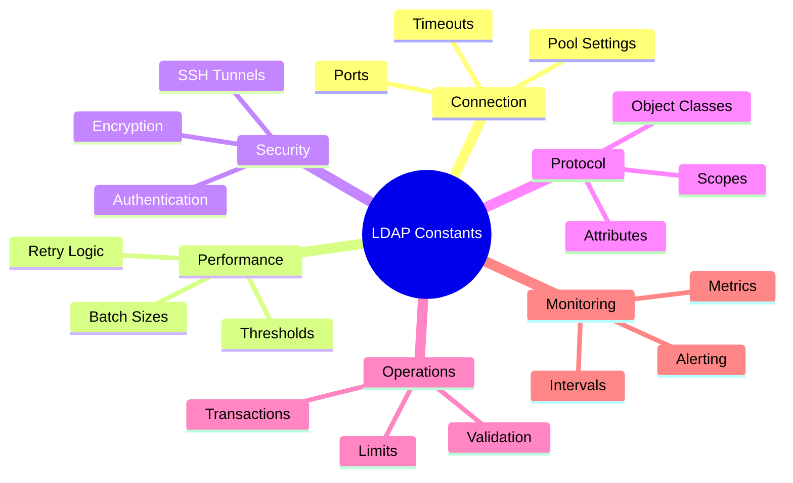

# 📋 Constants API

**Comprehensive LDAP Constants and Configuration Values**

The constants module provides centralized LDAP constants used across the entire ldap-core-shared library. This ensures consistency, prevents magic numbers, and provides enterprise-grade configuration management.

## 📋 Table of Contents

- [🏗️ Architecture Overview](#-architecture-overview)
- [🔗 Connection Constants](#-connection-constants)
- [📊 Performance Constants](#-performance-constants)
- [🔒 Security Constants](#-security-constants)
- [🔍 LDAP Protocol Constants](#-ldap-protocol-constants)
- [⚙️ Operation Constants](#-operation-constants)
- [📈 Monitoring Constants](#-monitoring-constants)
- [🎯 Configuration Profiles](#-configuration-profiles)
- [🎯 Usage Examples](#-usage-examples)
- [🔧 Best Practices](#-best-practices)

## 🏗️ Architecture Overview

The constants module follows enterprise architecture principles for configuration management:

### 🎯 **Design Principles**
- **Centralized Configuration**: Single source of truth for all constants
- **Environment Awareness**: Different profiles for dev/test/prod
- **Type Safety**: Properly typed constants with validation
- **Performance Optimization**: A+ grade performance targets
- **Enterprise Standards**: RFC-compliant default values

### 📊 **Constant Categories**



## 🔗 Connection Constants

Core LDAP connection defaults and limits for enterprise environments.

### Port Configuration

```python
# Default LDAP ports
DEFAULT_LDAP_PORT = 389        # Standard LDAP port
DEFAULT_LDAPS_PORT = 636       # LDAP over SSL port
```

### Timeout Configuration

```python
# Connection timeouts
DEFAULT_LDAP_TIMEOUT = 30      # Connection timeout (seconds)
DEFAULT_LDAP_SIZE_LIMIT = 1000 # Default search size limit
DEFAULT_LDAP_TIME_LIMIT = 30   # Default search time limit (seconds)
```

### Connection Pool Constants

```python
# Connection pooling
DEFAULT_POOL_SIZE = 10         # Initial pool size
DEFAULT_MAX_POOL_SIZE = 50     # Maximum pool size
DEFAULT_POOL_TIMEOUT = 60      # Pool connection timeout (seconds)
CONNECTION_MAX_AGE = 3600      # Connection max age (1 hour)
CONNECTION_MAX_IDLE = 300      # Connection max idle time (5 minutes)
```

### Usage Examples

```python
from ldap_core_shared.utils.constants import (
    DEFAULT_LDAP_PORT, DEFAULT_LDAPS_PORT, 
    DEFAULT_POOL_SIZE, CONNECTION_MAX_AGE
)

# Standard LDAP connection
conn_info = ConnectionInfo(
    host="ldap.example.com",
    port=DEFAULT_LDAP_PORT,  # 389
    timeout=DEFAULT_LDAP_TIMEOUT  # 30 seconds
)

# Secure LDAP connection
secure_conn_info = ConnectionInfo(
    host="ldaps.example.com", 
    port=DEFAULT_LDAPS_PORT,  # 636
    use_ssl=True
)

# Connection pool configuration
pool = ConnectionPool(
    connection_info=conn_info,
    min_connections=DEFAULT_POOL_SIZE,  # 10
    max_connections=DEFAULT_MAX_POOL_SIZE,  # 50
    timeout=DEFAULT_POOL_TIMEOUT  # 60 seconds
)
```

## 📊 Performance Constants

Enterprise performance targets and operational parameters for A+ grade performance.

### Batch Processing

```python
# Batch operation settings
DEFAULT_BATCH_SIZE = 100               # Default batch size for bulk operations
CHECKPOINT_INTERVAL_ENTRIES = 1000     # Checkpoint every N entries
PERFORMANCE_SAMPLING_INTERVAL = 10     # Performance sampling (seconds)
```

### Retry Logic

```python
# Retry configuration
MAX_RETRY_ATTEMPTS = 3                 # Maximum retry attempts
RETRY_DELAY_BASE = 1.0                 # Base retry delay (seconds)
```

### A+ Performance Targets

```python
# Enterprise performance thresholds
TARGET_OPERATIONS_PER_SECOND = 12000  # Target: 12K ops/second
TARGET_CONNECTION_REUSE_RATE = 0.95   # Target: 95% connection reuse
TARGET_POOL_EFFICIENCY_MS = 10        # Target: <10ms connection acquisition
TARGET_SUCCESS_RATE = 0.99            # Target: 99% success rate
```

### Resource Limits

```python
# Memory and resource limits
MAX_ENTRIES_LIMIT = 100000             # Maximum entries per operation
MAX_MEMORY_MB = 1024                   # Maximum memory usage (MB)
DEFAULT_FILE_ENCODING = "utf-8"       # Default file encoding
```

### Usage Examples

```python
from ldap_core_shared.utils.constants import (
    DEFAULT_BATCH_SIZE, TARGET_OPERATIONS_PER_SECOND,
    MAX_RETRY_ATTEMPTS, RETRY_DELAY_BASE
)

# Bulk operation with performance targets
def bulk_import_optimized(entries):
    batch_size = DEFAULT_BATCH_SIZE  # 100
    
    for i in range(0, len(entries), batch_size):
        batch = entries[i:i + batch_size]
        
        # Process with retry logic
        for attempt in range(MAX_RETRY_ATTEMPTS):  # 3 attempts
            try:
                result = operations.bulk_add(batch)
                break
            except Exception as e:
                if attempt < MAX_RETRY_ATTEMPTS - 1:
                    time.sleep(RETRY_DELAY_BASE * (2 ** attempt))  # Exponential backoff
                else:
                    raise

# Performance monitoring
def check_performance_targets(metrics):
    if metrics.operations_per_second < TARGET_OPERATIONS_PER_SECOND:
        logger.warning(
            f"Performance below target: {metrics.operations_per_second} < "
            f"{TARGET_OPERATIONS_PER_SECOND} ops/sec"
        )
    
    if metrics.connection_reuse_rate < TARGET_CONNECTION_REUSE_RATE:
        logger.warning(
            f"Low connection reuse: {metrics.connection_reuse_rate:.1%} < "
            f"{TARGET_CONNECTION_REUSE_RATE:.1%}"
        )
```

## 🔒 Security Constants

Security and encryption configuration for enterprise LDAP deployments.

### SSH Tunnel Configuration

```python
# SSH tunnel settings
SSH_TUNNEL_TIMEOUT = 30                # SSH tunnel timeout (seconds)
SSH_TUNNEL_RETRY_ATTEMPTS = 3          # SSH tunnel retry attempts
SSH_LOCAL_PORT_RANGE = (20000, 30000)  # Local port range for SSH tunnels
```

### Enterprise Security

```python
# Security parameters
PASSWORD_MIN_LENGTH = 12               # Minimum password length
SESSION_TIMEOUT_MINUTES = 30           # Session timeout (minutes)
AUDIT_LOG_RETENTION_DAYS = 365         # Audit log retention (days)
ENCRYPTION_ALGORITHM = "AES-256-GCM"   # Default encryption algorithm
```

### Error Handling

```python
# Error handling and resilience
MAX_ERROR_RETRIES = 3                  # Maximum error retries
ERROR_COOLDOWN_SECONDS = 5             # Error cooldown period
FAILURE_RATE_THRESHOLD = 0.1           # 10% failure rate threshold
CIRCUIT_BREAKER_THRESHOLD = 5          # Circuit breaker threshold
```

### Usage Examples

```python
from ldap_core_shared.utils.constants import (
    SSH_TUNNEL_TIMEOUT, PASSWORD_MIN_LENGTH,
    ENCRYPTION_ALGORITHM, CIRCUIT_BREAKER_THRESHOLD
)

# SSH tunnel configuration
tunnel = SSHTunnel(
    ssh_host="bastion.example.com",
    ssh_port=22,
    local_port_range=SSH_LOCAL_PORT_RANGE,  # (20000, 30000)
    timeout=SSH_TUNNEL_TIMEOUT  # 30 seconds
)

# Password validation
def validate_password(password: str) -> bool:
    if len(password) < PASSWORD_MIN_LENGTH:  # 12 characters
        raise ValueError(f"Password must be at least {PASSWORD_MIN_LENGTH} characters")
    return True

# Circuit breaker implementation
class LDAPCircuitBreaker:
    def __init__(self):
        self.failure_count = 0
        self.threshold = CIRCUIT_BREAKER_THRESHOLD  # 5 failures
    
    def record_failure(self):
        self.failure_count += 1
        if self.failure_count >= self.threshold:
            self.open_circuit()
```

## 🔍 LDAP Protocol Constants

Standard LDAP protocol values and RFC-compliant constants.

### Search Scopes

```python
# LDAP search scopes (RFC 4511)
LDAP_SCOPES = {
    "BASE": "base",        # Search only the base entry
    "ONELEVEL": "level",   # Search immediate children only
    "SUBTREE": "subtree",  # Search entire subtree
}
```

### Authentication Methods

```python
# LDAP authentication methods (RFC 4513)
LDAP_AUTH_METHODS = {
    "ANONYMOUS": "anonymous",  # Anonymous bind
    "SIMPLE": "simple",        # Simple authentication
    "SASL": "sasl",           # SASL authentication
}
```

### Encryption Protocols

```python
# Supported encryption protocols
SUPPORTED_PROTOCOLS = {
    "NONE": "none",            # No encryption
    "SSL": "ssl",              # SSL/TLS encryption
    "TLS": "tls",              # TLS encryption
    "STARTTLS": "starttls",    # StartTLS extension
}
```

### Object Classes

```python
# Common LDAP object classes (RFC 4519)
COMMON_OBJECT_CLASSES = {
    "PERSON": "person",                    # Person object class
    "INET_ORG_PERSON": "inetOrgPerson",   # Internet organizational person
    "GROUP": "group",                      # Group object class
    "ORGANIZATIONAL_UNIT": "organizationalUnit",  # Organizational unit
    "ORGANIZATION": "organization",        # Organization object class
    "DOMAIN": "domain",                   # Domain object class
}
```

### Standard Attributes

```python
# Standard LDAP attributes (RFC 4519)
STANDARD_ATTRIBUTES = {
    "CN": "cn",                    # Common Name
    "SN": "sn",                    # Surname
    "GIVEN_NAME": "givenName",     # Given name
    "DISPLAY_NAME": "displayName", # Display name
    "MAIL": "mail",                # Email address
    "UID": "uid",                  # User ID
    "OU": "ou",                    # Organizational Unit
    "DC": "dc",                    # Domain Component
    "OBJECT_CLASS": "objectClass", # Object class
    "DISTINGUISHED_NAME": "distinguishedName", # Distinguished name
    "MEMBER": "member",            # Group member
    "MEMBER_OF": "memberOf",       # Member of group
}
```

### Search Filter Templates

```python
# Common search filter templates
SEARCH_FILTERS = {
    "ALL_OBJECTS": "(objectClass=*)",        # All objects
    "PERSONS": "(objectClass=person)",       # All persons
    "GROUPS": "(objectClass=group)",         # All groups
    "USERS": "(objectClass=inetOrgPerson)",  # All users
    "CONTAINERS": "(objectClass=organizationalUnit)", # All containers
}
```

### Usage Examples

```python
from ldap_core_shared.utils.constants import (
    LDAP_SCOPES, COMMON_OBJECT_CLASSES, 
    STANDARD_ATTRIBUTES, SEARCH_FILTERS
)

# Search configuration
def search_users():
    return operations.search_entries(
        base_dn="ou=people,dc=example,dc=com",
        search_filter=SEARCH_FILTERS["USERS"],  # "(objectClass=inetOrgPerson)"
        scope=LDAP_SCOPES["SUBTREE"],           # "subtree"
        attributes=[
            STANDARD_ATTRIBUTES["CN"],           # "cn"
            STANDARD_ATTRIBUTES["MAIL"],         # "mail"
            STANDARD_ATTRIBUTES["GIVEN_NAME"],   # "givenName"
            STANDARD_ATTRIBUTES["SN"]            # "sn"
        ]
    )

# Entry creation
def create_user_entry(name, email):
    return {
        "dn": f"cn={name},ou=people,dc=example,dc=com",
        "attributes": {
            STANDARD_ATTRIBUTES["OBJECT_CLASS"]: [
                COMMON_OBJECT_CLASSES["PERSON"],        # "person"
                COMMON_OBJECT_CLASSES["INET_ORG_PERSON"] # "inetOrgPerson"
            ],
            STANDARD_ATTRIBUTES["CN"]: [name],           # "cn"
            STANDARD_ATTRIBUTES["MAIL"]: [email]         # "mail"
        }
    }
```

## ⚙️ Operation Constants

Constants for LDAP operations, transactions, and validation.

### Transaction Configuration

```python
# Transaction and backup settings
BACKUP_INITIAL_COUNT = 0                    # Initial backup count
LDAP_BACKUP_RETENTION_DAYS = 30            # Backup retention (days)
TRANSACTION_TIMEOUT_SECONDS = 300          # Transaction timeout (5 minutes)
CHECKPOINT_FILE_PREFIX = "ldap_checkpoint" # Checkpoint file prefix
```

### Validation Settings

```python
# Validation timeouts and patterns
SCHEMA_VALIDATION_TIMEOUT = 60             # Schema validation timeout (seconds)
REFERENCE_VALIDATION_TIMEOUT = 120        # Reference validation timeout (seconds)

# Encoding validation patterns
ENCODING_VALIDATION_PATTERNS = [
    r"[\x00-\x08\x0B\x0C\x0E-\x1F\x7F]",  # Control characters
    r"[\uFFFE\uFFFF]",                      # Invalid Unicode
]
```

### API Limits

```python
# API and client constraints
API_RATE_LIMIT_PER_MINUTE = 1000           # Rate limit per minute
CLIENT_MAX_CONCURRENT_OPERATIONS = 20      # Max concurrent operations
DEFAULT_PAGE_SIZE = 100                    # Default pagination size
MAX_PAGE_SIZE = 1000                       # Maximum pagination size
```

### State Management

```python
# Connection and operation states
CONNECTION_STATES = {
    "DISCONNECTED": "disconnected",
    "CONNECTING": "connecting", 
    "CONNECTED": "connected",
    "AUTHENTICATING": "authenticating",
    "AUTHENTICATED": "authenticated",
    "ERROR": "error",
}

OPERATION_STATES = {
    "PENDING": "pending",
    "RUNNING": "running",
    "SUCCESS": "success", 
    "FAILED": "failed",
    "CANCELLED": "cancelled",
}
```

### Usage Examples

```python
from ldap_core_shared.utils.constants import (
    TRANSACTION_TIMEOUT_SECONDS, DEFAULT_PAGE_SIZE,
    CONNECTION_STATES, OPERATION_STATES
)

# Transaction management
def execute_with_transaction(operations_list):
    transaction = TransactionManager(
        timeout=TRANSACTION_TIMEOUT_SECONDS  # 300 seconds
    )
    
    try:
        with transaction:
            for op in operations_list:
                result = op.execute()
                if result.operation_state == OPERATION_STATES["FAILED"]:
                    transaction.rollback()
                    break
    except TransactionTimeout:
        logger.error("Transaction timed out")

# Pagination handling
def paginated_search(base_dn, filter_str):
    page_size = DEFAULT_PAGE_SIZE  # 100
    all_entries = []
    
    result = operations.search_entries(
        base_dn=base_dn,
        search_filter=filter_str,
        page_size=page_size
    )
    
    all_entries.extend(result.entries)
    
    while result.has_more_pages:
        result = operations.search_entries(
            base_dn=base_dn,
            search_filter=filter_str,
            page_size=page_size,
            page_cookie=result.page_cookie
        )
        all_entries.extend(result.entries)
    
    return all_entries
```

## 📈 Monitoring Constants

Performance monitoring, metrics collection, and alerting configuration.

### Monitoring Intervals

```python
# Monitoring and metrics collection
METRICS_COLLECTION_INTERVAL = 30   # Metrics collection interval (seconds)
HEALTH_CHECK_INTERVAL = 60         # Health check interval (seconds)
LOG_ROTATION_SIZE_MB = 100         # Log rotation size (MB)
```

### Performance Calculations

```python
# Performance calculation constants
PERCENTAGE_CALCULATION_BASE = 100.0  # Base for percentage calculations
MILLISECONDS_PER_SECOND = 1000      # Milliseconds per second
BYTES_PER_MB = 1024 * 1024          # Bytes per megabyte
```

### Usage Examples

```python
from ldap_core_shared.utils.constants import (
    METRICS_COLLECTION_INTERVAL, HEALTH_CHECK_INTERVAL,
    PERCENTAGE_CALCULATION_BASE, MILLISECONDS_PER_SECOND
)

# Performance monitoring setup
class PerformanceMonitor:
    def __init__(self):
        self.collection_interval = METRICS_COLLECTION_INTERVAL  # 30 seconds
        self.health_check_interval = HEALTH_CHECK_INTERVAL      # 60 seconds
    
    def calculate_success_rate(self, successful, total):
        if total == 0:
            return PERCENTAGE_CALCULATION_BASE  # 100.0%
        return (successful / total) * PERCENTAGE_CALCULATION_BASE
    
    def convert_to_ms(self, seconds):
        return seconds * MILLISECONDS_PER_SECOND

# Monitoring daemon
def start_monitoring():
    while True:
        collect_metrics()
        time.sleep(METRICS_COLLECTION_INTERVAL)  # 30 seconds
        
        if time.time() % HEALTH_CHECK_INTERVAL == 0:  # Every 60 seconds
            perform_health_check()
```

## 🎯 Configuration Profiles

Pre-configured profiles for different environments and use cases.

### Environment Profiles

```python
# Default configuration profiles for different environments
DEFAULT_PROFILES = {
    "DEVELOPMENT": {
        "pool_size": 5,
        "max_pool_size": 10,
        "timeout": 10,
        "retry_attempts": 1,
    },
    "TESTING": {
        "pool_size": 3,
        "max_pool_size": 5,
        "timeout": 5,
        "retry_attempts": 1,
    },
    "PRODUCTION": {
        "pool_size": 20,
        "max_pool_size": 100,
        "timeout": 30,
        "retry_attempts": 3,
    },
    "HIGH_PERFORMANCE": {
        "pool_size": 50,
        "max_pool_size": 200,
        "timeout": 60,
        "retry_attempts": 5,
    },
}
```

### Usage Examples

```python
from ldap_core_shared.utils.constants import DEFAULT_PROFILES
import os

# Environment-based configuration
env = os.getenv("ENVIRONMENT", "DEVELOPMENT")
profile = DEFAULT_PROFILES[env]

# Create connection info with profile settings
conn_info = ConnectionInfo(
    host="ldap.example.com",
    pool_size=profile["pool_size"],
    max_pool_size=profile["max_pool_size"],
    timeout=profile["timeout"],
    max_retries=profile["retry_attempts"]
)

# Profile-specific optimizations
if env == "HIGH_PERFORMANCE":
    # Enable additional optimizations for high-performance environments
    conn_info.enable_compression = True
    conn_info.enable_connection_warming = True
    conn_info.preload_schema = True

elif env == "DEVELOPMENT":
    # Enable debugging for development
    conn_info.enable_debug_logging = True
    conn_info.validate_certificates = False  # For self-signed certs
```

### Custom Profile Creation

```python
# Create custom profile for specific use case
CUSTOM_PROFILE = {
    "name": "MICROSERVICES",
    "description": "Optimized for microservices architecture",
    "pool_size": 15,
    "max_pool_size": 75,
    "timeout": 20,
    "retry_attempts": 2,
    "health_check_interval": 15,
    "enable_circuit_breaker": True,
    "circuit_breaker_threshold": 3,
}

# Apply custom profile
def create_microservices_connection(host):
    return ConnectionInfo(
        host=host,
        **{k: v for k, v in CUSTOM_PROFILE.items() 
           if k not in ["name", "description"]}
    )
```

## 🎯 Usage Examples

### Complete Configuration Example

```python
from ldap_core_shared.utils.constants import *
from ldap_core_shared.core import LDAPConnectionManager, ConnectionInfo

# Production LDAP configuration using constants
def create_production_ldap_manager():
    # Use production profile
    prod_config = DEFAULT_PROFILES["PRODUCTION"]
    
    # Connection configuration
    conn_info = ConnectionInfo(
        host="ldaps.example.com",
        port=DEFAULT_LDAPS_PORT,              # 636
        use_ssl=True,
        bind_dn="cn=service,ou=services,dc=example,dc=com",
        password=os.getenv("LDAP_PASSWORD"),
        timeout=prod_config["timeout"],        # 30 seconds
        max_retries=prod_config["retry_attempts"], # 3
        pool_size=prod_config["pool_size"],    # 20
        max_pool_size=prod_config["max_pool_size"], # 100
        validate_cert=True,
    )
    
    # Create manager with production settings
    manager = LDAPConnectionManager(
        connection_info=conn_info,
        use_pool=True,
        health_check_interval=HEALTH_CHECK_INTERVAL,  # 60 seconds
        enable_monitoring=True,
    )
    
    # Set performance thresholds
    manager.set_performance_thresholds(
        target_ops_per_second=TARGET_OPERATIONS_PER_SECOND,      # 12000
        target_success_rate=TARGET_SUCCESS_RATE,                # 0.99
        target_connection_reuse=TARGET_CONNECTION_REUSE_RATE     # 0.95
    )
    
    return manager

# Search with standard filters and attributes
def search_all_users():
    return operations.search_entries(
        base_dn="ou=people,dc=example,dc=com",
        search_filter=SEARCH_FILTERS["USERS"],  # "(objectClass=inetOrgPerson)"
        scope=LDAP_SCOPES["SUBTREE"],           # "subtree"
        attributes=[
            STANDARD_ATTRIBUTES["CN"],           # "cn"
            STANDARD_ATTRIBUTES["MAIL"],         # "mail"
            STANDARD_ATTRIBUTES["GIVEN_NAME"],   # "givenName"
            STANDARD_ATTRIBUTES["SN"],           # "sn"
        ],
        page_size=DEFAULT_PAGE_SIZE             # 100
    )

# Bulk operation with retry logic
def bulk_import_with_retries(entries):
    batch_size = DEFAULT_BATCH_SIZE  # 100
    
    for i in range(0, len(entries), batch_size):
        batch = entries[i:i + batch_size]
        
        for attempt in range(MAX_RETRY_ATTEMPTS):  # 3 attempts
            try:
                result = operations.bulk_add(batch)
                
                # Check performance targets
                if result.operations_per_second < TARGET_OPERATIONS_PER_SECOND:
                    logger.warning("Performance below target")
                
                break
                
            except Exception as e:
                if attempt < MAX_RETRY_ATTEMPTS - 1:
                    delay = RETRY_DELAY_BASE * (2 ** attempt)  # Exponential backoff
                    time.sleep(delay)
                else:
                    raise
```

### Monitoring and Alerting Example

```python
# Performance monitoring with thresholds
def monitor_ldap_performance(manager):
    metrics = manager.get_metrics()
    
    # Check against targets
    alerts = []
    
    if metrics.operations_per_second < TARGET_OPERATIONS_PER_SECOND:
        alerts.append({
            "type": "performance",
            "message": f"Low throughput: {metrics.operations_per_second} ops/sec",
            "threshold": TARGET_OPERATIONS_PER_SECOND
        })
    
    if metrics.success_rate < TARGET_SUCCESS_RATE:
        alerts.append({
            "type": "reliability",
            "message": f"Low success rate: {metrics.success_rate:.1%}",
            "threshold": TARGET_SUCCESS_RATE
        })
    
    if metrics.connection_reuse_rate < TARGET_CONNECTION_REUSE_RATE:
        alerts.append({
            "type": "efficiency",
            "message": f"Low connection reuse: {metrics.connection_reuse_rate:.1%}",
            "threshold": TARGET_CONNECTION_REUSE_RATE
        })
    
    # Handle alerts
    for alert in alerts:
        logger.warning(f"Performance Alert: {alert['message']}")
        
        # Trigger automated responses
        if alert["type"] == "performance":
            scale_up_resources()
        elif alert["type"] == "reliability":
            check_service_health()
        elif alert["type"] == "efficiency":
            optimize_connection_pool()

# Health monitoring
def continuous_health_monitoring():
    while True:
        try:
            health_result = manager.health_check()
            
            if not health_result.connected:
                logger.error("LDAP connection lost - attempting reconnection")
                manager.reconnect()
            
            if health_result.response_time > 100:  # 100ms threshold
                logger.warning(f"High latency: {health_result.response_time:.2f}ms")
            
        except Exception as e:
            logger.exception("Health check failed")
        
        time.sleep(HEALTH_CHECK_INTERVAL)  # 60 seconds
```

## 🔧 Best Practices

### 1. **Use Named Constants Instead of Magic Numbers**

```python
# ✅ Good - Use named constants
timeout = DEFAULT_LDAP_TIMEOUT  # 30
pool_size = DEFAULT_POOL_SIZE   # 10

# ❌ Bad - Magic numbers
timeout = 30
pool_size = 10
```

### 2. **Use Configuration Profiles**

```python
# ✅ Good - Use environment profiles
env_profile = DEFAULT_PROFILES[os.getenv("ENVIRONMENT", "DEVELOPMENT")]
conn_info = ConnectionInfo(host="ldap.example.com", **env_profile)

# ❌ Bad - Hardcoded values
conn_info = ConnectionInfo(
    host="ldap.example.com",
    pool_size=10,  # Hardcoded
    timeout=30     # Hardcoded
)
```

### 3. **Use Standard LDAP Constants**

```python
# ✅ Good - Use standard constants
search_filter = SEARCH_FILTERS["USERS"]
object_classes = [COMMON_OBJECT_CLASSES["PERSON"]]
attributes = [STANDARD_ATTRIBUTES["CN"], STANDARD_ATTRIBUTES["MAIL"]]

# ❌ Bad - Hardcoded LDAP values
search_filter = "(objectClass=inetOrgPerson)"  # Hardcoded
object_classes = ["person"]                    # Hardcoded
attributes = ["cn", "mail"]                    # Hardcoded
```

### 4. **Monitor Against Performance Targets**

```python
# ✅ Good - Use performance targets
if metrics.operations_per_second < TARGET_OPERATIONS_PER_SECOND:
    optimize_performance()

if metrics.success_rate < TARGET_SUCCESS_RATE:
    investigate_failures()

# ❌ Bad - Hardcoded thresholds
if metrics.operations_per_second < 10000:  # Hardcoded threshold
    optimize_performance()
```

### 5. **Use Proper Retry Logic**

```python
# ✅ Good - Use retry constants
for attempt in range(MAX_RETRY_ATTEMPTS):
    try:
        result = operation()
        break
    except Exception as e:
        if attempt < MAX_RETRY_ATTEMPTS - 1:
            time.sleep(RETRY_DELAY_BASE * (2 ** attempt))
        else:
            raise

# ❌ Bad - Hardcoded retry logic
for attempt in range(3):  # Hardcoded
    try:
        result = operation()
        break
    except Exception as e:
        if attempt < 2:
            time.sleep(1.0 * (2 ** attempt))  # Hardcoded
        else:
            raise
```

---

**📋 Related Documentation**
- [🔗 Connection Management](../core/connection-management.md)
- [📈 Performance Monitoring](performance.md)
- [🔧 LDAP Helpers](helpers.md)
- [🎯 Configuration Guide](../../README.md#configuration)