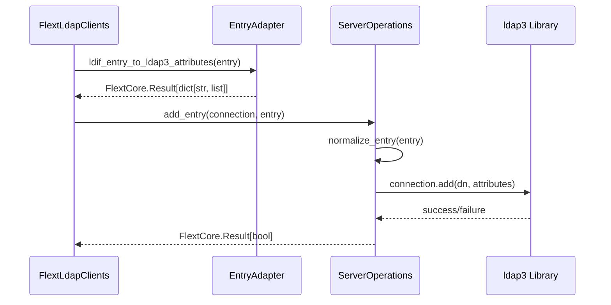
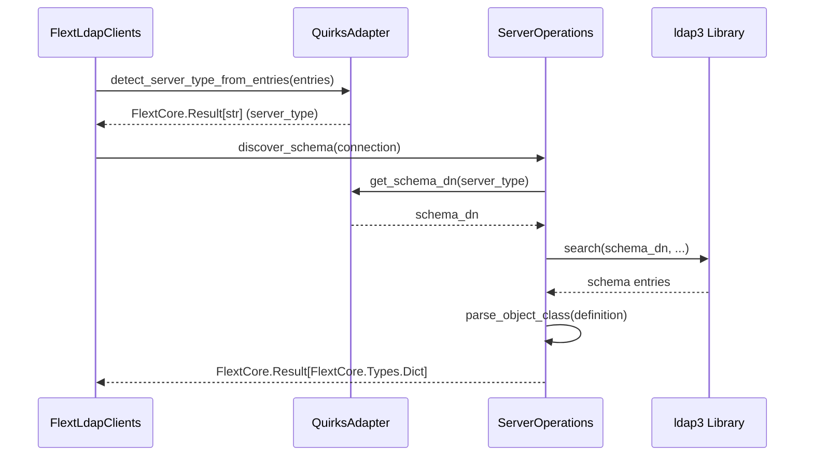
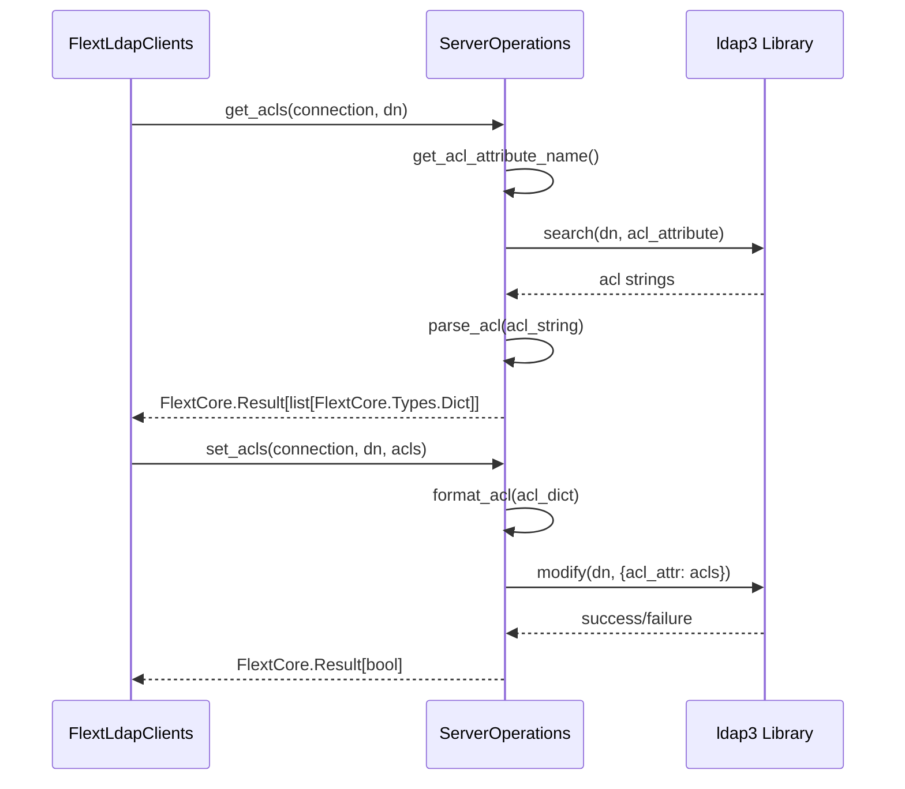

# FLEXT-LDAP Architecture

**Universal LDAP Interface with Server-Specific Implementations**

This document describes the architectural patterns, design decisions, and implementation layers in flext-ldap's universal LDAP interface.

**Version**: 0.9.9 | **Test Coverage**: 35% | **Phase 2**: ✅ Complete
**Architecture**: Clean Architecture + DDD + Railway-oriented programming

---

## 🏗️ Four-Layer Universal Architecture

FLEXT-LDAP implements a four-layer architecture for universal LDAP server support:

```
┌────────────────────────────────────────────────────────┐
│               Application Layer                        │
│   FlextLdap, FlextLdapClients                       │
│   Public facade, connection management                 │
└────────────────────────────────────────────────────────┘
                        ▼
┌────────────────────────────────────────────────────────┐
│                  Domain Layer                          │
│   Entry Adapter, Quirks Integration                   │
│   ldap3 ↔ FlextLdif conversion, server detection     │
└────────────────────────────────────────────────────────┘
                        ▼
┌────────────────────────────────────────────────────────┐
│              Infrastructure Layer                      │
│   Server Operations (OpenLDAP, Oracle, AD, Generic)   │
│   Server-specific schema, ACL, entry operations       │
└────────────────────────────────────────────────────────┘
                        ▼
┌────────────────────────────────────────────────────────┐
│                 Protocol Layer                         │
│   ldap3 (LDAP protocol), FlextLdif (entry models)    │
│   Low-level LDAP operations, LDIF processing          │
└────────────────────────────────────────────────────────┘
```

---

## 📦 Core Components

### **1. Application Layer**

#### FlextLdap

**Purpose**: Public facade for LDAP operations
**Location**: `src/flext_ldap/api.py`
**Responsibilities**:

- Unified API for all LDAP operations
- Connection lifecycle management
- High-level operation orchestration
- Error handling and result wrapping

#### FlextLdapClients

**Purpose**: LDAP connection and operation client
**Location**: `src/flext_ldap/clients.py`
**Responsibilities**:

- ldap3 connection management
- Operation execution coordination
- Server capability detection
- Connection pooling and retry logic

### **2. Domain Layer**

#### FlextLdapEntryAdapter

**Purpose**: Bidirectional ldap3 ↔ FlextLdif entry conversion
**Location**: `src/flext_ldap/entry_adapter.py`
**Lines**: 308 lines
**Responsibilities**:

- Convert ldap3.Entry to FlextLdifModels.Entry
- Convert FlextLdifModels.Entry to ldap3 attributes dict
- Handle attribute encoding/decoding
- Preserve entry structure and metadata

**Key Methods**:

```python
def ldap3_to_ldif_entry(
    ldap3_entry: Ldap3Entry
) -> FlextCore.Result[FlextLdifModels.Entry]:
    """Convert ldap3 entry to FlextLdif entry."""

def ldif_entry_to_ldap3_attributes(
    ldif_entry: FlextLdifModels.Entry
) -> FlextCore.Result[dict[str, FlextCore.Types.List]]:
    """Convert FlextLdif entry to ldap3 attributes."""
```

#### FlextLdapQuirksAdapter

**Purpose**: Wrap FlextLdif quirks system for server detection
**Location**: `src/flext_ldap/quirks_integration.py`
**Lines**: 320 lines
**Responsibilities**:

- Detect LDAP server type from entries
- Provide server-specific quirks information
- Map server types to ACL attributes
- Provide schema discovery endpoints

**Key Methods**:

```python
def detect_server_type_from_entries(
    entries: list[FlextLdifModels.Entry]
) -> FlextCore.Result[str]:
    """Detect server type using FlextLdif quirks."""

def get_acl_attribute_name(
    server_type: str | None = None
) -> FlextCore.Result[str]:
    """Get ACL attribute for server (olcAccess, orclaci, etc.)."""

def get_schema_subentry(
    server_type: str | None = None
) -> FlextCore.Result[str]:
    """Get schema DN for server (cn=subschema, cn=schema, etc.)."""
```

### **3. Infrastructure Layer**

#### BaseServerOperations (Abstract)

**Purpose**: Define complete server operations interface
**Location**: `src/flext_ldap/servers/base_operations.py`
**Lines**: 305 lines
**Pattern**: Abstract base class with comprehensive API contract

**Operation Categories**:

1. **Connection Operations**: ports, SSL, START_TLS, bind mechanisms
2. **Schema Operations**: discovery, parsing, validation
3. **ACL Operations**: get/set ACLs, format conversion
4. **Entry Operations**: add, modify, delete, normalize
5. **Search Operations**: paged search, VLV support

#### Server-Specific Implementations

##### OpenLDAP2Operations

**Location**: `src/flext_ldap/servers/openldap2_operations.py`
**Lines**: 525 lines (largest implementation)
**Status**: 🟢 Complete

**Features**:

- **ACL Format**: `olcAccess` (cn=config format)
- **Schema DN**: `cn=subschema`
- **Features**: Paged results, VLV, matching rules
- **Special Handling**: olc\* attributes, cn=config entries

**Key Characteristics**:

```python
def get_acl_attribute_name(self) -> str:
    return "olcAccess"

def get_schema_dn(self) -> str:
    return "cn=subschema"

def supports_paged_results(self) -> bool:
    return True

def supports_vlv(self) -> bool:
    return True
```

##### OpenLDAP1Operations

**Location**: `src/flext_ldap/servers/openldap1_operations.py`
**Lines**: 102 lines
**Status**: 🟢 Complete
**Pattern**: Extends OpenLDAP2Operations, overrides ACL syntax

**Features**:

- **ACL Format**: `access` (slapd.conf format)
- **Inherits**: Most operations from OpenLDAP2Operations
- **Difference**: ACL attribute and parsing only

##### OracleOIDOperations

**Location**: `src/flext_ldap/servers/oid_operations.py`
**Lines**: 361 lines
**Status**: 🟢 Complete

**Features**:

- **ACL Format**: `orclaci`
- **Schema DN**: `cn=subschemasubentry`
- **Object Classes**: orclUserV2, orclContainer
- **Features**: VLV support, Oracle-specific extensions

##### OracleOUDOperations

**Location**: `src/flext_ldap/servers/oud_operations.py`
**Lines**: 373 lines
**Status**: 🟢 Complete

**Features**:

- **ACL Format**: `ds-privilege-name`
- **Schema DN**: `cn=schema`
- **Base**: 389 Directory Server with Oracle extensions
- **SASL**: SIMPLE, EXTERNAL, DIGEST-MD5, GSSAPI, PLAIN

##### ActiveDirectoryOperations

**Location**: `src/flext_ldap/servers/ad_operations.py`
**Lines**: 250 lines
**Status**: 🟡 Stub (NotImplementedError)

**Planned Features**:

- **ACL Format**: `nTSecurityDescriptor`
- **Schema DN**: `cn=schema,cn=configuration`
- **Features**: GUID-based DNs, Global Catalog
- **Auth**: SASL/GSSAPI, SASL/DIGEST-MD5

##### GenericServerOperations

**Location**: `src/flext_ldap/servers/generic_operations.py`
**Lines**: 310 lines
**Status**: 🟢 Complete (fallback)

**Features**:

- **ACL Format**: `aci` (generic)
- **Schema DN**: `cn=subschema` (RFC 4512)
- **Purpose**: RFC-compliant fallback for unknown servers
- **Operations**: Basic add/modify/delete, paged search

### **4. Protocol Layer**

#### ldap3

**Purpose**: Low-level LDAP protocol operations
**Status**: External dependency (wrapped by flext-ldap)
**Operations**: Connection, bind, search, add, modify, delete, compare

#### FlextLdif

**Purpose**: LDIF entry models and quirks detection
**Status**: External flext library (flext-ldif)
**Models**: Entry, DistinguishedName, Attributes, Quirks

---

## 🔄 Data Flow Patterns

### **Entry Creation Flow**



### **Schema Discovery Flow**



### **ACL Management Flow**



---

## 🎨 Design Patterns

### **1. Adapter Pattern**

**FlextLdapEntryAdapter** bridges ldap3 and FlextLdif representations:

```python
# ldap3 → FlextLdif
ldap3_entry = connection.entries[0]
result = adapter.ldap3_to_ldif_entry(ldap3_entry)
ldif_entry = result.unwrap()

# FlextLdif → ldap3
ldif_entry = FlextLdifModels.Entry(...)
result = adapter.ldif_entry_to_ldap3_attributes(ldif_entry)
attributes = result.unwrap()
```

### **2. Strategy Pattern**

**Server Operations** implement different strategies per server:

```python
# Runtime selection based on server type
if server_type == "openldap2":
    ops = OpenLDAP2Operations()
elif server_type == "oid":
    ops = OracleOIDOperations()
else:
    ops = GenericServerOperations()

# Common interface, different implementations
schema = ops.discover_schema(connection)
acls = ops.get_acls(connection, dn)
```

### **3. Template Method Pattern**

**BaseServerOperations** defines operation templates:

```python
class BaseServerOperations(ABC):
    @abstractmethod
    def add_entry(
        self, connection: object, entry: FlextLdifModels.Entry
    ) -> FlextCore.Result[bool]:
        """Template for entry addition."""

    @abstractmethod
    def normalize_entry(
        self, entry: FlextLdifModels.Entry
    ) -> FlextCore.Result[FlextLdifModels.Entry]:
        """Template for server-specific normalization."""
```

### **4. Railway-Oriented Programming**

**FlextCore.Result** pattern for explicit error handling:

```python
# Operation chain with early returns
result = adapter.ldif_entry_to_ldap3_attributes(entry)
if result.is_failure:
    return FlextCore.Result[bool].fail(result.error)

attributes = result.unwrap()
add_result = ops.add_entry(connection, entry)
if add_result.is_failure:
    return FlextCore.Result[bool].fail(add_result.error)

return FlextCore.Result[bool].ok(True)
```

---

## 🔐 Security Considerations

### **ACL Format Isolation**

Each server operation handles its specific ACL format:

| Server           | ACL Attribute        | Format              | Security Model |
| ---------------- | -------------------- | ------------------- | -------------- |
| OpenLDAP 2.x     | olcAccess            | OpenLDAP ACL syntax | RBAC           |
| OpenLDAP 1.x     | access               | Legacy ACL syntax   | RBAC           |
| Oracle OID       | orclaci              | Oracle ACI format   | ABAC           |
| Oracle OUD       | ds-privilege-name    | Privilege-based     | RBAC           |
| Active Directory | nTSecurityDescriptor | Security Descriptor | ACL            |

### **Connection Security**

- **SSL/TLS Support**: All server operations support SSL connections
- **START_TLS**: Supported on OpenLDAP, Oracle OID/OUD
- **SASL Mechanisms**: Server-specific (EXTERNAL, DIGEST-MD5, GSSAPI, PLAIN)

### **Entry Validation**

- **Server-specific normalization**: Each operation normalizes entries per server requirements
- **Attribute validation**: Validated against server schema
- **DN validation**: RFC 2253 compliance through FlextLdif

---

## 📊 Implementation Statistics

### **Code Distribution**

| Component                 | Lines     | Purpose                       |
| ------------------------- | --------- | ----------------------------- |
| Entry Adapter             | 308       | ldap3 ↔ FlextLdif conversion |
| Quirks Integration        | 320       | Server detection and quirks   |
| Base Operations           | 305       | Abstract interface            |
| OpenLDAP2Operations       | 525       | Complete implementation       |
| OpenLDAP1Operations       | 102       | Legacy implementation         |
| OracleOIDOperations       | 361       | Oracle OID implementation     |
| OracleOUDOperations       | 373       | Oracle OUD implementation     |
| ActiveDirectoryOperations | 250       | Stub for future               |
| GenericServerOperations   | 310       | RFC-compliant fallback        |
| **Total**                 | **2,854** | **Universal LDAP interface**  |

### **Operation Coverage**

| Operation        | OpenLDAP 2.x | OpenLDAP 1.x | Oracle OID  | Oracle OUD  | AD      | Generic     |
| ---------------- | ------------ | ------------ | ----------- | ----------- | ------- | ----------- |
| Connection       | ✅ Complete  | ✅ Complete  | ✅ Complete | ✅ Complete | 🟡 Stub | ✅ Complete |
| Schema Discovery | ✅ Complete  | ✅ Complete  | ✅ Complete | ✅ Complete | 🟡 Stub | ✅ Complete |
| ACL Management   | ✅ Complete  | ✅ Complete  | ✅ Complete | ✅ Complete | 🟡 Stub | ⚠️ Limited  |
| Entry Operations | ✅ Complete  | ✅ Complete  | ✅ Complete | ✅ Complete | 🟡 Stub | ✅ Complete |
| Paged Search     | ✅ Complete  | ✅ Complete  | ✅ Complete | ✅ Complete | 🟡 Stub | ✅ Complete |

---

## 🔮 Future Enhancements

### **Short Term (1.0.0)**

- Complete Active Directory implementation
- Enhanced error messages with server context
- Connection pooling and retry mechanisms
- Performance optimization for large directories

### **Long Term (2.0.0+)**

- Additional server support (DS389, eDirectory)
- Advanced schema validation
- Replication monitoring
- Backup/restore utilities per server type

---

## 📚 References

- **Clean Architecture**: Robert C. Martin ("Uncle Bob")
- **Domain-Driven Design**: Eric Evans
- **RFC 4510**: LDAP Technical Specification Roadmap
- **RFC 4512**: LDAP Directory Information Models
- **RFC 2253**: Distinguished Names representation
- **flext-core**: Foundation patterns and utilities
- **flext-ldif**: LDIF processing and quirks detection
