# 🏗️ Architecture Guide

**Enterprise LDAP Library Architecture and Design Patterns**

This guide provides a comprehensive overview of the ldap-core-shared library architecture, design patterns, and implementation strategies. It serves as a reference for developers, architects, and maintainers working with the library.

## 📋 Table of Contents

- [🎯 Architecture Overview](#-architecture-overview)
- [🏗️ Core Design Principles](#-core-design-principles)
- [📊 Module Architecture](#-module-architecture)
- [🔄 Data Flow Patterns](#-data-flow-patterns)
- [🎨 Design Patterns](#-design-patterns)
- [⚡ Performance Architecture](#-performance-architecture)
- [🔒 Security Architecture](#-security-architecture)
- [🧪 Testing Architecture](#-testing-architecture)
- [📈 Monitoring and Observability](#-monitoring-and-observability)
- [🔄 Extension Points](#-extension-points)

## 🎯 Architecture Overview

The ldap-core-shared library follows a **Domain-Driven Design (DDD)** approach with **Clean Architecture** principles, providing enterprise-grade LDAP functionality through well-defined layers and boundaries.

### 🎯 **High-Level Architecture**

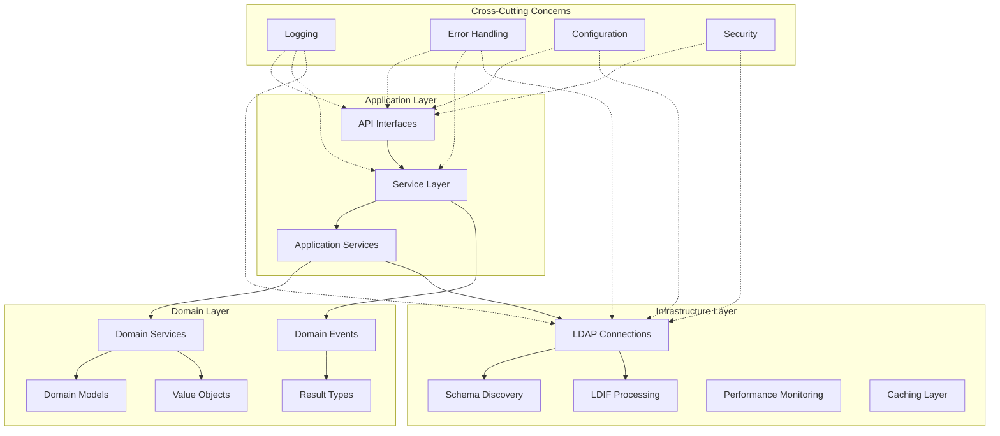

### 🎯 **Core Components**

| Layer | Components | Responsibility |
|-------|------------|----------------|
| **Application** | API, Services, Controllers | External interfaces and orchestration |
| **Domain** | Models, Events, Services | Business logic and rules |
| **Infrastructure** | Connections, Repositories, Adapters | External system integration |
| **Cross-Cutting** | Logging, Security, Configuration | System-wide concerns |

## 🏗️ Core Design Principles

The library architecture is built on fundamental principles that ensure maintainability, scalability, and reliability.

### 🎯 **SOLID Principles**

#### Single Responsibility Principle (SRP)
Each class and module has a single, well-defined responsibility:

```python
# ✅ Good - Single responsibility
class LDAPConnectionManager:
    """Manages LDAP connections only."""
    
    def connect(self) -> LDAPConnectionResult:
        """Establish connection."""
        pass
    
    def disconnect(self) -> bool:
        """Close connection."""
        pass

class LDAPOperations:
    """Handles LDAP operations only."""
    
    def search_entries(self, base_dn: str, filter: str) -> LDAPSearchResult:
        """Perform LDAP search."""
        pass
    
    def add_entry(self, dn: str, attributes: dict) -> LDAPOperationResult:
        """Add LDAP entry."""
        pass
```

#### Open/Closed Principle (OCP)
Classes are open for extension but closed for modification:

```python
# Base class closed for modification
class BaseTransformationRule(ABC):
    @abstractmethod
    def apply(self, entry: dict) -> dict:
        """Apply transformation rule."""
        pass

# Open for extension through inheritance
class AttributeRenameRule(BaseTransformationRule):
    def __init__(self, from_attr: str, to_attr: str):
        self.from_attr = from_attr
        self.to_attr = to_attr
    
    def apply(self, entry: dict) -> dict:
        if self.from_attr in entry:
            entry[self.to_attr] = entry.pop(self.from_attr)
        return entry

class ValueTransformRule(BaseTransformationRule):
    def __init__(self, attribute: str, transform_func: Callable):
        self.attribute = attribute
        self.transform_func = transform_func
    
    def apply(self, entry: dict) -> dict:
        if self.attribute in entry:
            entry[self.attribute] = [
                self.transform_func(value) for value in entry[self.attribute]
            ]
        return entry
```

#### Dependency Inversion Principle (DIP)
High-level modules don't depend on low-level modules:

```python
# Abstract interface
class ConnectionProvider(Protocol):
    def get_connection(self) -> Any:
        """Get LDAP connection."""
        pass

# High-level module depends on abstraction
class LDAPOperations:
    def __init__(self, connection_provider: ConnectionProvider):
        self._connection_provider = connection_provider
    
    def search_entries(self, base_dn: str, filter: str) -> LDAPSearchResult:
        conn = self._connection_provider.get_connection()
        # Perform search using connection
        pass

# Low-level implementation
class LDAPConnectionManager(ConnectionProvider):
    def get_connection(self) -> Any:
        return self._pool.get_connection()
```

### 🎯 **Domain-Driven Design (DDD)**

#### Bounded Contexts
The library is organized into clear bounded contexts:

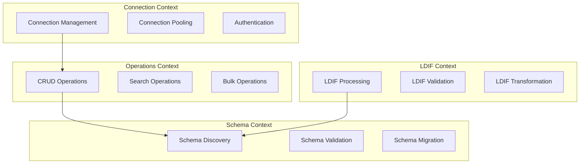

#### Ubiquitous Language
Consistent terminology across the codebase:

```python
# Domain concepts use business language
class DistinguishedName:
    """Represents an LDAP Distinguished Name."""
    pass

class SearchFilter:
    """Represents an LDAP search filter expression."""
    pass

class AttributeType:
    """Represents an LDAP attribute type definition."""
    pass

class ObjectClass:
    """Represents an LDAP object class definition."""
    pass
```

### 🎯 **Clean Architecture**

#### Dependency Direction
Dependencies point inward toward the domain:

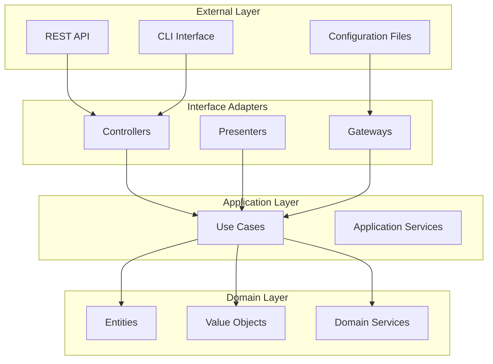

## 📊 Module Architecture

Detailed architecture of each major module in the library.

### 🔗 **Core Module Architecture**

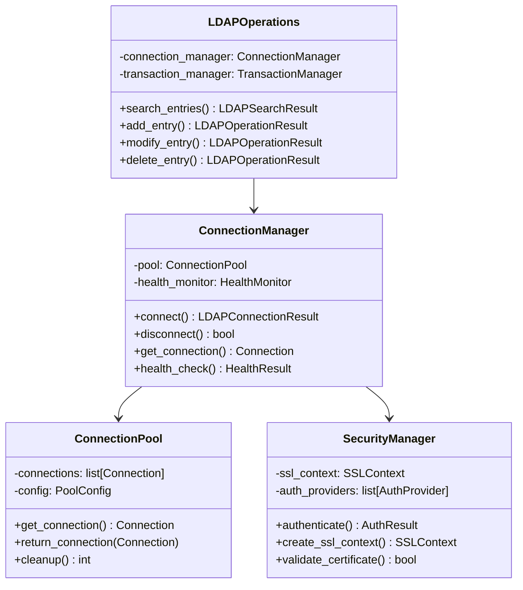

### 📄 **LDIF Module Architecture**

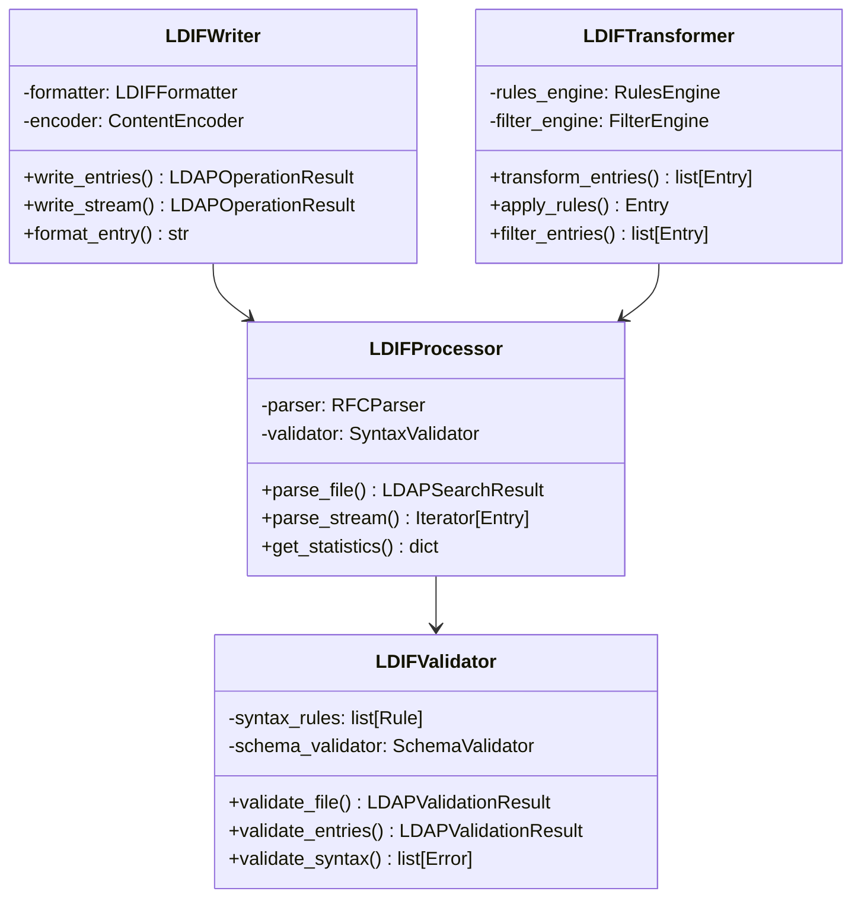

### 🗂️ **Schema Module Architecture**

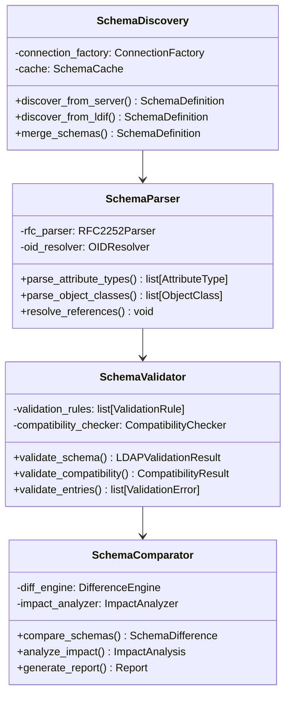

## 🔄 Data Flow Patterns

Understanding how data flows through the system for different operations.

### 🔍 **Search Operation Flow**

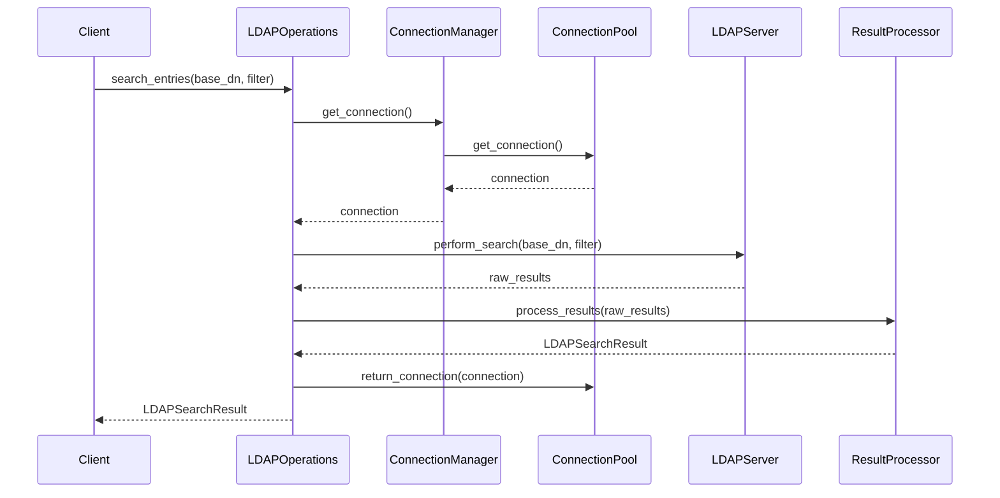

### 📄 **LDIF Processing Flow**

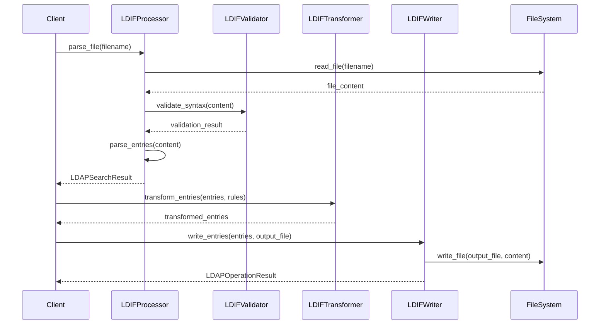

### 🔄 **Schema Migration Flow**

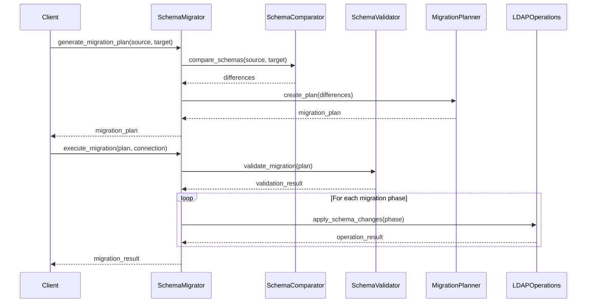

## 🎨 Design Patterns

Key design patterns used throughout the library.

### 🏭 **Factory Pattern**

Used for creating complex objects with different configurations:

```python
class ConnectionFactory:
    """Factory for creating LDAP connections."""
    
    @staticmethod
    def create_connection(connection_info: ConnectionInfo) -> Connection:
        """Create connection based on configuration."""
        if connection_info.use_ssl:
            return SSLConnection(connection_info)
        elif connection_info.use_tls:
            return TLSConnection(connection_info)
        else:
            return PlainConnection(connection_info)
    
    @staticmethod
    def create_pooled_connection(connection_info: ConnectionInfo) -> ConnectionPool:
        """Create connection pool."""
        return ConnectionPool(
            connection_factory=lambda: ConnectionFactory.create_connection(connection_info),
            min_connections=connection_info.pool_size,
            max_connections=connection_info.max_pool_size
        )
```

### 🎯 **Strategy Pattern**

Used for pluggable algorithms and behaviors:

```python
class ConflictResolutionStrategy(ABC):
    """Abstract strategy for resolving merge conflicts."""
    
    @abstractmethod
    def resolve(self, entry1: dict, entry2: dict) -> dict:
        """Resolve conflict between two entries."""
        pass

class NewestWinsStrategy(ConflictResolutionStrategy):
    """Resolve conflicts by choosing the newest entry."""
    
    def resolve(self, entry1: dict, entry2: dict) -> dict:
        timestamp1 = entry1.get('modifyTimestamp', '')
        timestamp2 = entry2.get('modifyTimestamp', '')
        return entry2 if timestamp2 > timestamp1 else entry1

class MergeAttributesStrategy(ConflictResolutionStrategy):
    """Resolve conflicts by merging attributes."""
    
    def resolve(self, entry1: dict, entry2: dict) -> dict:
        merged = entry1.copy()
        for attr, values in entry2.items():
            if attr in merged:
                # Merge values, removing duplicates
                merged[attr] = list(set(merged[attr] + values))
            else:
                merged[attr] = values
        return merged

class LDIFMerger:
    def __init__(self, resolution_strategy: ConflictResolutionStrategy):
        self._resolution_strategy = resolution_strategy
    
    def merge_entries(self, entries1: list, entries2: list) -> list:
        conflicts = self._find_conflicts(entries1, entries2)
        for conflict in conflicts:
            resolved = self._resolution_strategy.resolve(
                conflict.entry1, 
                conflict.entry2
            )
            # Apply resolved entry
```

### 🔍 **Observer Pattern**

Used for event handling and monitoring:

```python
class LDAPEventObserver(ABC):
    """Abstract observer for LDAP events."""
    
    @abstractmethod
    def on_connection_established(self, event: ConnectionEvent):
        """Handle connection established event."""
        pass
    
    @abstractmethod
    def on_operation_completed(self, event: OperationEvent):
        """Handle operation completed event."""
        pass

class PerformanceMonitorObserver(LDAPEventObserver):
    """Observer that monitors performance metrics."""
    
    def __init__(self):
        self._metrics = PerformanceMetrics()
    
    def on_connection_established(self, event: ConnectionEvent):
        self._metrics.record_connection_time(event.duration)
    
    def on_operation_completed(self, event: OperationEvent):
        self._metrics.record_operation(
            operation_type=event.operation_type,
            duration=event.duration,
            success=event.success
        )

class AuditLogObserver(LDAPEventObserver):
    """Observer that logs operations for audit purposes."""
    
    def __init__(self, audit_logger: Logger):
        self._audit_logger = audit_logger
    
    def on_operation_completed(self, event: OperationEvent):
        self._audit_logger.info(
            f"LDAP Operation: {event.operation_type} "
            f"DN: {event.dn} "
            f"Success: {event.success} "
            f"User: {event.user_context}"
        )

class LDAPOperations:
    def __init__(self):
        self._observers: list[LDAPEventObserver] = []
    
    def add_observer(self, observer: LDAPEventObserver):
        self._observers.append(observer)
    
    def _notify_operation_completed(self, event: OperationEvent):
        for observer in self._observers:
            observer.on_operation_completed(event)
```

### 🔧 **Builder Pattern**

Used for constructing complex configurations:

```python
class LDAPSearchBuilder:
    """Builder for constructing LDAP search queries."""
    
    def __init__(self):
        self._base_dn = ""
        self._filter = "(objectClass=*)"
        self._attributes = []
        self._scope = "subtree"
        self._size_limit = 1000
        self._time_limit = 30
        self._page_size = None
        self._sort_attributes = []
    
    def base_dn(self, dn: str) -> 'LDAPSearchBuilder':
        self._base_dn = dn
        return self
    
    def filter(self, filter_expr: str) -> 'LDAPSearchBuilder':
        self._filter = filter_expr
        return self
    
    def attributes(self, *attrs: str) -> 'LDAPSearchBuilder':
        self._attributes.extend(attrs)
        return self
    
    def scope(self, scope: str) -> 'LDAPSearchBuilder':
        self._scope = scope
        return self
    
    def limit(self, size: int, time: int = None) -> 'LDAPSearchBuilder':
        self._size_limit = size
        if time is not None:
            self._time_limit = time
        return self
    
    def paginated(self, page_size: int) -> 'LDAPSearchBuilder':
        self._page_size = page_size
        return self
    
    def sorted_by(self, *attributes: str) -> 'LDAPSearchBuilder':
        self._sort_attributes.extend(attributes)
        return self
    
    def build(self) -> SearchRequest:
        return SearchRequest(
            base_dn=self._base_dn,
            filter=self._filter,
            attributes=self._attributes,
            scope=self._scope,
            size_limit=self._size_limit,
            time_limit=self._time_limit,
            page_size=self._page_size,
            sort_attributes=self._sort_attributes
        )

# Usage
search_request = (LDAPSearchBuilder()
    .base_dn("ou=people,dc=example,dc=com")
    .filter("(&(objectClass=person)(mail=*))")
    .attributes("cn", "mail", "telephoneNumber")
    .scope("subtree")
    .limit(500, 30)
    .paginated(100)
    .sorted_by("cn")
    .build())
```

### 🎭 **Adapter Pattern**

Used for integrating different LDAP libraries:

```python
class LDAPConnectionAdapter(ABC):
    """Abstract adapter for different LDAP libraries."""
    
    @abstractmethod
    def connect(self, connection_info: ConnectionInfo) -> bool:
        """Connect to LDAP server."""
        pass
    
    @abstractmethod
    def search(self, base_dn: str, filter: str, attributes: list) -> list:
        """Perform LDAP search."""
        pass

class LDAP3Adapter(LDAPConnectionAdapter):
    """Adapter for ldap3 library."""
    
    def __init__(self):
        self._connection = None
    
    def connect(self, connection_info: ConnectionInfo) -> bool:
        from ldap3 import Server, Connection
        
        server = Server(
            connection_info.host, 
            port=connection_info.port,
            use_ssl=connection_info.use_ssl
        )
        
        self._connection = Connection(
            server,
            user=connection_info.bind_dn,
            password=connection_info.password
        )
        
        return self._connection.bind()
    
    def search(self, base_dn: str, filter: str, attributes: list) -> list:
        self._connection.search(
            search_base=base_dn,
            search_filter=filter,
            attributes=attributes
        )
        return self._connection.entries

class PythonLDAPAdapter(LDAPConnectionAdapter):
    """Adapter for python-ldap library."""
    
    def __init__(self):
        self._connection = None
    
    def connect(self, connection_info: ConnectionInfo) -> bool:
        import ldap
        
        protocol = "ldaps" if connection_info.use_ssl else "ldap"
        ldap_url = f"{protocol}://{connection_info.host}:{connection_info.port}"
        
        self._connection = ldap.initialize(ldap_url)
        
        try:
            self._connection.simple_bind_s(
                connection_info.bind_dn,
                connection_info.password
            )
            return True
        except ldap.LDAPError:
            return False
    
    def search(self, base_dn: str, filter: str, attributes: list) -> list:
        result = self._connection.search_s(
            base_dn,
            ldap.SCOPE_SUBTREE,
            filter,
            attributes
        )
        return result
```

## ⚡ Performance Architecture

The library is designed for high-performance enterprise environments.

### 🎯 **Performance Patterns**

#### Connection Pooling

```python
class ConnectionPool:
    """High-performance connection pool with health monitoring."""
    
    def __init__(self, factory: Callable, min_size: int, max_size: int):
        self._factory = factory
        self._min_size = min_size
        self._max_size = max_size
        self._pool: queue.Queue = queue.Queue(maxsize=max_size)
        self._created_connections = 0
        self._metrics = PoolMetrics()
        
        # Pre-populate pool
        self._populate_pool()
    
    def get_connection(self) -> Connection:
        """Get connection with health check."""
        try:
            connection = self._pool.get_nowait()
            
            # Health check
            if not self._is_healthy(connection):
                connection = self._create_new_connection()
            
            self._metrics.record_acquisition()
            return connection
            
        except queue.Empty:
            if self._created_connections < self._max_size:
                return self._create_new_connection()
            else:
                # Wait for available connection
                return self._pool.get(timeout=30)
    
    def return_connection(self, connection: Connection):
        """Return connection to pool."""
        if self._is_healthy(connection):
            try:
                self._pool.put_nowait(connection)
                self._metrics.record_return()
            except queue.Full:
                # Pool is full, close connection
                connection.close()
        else:
            # Unhealthy connection, replace it
            connection.close()
            self._pool.put_nowait(self._create_new_connection())
```

#### Caching Strategy

```python
class LRUCache:
    """LRU cache with TTL support."""
    
    def __init__(self, max_size: int, ttl: int = 3600):
        self._max_size = max_size
        self._ttl = ttl
        self._cache: OrderedDict = OrderedDict()
        self._timestamps: dict = {}
        self._lock = threading.RLock()
    
    def get(self, key: str) -> Any | None:
        with self._lock:
            if key not in self._cache:
                return None
            
            # Check TTL
            if time.time() - self._timestamps[key] > self._ttl:
                del self._cache[key]
                del self._timestamps[key]
                return None
            
            # Move to end (most recently used)
            self._cache.move_to_end(key)
            return self._cache[key]
    
    def put(self, key: str, value: Any):
        with self._lock:
            if key in self._cache:
                self._cache.move_to_end(key)
            else:
                if len(self._cache) >= self._max_size:
                    # Remove least recently used
                    oldest_key = next(iter(self._cache))
                    del self._cache[oldest_key]
                    del self._timestamps[oldest_key]
            
            self._cache[key] = value
            self._timestamps[key] = time.time()

class SchemaCache:
    """Schema-specific caching with invalidation."""
    
    def __init__(self, cache_size: int = 100, ttl: int = 3600):
        self._cache = LRUCache(cache_size, ttl)
        self._version_cache: dict[str, str] = {}
    
    def get_schema(self, server_id: str) -> SchemaDefinition | None:
        """Get cached schema if version matches."""
        cached_entry = self._cache.get(server_id)
        if not cached_entry:
            return None
        
        schema, cached_version = cached_entry
        current_version = self._get_server_schema_version(server_id)
        
        if cached_version != current_version:
            # Schema version changed, invalidate cache
            self._cache.put(server_id, None)
            return None
        
        return schema
    
    def put_schema(self, server_id: str, schema: SchemaDefinition):
        """Cache schema with version."""
        version = self._get_server_schema_version(server_id)
        self._cache.put(server_id, (schema, version))
```

#### Streaming Processing

```python
class StreamingLDIFProcessor:
    """Memory-efficient streaming LDIF processor."""
    
    def __init__(self, chunk_size: int = 8192):
        self._chunk_size = chunk_size
        self._buffer = ""
        self._entry_boundary = re.compile(r'\n\s*\n')
    
    def process_stream(self, file_stream: IO) -> Iterator[dict]:
        """Process LDIF stream without loading entire file."""
        
        while True:
            chunk = file_stream.read(self._chunk_size)
            if not chunk:
                break
            
            self._buffer += chunk
            
            # Process complete entries in buffer
            while True:
                match = self._entry_boundary.search(self._buffer)
                if not match:
                    break
                
                # Extract complete entry
                entry_text = self._buffer[:match.start()]
                self._buffer = self._buffer[match.end():]
                
                # Parse entry
                if entry_text.strip():
                    entry = self._parse_entry(entry_text)
                    if entry:
                        yield entry
        
        # Process remaining buffer
        if self._buffer.strip():
            entry = self._parse_entry(self._buffer)
            if entry:
                yield entry
```

### 📊 **Performance Monitoring**

```python
class PerformanceMetrics:
    """Comprehensive performance metrics collection."""
    
    def __init__(self):
        self._operation_times: defaultdict[str, list] = defaultdict(list)
        self._operation_counts: defaultdict[str, int] = defaultdict(int)
        self._error_counts: defaultdict[str, int] = defaultdict(int)
        self._start_times: dict[str, float] = {}
        self._lock = threading.Lock()
    
    @contextmanager
    def track_operation(self, operation_name: str):
        """Context manager for tracking operation performance."""
        start_time = time.perf_counter()
        operation_id = f"{operation_name}_{threading.get_ident()}_{start_time}"
        
        try:
            yield operation_id
            
            # Record successful operation
            duration = (time.perf_counter() - start_time) * 1000  # ms
            with self._lock:
                self._operation_times[operation_name].append(duration)
                self._operation_counts[operation_name] += 1
                
        except Exception as e:
            # Record error
            with self._lock:
                self._error_counts[operation_name] += 1
            raise
    
    def get_metrics(self, operation_name: str = None) -> dict:
        """Get performance metrics."""
        with self._lock:
            if operation_name:
                times = self._operation_times[operation_name]
                return {
                    'operation_name': operation_name,
                    'total_operations': self._operation_counts[operation_name],
                    'total_errors': self._error_counts[operation_name],
                    'average_duration': sum(times) / len(times) if times else 0,
                    'min_duration': min(times) if times else 0,
                    'max_duration': max(times) if times else 0,
                    'success_rate': (
                        (self._operation_counts[operation_name] - self._error_counts[operation_name]) / 
                        self._operation_counts[operation_name]
                    ) if self._operation_counts[operation_name] > 0 else 0
                }
            else:
                # Return aggregate metrics
                all_operations = set(self._operation_counts.keys()) | set(self._error_counts.keys())
                return {
                    op: self.get_metrics(op) for op in all_operations
                }
```

## 🔒 Security Architecture

Security is built into every layer of the architecture.

### 🔐 **Security Layers**

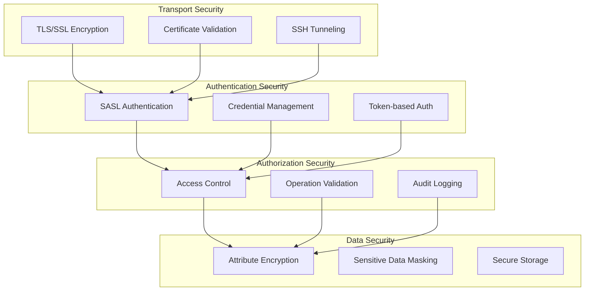

### 🔑 **Authentication Architecture**

```python
class AuthenticationProvider(ABC):
    """Abstract authentication provider."""
    
    @abstractmethod
    def authenticate(self, credentials: Credentials) -> AuthenticationResult:
        """Authenticate user with credentials."""
        pass

class SAMLAuthProvider(AuthenticationProvider):
    """SAML-based authentication provider."""
    
    def __init__(self, saml_config: SAMLConfig):
        self._saml_config = saml_config
    
    def authenticate(self, credentials: Credentials) -> AuthenticationResult:
        # SAML authentication logic
        pass

class LDAPAuthProvider(AuthenticationProvider):
    """LDAP-based authentication provider."""
    
    def __init__(self, ldap_config: LDAPConfig):
        self._ldap_config = ldap_config
    
    def authenticate(self, credentials: Credentials) -> AuthenticationResult:
        # LDAP bind authentication
        pass

class MultiFactorAuthProvider(AuthenticationProvider):
    """Multi-factor authentication provider."""
    
    def __init__(self, primary_provider: AuthenticationProvider, 
                 secondary_provider: AuthenticationProvider):
        self._primary = primary_provider
        self._secondary = secondary_provider
    
    def authenticate(self, credentials: Credentials) -> AuthenticationResult:
        # Primary authentication
        primary_result = self._primary.authenticate(credentials.primary)
        if not primary_result.success:
            return primary_result
        
        # Secondary authentication (MFA)
        secondary_result = self._secondary.authenticate(credentials.secondary)
        
        return AuthenticationResult(
            success=secondary_result.success,
            user_context=primary_result.user_context,
            token=secondary_result.token
        )
```

### 🛡️ **Security Interceptors**

```python
class SecurityInterceptor:
    """Intercepts operations for security validation."""
    
    def __init__(self, auth_provider: AuthenticationProvider,
                 access_controller: AccessController,
                 audit_logger: AuditLogger):
        self._auth_provider = auth_provider
        self._access_controller = access_controller
        self._audit_logger = audit_logger
    
    def intercept_operation(self, operation: LDAPOperation, 
                          user_context: UserContext) -> InterceptionResult:
        """Intercept and validate operation."""
        
        # Authentication check
        if not self._is_authenticated(user_context):
            self._audit_logger.log_unauthorized_access(operation, user_context)
            return InterceptionResult(
                allowed=False,
                reason="Authentication required"
            )
        
        # Authorization check
        if not self._access_controller.is_authorized(user_context, operation):
            self._audit_logger.log_unauthorized_operation(operation, user_context)
            return InterceptionResult(
                allowed=False,
                reason="Insufficient privileges"
            )
        
        # Rate limiting
        if not self._check_rate_limits(user_context, operation):
            self._audit_logger.log_rate_limit_exceeded(operation, user_context)
            return InterceptionResult(
                allowed=False,
                reason="Rate limit exceeded"
            )
        
        # Audit successful operation
        self._audit_logger.log_operation(operation, user_context)
        
        return InterceptionResult(allowed=True)
```

## 🧪 Testing Architecture

Comprehensive testing strategy across all layers.

### 🎯 **Testing Pyramid**

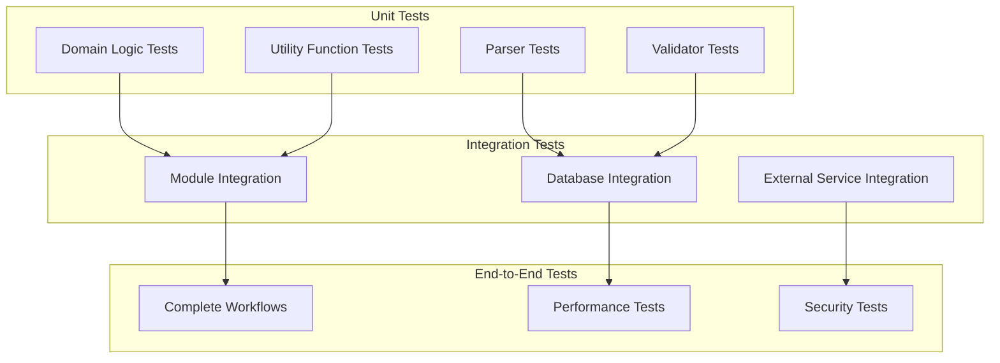

### 🧪 **Test Patterns**

#### Test Fixtures and Factories

```python
class LDAPTestFixture:
    """Comprehensive test fixture for LDAP operations."""
    
    @pytest.fixture
    def mock_connection_info(self):
        return ConnectionInfo(
            host="test.ldap.example.com",
            port=389,
            bind_dn="cn=test,dc=example,dc=com",
            password="test_password"
        )
    
    @pytest.fixture
    def mock_ldap_server(self):
        """Mock LDAP server for testing."""
        with patch('ldap3.Server') as mock_server:
            mock_instance = Mock()
            mock_server.return_value = mock_instance
            yield mock_instance
    
    @pytest.fixture
    def sample_schema(self):
        """Sample schema for testing."""
        return SchemaDefinition(
            attribute_types=[
                AttributeType(
                    oid="2.5.4.3",
                    name="cn",
                    syntax="1.3.6.1.4.1.1466.115.121.1.15"
                )
            ],
            object_classes=[
                ObjectClass(
                    oid="2.5.6.6",
                    name="person",
                    superior="top",
                    must_attributes=["cn", "sn"]
                )
            ]
        )

class EntryFactory:
    """Factory for creating test LDAP entries."""
    
    @staticmethod
    def create_person_entry(cn: str, mail: str = None) -> dict:
        entry = {
            'dn': f'cn={cn},ou=people,dc=example,dc=com',
            'objectClass': ['person', 'inetOrgPerson'],
            'cn': [cn],
            'sn': [cn.split()[-1]]
        }
        
        if mail:
            entry['mail'] = [mail]
        
        return entry
    
    @staticmethod
    def create_group_entry(cn: str, members: list[str] = None) -> dict:
        entry = {
            'dn': f'cn={cn},ou=groups,dc=example,dc=com',
            'objectClass': ['group'],
            'cn': [cn]
        }
        
        if members:
            entry['member'] = members
        
        return entry
```

#### Property-Based Testing

```python
from hypothesis import given, strategies as st

class TestDNValidation:
    """Property-based tests for DN validation."""
    
    @given(st.text(min_size=1, max_size=100))
    def test_dn_roundtrip(self, cn_value):
        """Test that DN parsing and formatting is reversible."""
        assume(all(c.isprintable() and c != ',' for c in cn_value))
        
        original_dn = f'cn={cn_value},ou=people,dc=example,dc=com'
        
        # Parse DN
        parsed_dn = DNHelper.parse_dn(original_dn)
        
        # Format back to string
        formatted_dn = DNHelper.format_dn(parsed_dn)
        
        # Should be equivalent
        assert DNHelper.normalize_dn(original_dn) == DNHelper.normalize_dn(formatted_dn)
    
    @given(st.lists(st.text(min_size=1, max_size=50), min_size=1, max_size=10))
    def test_dn_components_parsing(self, components):
        """Test parsing of DN components."""
        # Create DN from components
        dn_string = ','.join(f'cn={comp}' for comp in components) + ',dc=example,dc=com'
        
        parsed = DNHelper.parse_dn(dn_string)
        
        # Verify all components are preserved
        assert len(parsed.rdn_sequence) >= len(components)
```

### 📊 **Performance Testing**

```python
class PerformanceTestSuite:
    """Comprehensive performance testing."""
    
    def test_connection_pool_performance(self):
        """Test connection pool under load."""
        pool = ConnectionPool(
            factory=mock_connection_factory,
            min_size=10,
            max_size=100
        )
        
        results = []
        
        def worker():
            start_time = time.perf_counter()
            with pool.get_connection() as conn:
                # Simulate work
                time.sleep(0.001)
            end_time = time.perf_counter()
            results.append(end_time - start_time)
        
        # Run concurrent workers
        threads = []
        for _ in range(200):
            thread = threading.Thread(target=worker)
            threads.append(thread)
            thread.start()
        
        for thread in threads:
            thread.join()
        
        # Verify performance targets
        avg_time = sum(results) / len(results)
        assert avg_time < 0.01  # < 10ms average
        
        p95_time = sorted(results)[int(len(results) * 0.95)]
        assert p95_time < 0.05  # < 50ms 95th percentile
    
    @pytest.mark.benchmark
    def test_ldif_parsing_performance(self, benchmark):
        """Benchmark LDIF parsing performance."""
        
        # Create large LDIF content
        ldif_content = self._generate_large_ldif(10000)  # 10k entries
        
        processor = LDIFProcessor()
        
        # Benchmark parsing
        result = benchmark(processor.parse_string, ldif_content)
        
        # Verify performance targets
        assert result.entries_found == 10000
        assert result.search_duration < 5000  # < 5 seconds
        assert result.entries_per_second > 2000  # > 2k entries/sec
```

## 📈 Monitoring and Observability

Built-in monitoring and observability features.

### 📊 **Metrics Architecture**

```python
class MetricsCollector:
    """Centralized metrics collection."""
    
    def __init__(self):
        self._counters: defaultdict[str, int] = defaultdict(int)
        self._histograms: defaultdict[str, list] = defaultdict(list)
        self._gauges: dict[str, float] = {}
        self._labels: dict[str, dict] = {}
    
    def increment(self, metric_name: str, value: int = 1, labels: dict = None):
        """Increment counter metric."""
        key = self._make_key(metric_name, labels)
        self._counters[key] += value
    
    def observe(self, metric_name: str, value: float, labels: dict = None):
        """Observe histogram metric."""
        key = self._make_key(metric_name, labels)
        self._histograms[key].append(value)
    
    def set_gauge(self, metric_name: str, value: float, labels: dict = None):
        """Set gauge metric."""
        key = self._make_key(metric_name, labels)
        self._gauges[key] = value
    
    def export_prometheus(self) -> str:
        """Export metrics in Prometheus format."""
        output = []
        
        # Export counters
        for key, value in self._counters.items():
            output.append(f"{key} {value}")
        
        # Export histograms
        for key, values in self._histograms.items():
            if values:
                output.append(f"{key}_count {len(values)}")
                output.append(f"{key}_sum {sum(values)}")
                output.append(f"{key}_avg {sum(values)/len(values)}")
        
        # Export gauges
        for key, value in self._gauges.items():
            output.append(f"{key} {value}")
        
        return '\n'.join(output)

# Global metrics instance
metrics = MetricsCollector()

# Metrics decorators
def track_performance(metric_name: str):
    """Decorator to track function performance."""
    def decorator(func):
        @wraps(func)
        def wrapper(*args, **kwargs):
            start_time = time.perf_counter()
            try:
                result = func(*args, **kwargs)
                metrics.increment(f"{metric_name}_success")
                return result
            except Exception as e:
                metrics.increment(f"{metric_name}_error", labels={'error_type': type(e).__name__})
                raise
            finally:
                duration = (time.perf_counter() - start_time) * 1000
                metrics.observe(f"{metric_name}_duration_ms", duration)
        return wrapper
    return decorator

# Usage
@track_performance("ldap_search")
def search_entries(base_dn: str, filter: str) -> LDAPSearchResult:
    # Implementation
    pass
```

### 🔍 **Distributed Tracing**

```python
class TracingContext:
    """Distributed tracing context."""
    
    def __init__(self, trace_id: str = None, span_id: str = None):
        self.trace_id = trace_id or self._generate_trace_id()
        self.span_id = span_id or self._generate_span_id()
        self.parent_span_id = None
        self.spans: list[Span] = []
    
    @contextmanager
    def create_span(self, operation_name: str, tags: dict = None):
        """Create a new span within this trace."""
        span = Span(
            trace_id=self.trace_id,
            span_id=self._generate_span_id(),
            parent_span_id=self.span_id,
            operation_name=operation_name,
            start_time=time.time(),
            tags=tags or {}
        )
        
        try:
            yield span
            span.set_tag('success', True)
        except Exception as e:
            span.set_tag('error', True)
            span.set_tag('error.message', str(e))
            raise
        finally:
            span.finish_time = time.time()
            self.spans.append(span)

# Tracing integration
class TracedLDAPOperations:
    """LDAP operations with distributed tracing."""
    
    def __init__(self, connection_manager: ConnectionManager):
        self._connection_manager = connection_manager
    
    def search_entries(self, base_dn: str, filter: str, 
                      trace_context: TracingContext = None) -> LDAPSearchResult:
        
        trace_context = trace_context or TracingContext()
        
        with trace_context.create_span("ldap_search", {
            'base_dn': base_dn,
            'filter': filter
        }) as span:
            
            # Get connection with tracing
            with trace_context.create_span("get_connection") as conn_span:
                connection = self._connection_manager.get_connection()
                conn_span.set_tag('connection_id', id(connection))
            
            # Perform search with tracing
            with trace_context.create_span("execute_search") as search_span:
                result = connection.search(base_dn, filter)
                search_span.set_tag('entries_found', len(result))
            
            span.set_tag('total_entries', len(result))
            return LDAPSearchResult(entries=result, trace_context=trace_context)
```

## 🔄 Extension Points

The library provides multiple extension points for customization.

### 🔌 **Plugin Architecture**

```python
class LDAPPlugin(ABC):
    """Base class for LDAP plugins."""
    
    @abstractmethod
    def get_name(self) -> str:
        """Get plugin name."""
        pass
    
    @abstractmethod
    def get_version(self) -> str:
        """Get plugin version."""
        pass
    
    @abstractmethod
    def initialize(self, config: dict):
        """Initialize plugin with configuration."""
        pass
    
    @abstractmethod
    def before_operation(self, operation: LDAPOperation) -> LDAPOperation:
        """Called before LDAP operation."""
        pass
    
    @abstractmethod
    def after_operation(self, operation: LDAPOperation, result: LDAPResult) -> LDAPResult:
        """Called after LDAP operation."""
        pass

class PluginManager:
    """Manages LDAP plugins."""
    
    def __init__(self):
        self._plugins: list[LDAPPlugin] = []
        self._plugin_configs: dict[str, dict] = {}
    
    def register_plugin(self, plugin: LDAPPlugin, config: dict = None):
        """Register a plugin."""
        plugin.initialize(config or {})
        self._plugins.append(plugin)
        self._plugin_configs[plugin.get_name()] = config
    
    def execute_before_hooks(self, operation: LDAPOperation) -> LDAPOperation:
        """Execute before operation hooks."""
        for plugin in self._plugins:
            operation = plugin.before_operation(operation)
        return operation
    
    def execute_after_hooks(self, operation: LDAPOperation, result: LDAPResult) -> LDAPResult:
        """Execute after operation hooks."""
        for plugin in self._plugins:
            result = plugin.after_operation(operation, result)
        return result

# Example plugin
class AuditPlugin(LDAPPlugin):
    """Plugin for auditing LDAP operations."""
    
    def __init__(self, audit_logger: Logger):
        self._audit_logger = audit_logger
    
    def get_name(self) -> str:
        return "audit_plugin"
    
    def get_version(self) -> str:
        return "1.0.0"
    
    def initialize(self, config: dict):
        self._audit_level = config.get('audit_level', 'INFO')
    
    def before_operation(self, operation: LDAPOperation) -> LDAPOperation:
        self._audit_logger.info(
            f"LDAP Operation Starting: {operation.operation_type} "
            f"DN: {operation.target_dn}"
        )
        return operation
    
    def after_operation(self, operation: LDAPOperation, result: LDAPResult) -> LDAPResult:
        self._audit_logger.info(
            f"LDAP Operation Completed: {operation.operation_type} "
            f"Success: {result.success} "
            f"Duration: {result.duration:.2f}ms"
        )
        return result
```

### 🎛️ **Custom Transformations**

```python
class TransformationPlugin(LDAPPlugin):
    """Plugin for custom data transformations."""
    
    def __init__(self):
        self._transformations: dict[str, Callable] = {}
    
    def register_transformation(self, name: str, func: Callable):
        """Register a custom transformation function."""
        self._transformations[name] = func
    
    def apply_transformation(self, transformation_name: str, data: Any) -> Any:
        """Apply named transformation to data."""
        if transformation_name in self._transformations:
            return self._transformations[transformation_name](data)
        else:
            raise ValueError(f"Unknown transformation: {transformation_name}")

# Example custom transformation
def normalize_phone_number(phone: str) -> str:
    """Normalize phone number format."""
    # Remove all non-digit characters
    digits = re.sub(r'\D', '', phone)
    
    # Format as (XXX) XXX-XXXX if US number
    if len(digits) == 10:
        return f"({digits[:3]}) {digits[3:6]}-{digits[6:]}"
    elif len(digits) == 11 and digits[0] == '1':
        return f"1-({digits[1:4]}) {digits[4:7]}-{digits[7:]}"
    else:
        return phone  # Return original if can't normalize

# Register transformation
transform_plugin = TransformationPlugin()
transform_plugin.register_transformation("normalize_phone", normalize_phone_number)
```

---

**🏗️ Related Documentation**
- [🔗 Connection Management API](../api/core/connection-management.md)
- [📋 Domain Results API](../api/domain/results.md)
- [📄 LDIF Processing API](../api/ldif/processor.md)
- [🔍 Schema Discovery API](../api/schema/discovery.md)
- [📋 Constants API](../api/utils/constants.md)